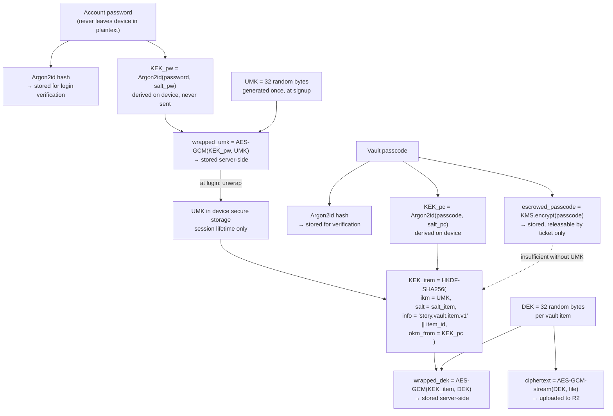

# 05 — Security & Cryptography

> The platform must be structurally incapable of reading a user's vault. Not unwilling — incapable. This document specifies exactly how, and states precisely where the guarantee ends.

Read this before writing any code that touches `users`, `user_keys`, `user_passcodes`, `vault_items`, or `audit_logs`.

## 1. The design goal, stated as a requirement

**R1.** An attacker with a full dump of MongoDB, Redis, and the R2 buckets learns nothing about vault contents.

**R2.** A malicious employee with production database access and the KMS escrow key still cannot decrypt vault contents.

**R3.** A user's vault is decryptable only by someone who holds *both* the account password and the vault passcode.

**R4.** No employee, at any privilege level, can authenticate as a user.

**R5.** Every privileged access to escrowed material produces an immutable, attributable record that the affected user can see.

**R6.** The absence of collected data is the primary defence. No email, no phone, no real name, no contacts, no precise location — ever, unless the user explicitly opts in, and then only in a form we cannot read.

These six requirements are the reason for every construction below. When a proposed feature conflicts with one of them, the feature loses.

## 2. Three secrets, three fates

The system's security rests on keeping three secrets in three different places with three different recoverability properties. This separation *is* the security model.

| Secret | Who holds it | Recoverable by platform? | What it unlocks |
|---|---|---|---|
| **Account password** | The user, only | **Never.** Argon2id hash only. | Account login, and the User Master Key |
| **User Master Key (UMK)** | Derived on the user's device at login | **Never.** Stored only as ciphertext wrapped by the password. | Half of every vault item key |
| **Vault passcode** | The user, plus an escrowed copy | **Yes**, through an audited ticket. | The other half of every vault item key |

The critical property: **the escrowed secret is useless alone.** A super_admin can release a passcode, but has no path to the password, therefore no path to the UMK, therefore no path to a single decrypted byte. This satisfies R2 and R3 simultaneously, and it is what makes the promise honest rather than aspirational.

## 3. Key hierarchy



### 3.1 Precise definitions

```
salt_pw       = 16 random bytes, per user, stored in user_keys
salt_pc       = 16 random bytes, per passcode, stored in user_passcodes
salt_item     = 16 random bytes, per vault item, stored in vault_items

KEK_pw        = Argon2id(password, salt_pw, params_A)            → 32 bytes
KEK_pc        = Argon2id(passcode, salt_pc, params_A)            → 32 bytes

UMK           = CSPRNG(32)
wrapped_umk   = nonce_u || AES-256-GCM(KEK_pw, nonce_u, UMK, aad = "story.umk.v1|" || user_id)

combined_ikm  = UMK || KEK_pc                                    → 64 bytes
KEK_item      = HKDF-SHA256(ikm = combined_ikm,
                            salt = salt_item,
                            info = "story.vault.item.v1|" || item_id,
                            length = 32)

DEK           = CSPRNG(32)
wrapped_dek   = nonce_d || AES-256-GCM(KEK_item, nonce_d, DEK, aad = "story.dek.v1|" || item_id)

ciphertext    = AES-256-GCM streaming over 1 MiB chunks, per-chunk nonce derived
                as HKDF(DEK, info = "chunk|" || chunk_index), tag appended per chunk
```

**Why HKDF over both halves rather than encrypting twice.** Double-wrapping (encrypt the DEK with `KEK_pc`, then with a UMK-derived key) would also satisfy R3, but it stores two ciphertexts and creates an ordering question in every code path. HKDF over the concatenation produces one key from two secrets in one step, and its extract-then-expand structure means neither input can be recovered from the output. Both halves are mandatory by construction, not by policy.

**Why `item_id` is in the `info` parameter.** It domain-separates every item's key. Two items with the same passcode and the same UMK still get different `KEK_item` values, so a key recovered for one item is worthless for another.

**Why AAD includes a version string and an identifier.** The version string makes a future algorithm migration expressible. The identifier binds the ciphertext to its record, so an attacker with database write access cannot swap one user's `wrapped_dek` into another user's item and have it decrypt — the AEAD tag check fails.

**Chunked streaming, not whole-file.** Vault items can be gigabyte-scale videos. A single AES-GCM operation over a multi-gigabyte plaintext is both memory-infeasible on a phone and against NIST's guidance on invocation limits for a single key. 1 MiB chunks with derived per-chunk nonces allow constant-memory streaming encryption, resumable uploads, and range-request playback.

### 3.2 Argon2id parameters

```
params_A  (key derivation, client-side, per unlock)
    memory      = 64 MiB
    iterations  = 3
    parallelism = 4
    output      = 32 bytes

params_B  (password verification, server-side, per login)
    memory      = 64 MiB
    iterations  = 3
    parallelism = 2
    output      = 32 bytes
```

Argon2**id**, not Argon2i or Argon2d: the hybrid mode is the one recommended for password hashing because it resists both side-channel and GPU-cracking attacks.

`params_A` runs on the user's device. 64 MiB and 3 iterations is roughly 300–600 ms on a mid-range 2023 Android phone — slow enough to make offline brute-force expensive, fast enough that vault unlock does not feel broken. Derivation runs on a background isolate so the UI never blocks.

`params_B` runs on the API server, where it is a denial-of-service vector: a login endpoint that allocates 64 MiB per request is trivially exhaustible. Mitigations, all required: rate limiting per IP and per username before the hash is computed, a bounded concurrency semaphore around the verification call, and parallelism reduced to 2 so per-request CPU is predictable.

Parameters are **stored alongside each hash** in PHC string format (`$argon2id$v=19$m=65536,t=3,p=2$...`). This is what makes raising the cost factor possible later: on successful login, if the stored parameters are below current policy, the password is re-hashed with the new parameters inside the same request. Hardcoding parameters at the verification site makes future migration impossible.

### 3.3 Password and passcode requirements

**Password:** minimum 10 characters, no composition rules, no forced rotation. Checked against a bundled list of the 100,000 most breached passwords, and rejected if the username appears in it. Composition rules ("one uppercase, one symbol") measurably reduce entropy by pushing users toward `Password1!`; length plus a breach list is the current consensus.

**Passcode:** either a 6-digit numeric PIN or a passphrase of at least 8 characters. The 6-digit option exists because it is what users will actually use for a frequently-unlocked vault, and its weak entropy is compensated by the fact that it is never verifiable offline — an attacker needs the UMK too, which needs the password, which is rate-limited server-side. The interface states this trade-off plainly and recommends a passphrase for the vault's most sensitive items.

**Attempt limits.** Passcode entry is limited to 5 consecutive failures per item, then a 15-minute lockout with exponential backoff on repeat. The counter is server-side in Redis, keyed by user and item, so it cannot be reset by reinstalling the app.

## 4. Account authentication

### 4.1 Sign-up

```
1. Client validates username shape locally: ^[a-z0-9_]{3,20}$
2. POST /auth/signup { username, password, tnc_accepted }
3. Server: check username uniqueness (unique index on users.username)
4. Server: password_hash = Argon2id(password, params_B)
5. Server: user_id = ULID with "usr_" prefix
6. Server: avatar_seed = CSPRNG-derived seed
7. Client: generate UMK, salt_pw; derive KEK_pw; compute wrapped_umk
8. Client: POST /users/me/keys { salt_pw, wrapped_umk, kdf_params }
9. Server: store in user_keys. Issue token pair. Set cookies (web) or return tokens (app)
```

Step 7 happens **on the device**, and the plaintext UMK is never transmitted. Steps 2 and 8 are separate requests because the server must never receive the password and the UMK material in the same payload — that would put both halves of a decryption path in one place in memory, in one log-adjacent request body, at the same moment. Keeping them separate is a defence-in-depth measure that costs one round trip.

`tnc_accepted` is required and recorded with a timestamp and the terms version.

### 4.2 Sign-in

```
1. POST /auth/signin { username, password }
2. Server: rate-limit check (per IP and per username) — BEFORE hashing
3. Server: fetch user by username; Argon2id verify
4. Server: if stored params < policy → re-hash with current params
5. Server: check status (active / blocked) 
6. Server: issue access token (JWT) + refresh token (opaque), new family
7. Server: enqueue login-alert job if the device fingerprint is new
8. Client: fetch user_keys; derive KEK_pw from the password still in memory;
           unwrap UMK; store UMK in Keychain/Keystore; zero the password buffer
```

Step 8 is the only moment the UMK exists in plaintext outside secure storage. The password is held in a mutable buffer that is explicitly overwritten immediately after derivation — Dart `String` is immutable and cannot be zeroed, so passwords are handled as `Uint8List` from the text field onward.

**Timing.** A failed login must take the same wall-clock time whether the username exists or not. When no user is found, the server verifies against a fixed dummy hash before returning the same generic error. Otherwise the endpoint is a username enumeration oracle, which for an anonymity product is a real leak — it would let someone confirm that a suspected handle is registered.

### 4.3 Tokens

Carried over from the reference project, whose token design is genuinely good.

**Access token** — JWT, HS256, 30-minute TTL. Claims: `user_id`, `role`, `status`, `family_id`, `jti`, `iat`, `exp`. Deliberately *not* included: `display_name`, `avatar_seed`, or anything else mutable. The reference denormalized profile data into claims to save a database read; here that would mean a renamed user shows a stale name for up to 30 minutes, and it grows the token on every request. We accept one cached lookup instead.

**Refresh token** — not a JWT. 32 random bytes, stored in Redis as a SHA-256 hash under `ST:RT:<hash>`, 30-day TTL. Every refresh belongs to a **family** representing one device lineage.

**Rotation with reuse detection.** On refresh, the presented token is deleted, a tombstone is written at `ST:RT_REVOKED_HASH:<hash>`, and a new token is issued into the same family. If a token that is *not* found in Redis matches a tombstone, it is a replay of a stolen token: the entire family is revoked immediately and the user is notified. This turns token theft from a silent persistent compromise into a detectable, self-limiting event.

**Access revocation** — a Redis denylist at `ST:JWT_DENY:<jti>` whose TTL equals the token's remaining life, so the list self-cleans and never grows without bound.

**Transport.** Web uses httpOnly `Secure` `SameSite=Lax` cookies with a separate JS-readable CSRF cookie (double-submit, constant-time compared). The Flutter app uses `Authorization: Bearer` with the refresh token in the platform keychain. The server reads the cookie first and falls back to the header — one verification path, both clients.

### 4.4 Login alerts

Every sign-in from an unrecognized device fingerprint produces:

- An in-app notification: "New sign-in on <device>, <approximate location>, <time>. If this was you, ignore this. If not, secure your account."
- An email, if and only if the user has set one.
- A `devices` record with the fingerprint, first-seen, and last-seen.

"Secure your account" is one tap and does three things at once: revokes every session except the current one, forces a password change, and locks the vault. A user who suspects compromise should not have to find three separate settings screens.

The fingerprint is a hash of platform, OS major version, app version, and device model — deliberately coarse. A precise fingerprint would be a tracking identifier, which violates R6.

## 5. Vault

### 5.1 Upload

```mermaid
sequenceDiagram
    participant C as Client
    participant A as API
    participant R as R2
    C->>C: Prompt for passcode, derive KEK_pc
    C->>C: Generate DEK, salt_item
    C->>C: Encrypt metadata (filename, mime, dimensions) with DEK
    C->>A: POST /vault/items (encrypted_metadata, wrapped_dek, salt_item,<br/>size, visibility, label_hash?)
    A->>A: Validate quota, create item (status: pending)
    A->>C: item_id + presigned PUT URL (15 min)
    C->>R: PUT ciphertext, chunk by chunk
    C->>A: POST /vault/items/{id}/complete (chunk_count, total_size)
    A->>R: HEAD object — verify it exists and size matches
    A->>A: status → ready; enqueue malware scan
```

Three properties worth noting:

**The API never sees plaintext or the DEK.** It stores `wrapped_dek` as an opaque blob. It cannot decrypt it, and it does not try.

**The filename is encrypted.** `IMG_20190614_wedding.jpg` is itself sensitive — it can reveal a date, an event, and a relationship. Filename, MIME type, dimensions, and duration all live inside an encrypted metadata blob. The server stores only size, chunk count, and a coarse `kind` (`image` / `video` / `document` / `audio` / `other`) needed to pick an icon.

**Ciphertext goes directly to R2.** The API only presigns. This keeps the API cheap and reinforces that it is not in the data path.

### 5.2 Download

```
1. GET /vault/items/{id}/download
2. Server: verify ownership; verify item status is ready
3. Server: return presigned GET URL, 5-minute expiry
4. Client: prompt for passcode if the item's key is not cached in memory
5. Client: derive KEK_pc → KEK_item → unwrap DEK
6. Client: stream chunks from R2, decrypt each, write to a temp file or render in memory
```

**Decrypted output never touches shared storage.** No gallery, no Downloads folder, no shared temp directory. Files render inside the app from an app-private location that is wiped when the vault locks. An explicit "Export" action exists and requires re-entering the passcode plus an acknowledgement that the exported file is no longer protected — because the whole point of the vault is that the file is not on the device.

**In-memory key cache.** After a successful unlock, `KEK_pc` is held in memory for the vault session so a user browsing 40 photos is not prompted 40 times. It is cleared on: explicit lock, app backgrounding for more than 60 seconds, device lock, and session end. There is no "remember passcode" option; biometric unlock is offered instead, where the OS keystore releases a stored `KEK_pc` only on biometric assertion.

### 5.3 The two visibility modes

This is the feature described as "like WhatsApp hidden contacts" — an item that does not appear in any list and is reachable only by typing its exact label.

| Mode | Appears in the item list | How it is opened |
|---|---|---|
| `normal` | Yes | Tap, then passcode |
| `hidden` | **No** | Type the exact label in vault search, then passcode |

Implementation:

```
label_hash = HMAC-SHA256(key = HKDF(UMK, info="story.vault.label.v1"),
                         msg = normalize(label))
normalize  = NFKC → trim → lowercase → collapse internal whitespace
```

The label is never stored, in any form the server can read. Only the HMAC is stored, and the HMAC key is derived from the UMK — so **the server cannot even build a dictionary of candidate labels**, because it does not have the key to compute HMACs with. Search works like this:

```
1. Client: user types a label
2. Client: compute label_hash locally using the UMK-derived key
3. Client: POST /vault/search { label_hash }
4. Server: exact-match lookup on the (user_id, label_hash) index
5. Server: 404 with a generic message if there is no match
```

The security properties that follow:

- Someone who steals the credentials and logs in sees only the `normal` items. Hidden items are invisible, and there is no count, no size total, and no storage-used figure that would betray their existence.
- The failure response for "no such label" is **byte-identical** to the response for "label exists but passcode wrong at the next step" in every observable way including timing, so search cannot be used as an existence oracle.
- Exact match only. No prefix search, no fuzzy match, no autocomplete — any of those would leak information about labels that exist.
- The label is not recoverable. A user who forgets their label loses the item permanently, and the interface says so at creation time and offers to store a hint (encrypted, visible after passcode entry on any normal item).

### 5.4 Quotas and abuse

The vault is not a cloud drive (a stated non-goal). Limits:

| Limit | Value |
|---|---|
| Total storage per user | 2 GiB (v1) |
| Max single item size | 512 MiB |
| Max items | 2,000 |
| Uploads per hour | 100 |

Malware scanning runs on ciphertext, which means it cannot inspect content. It therefore checks what it can: size and chunk-count consistency, upload rate anomalies, and object-store integrity. **This is an accepted limitation of end-to-end encryption and it is documented as such** — a platform that can scan your files can read your files.

## 6. Optional email

Email is optional, added only from Settings, and is the sole account-recovery path (see [06-recovery-and-admin-flows.md](06-recovery-and-admin-flows.md)). It must be stored so that it is usable for OTP delivery and uniqueness checks but **unreadable in a database dump**.

```
email_normalized = NFKC → trim → lowercase
email_index      = HMAC-SHA256(key = EMAIL_INDEX_KEY, msg = email_normalized)   ← deterministic
email_ciphertext = KMS-envelope AES-256-GCM(email_normalized)                    ← randomized
```

The **blind index** (`email_index`) is a keyed hash, so it supports an exact-match unique index and an exact-match lookup for "send an OTP to this address" without storing the address in a reversible form under the API's own keys. It is *not* plain SHA-256: an unkeyed hash of an email is trivially reversed by hashing a dictionary of a few billion known addresses. The HMAC key lives in the secret manager, is never in the database, and is rotatable by re-indexing.

The **ciphertext** is what we decrypt when we actually need to send mail. It is decryptable only by the narrow mail-sending service path, not by the general API role.

Verification flow: user submits address → 6-digit OTP generated, stored in Redis as `HMAC(OTP_HMAC_SECRET, otp)` with an attempt counter and a resend cooldown → user submits OTP → constant-time compare → `email_verified = true`.

The OTP record uses `HSETNX` on the attempt counter so that requesting a new code cannot reset the lockout — this is the reference project's technique and it closes an obvious bypass.

**The API never returns an email address, not even to its owner.** Settings displays a masked form (`d••••k@g••••.com`) computed server-side from the decrypted value. There is no endpoint that emits the plaintext, so there is no endpoint an attacker with a stolen session can call to harvest it.

## 7. Anonymity engineering

Anonymity is not achieved by omitting a name field. These are the specific measures that make it hold.

| Vector | Measure |
|---|---|
| IP address | Truncated before storage (`/24` for IPv4, `/48` for IPv6) and retained 30 days for abuse handling only. Never joined to content. |
| Device fingerprint | Coarse by design: platform, OS major, app version, model. Never advertising IDs, never `Settings.Secure.ANDROID_ID`. |
| Analytics | Self-hosted, event-level, no third-party SDK, no user identifier on events. No Firebase Analytics, no Meta SDK, no attribution networks. |
| Crash reporting | Sentry with PII scrubbing on; breadcrumbs exclude request bodies and route parameters. |
| Story metadata | No location, no EXIF (stripped server-side for story images), no device model, no "posted from" attribution. |
| Timing correlation | Publish time is stored to the minute, not the millisecond, so two accounts cannot be linked by microsecond-level co-occurrence. |
| Writing style | Documented as a real, unmitigated risk. Stylometry can deanonymize long-form text against a known corpus. The interface warns before a first public story that writing style is identifying if the same person also writes publicly elsewhere. |
| Image content | Story images are the user's own choice, but the composer warns when an image contains a detected face and offers to blur it, on-device. |
| Contacts / social graph import | No such feature. No "people you may know", no contact upload, no address-book permission requested. |
| Public story sharing | Share links carry an opaque slug, not the `user_id`, and no referrer is leaked (`rel="noopener noreferrer"`, `Referrer-Policy: no-referrer`). |
| Self-deanonymization in one's own prose | The exposure check ([12](12-ai-layer.md) §2.3) scans for names, employers, phone numbers, addresses, handles, and school-plus-year combinations before publish, and warns. It never blocks — the user's own information is the user's decision. |
| AI provider as a correlation vector | Content sent to a hosted model carries **no** `user_id`, no username, no device fingerprint, and no session identifier. The request contains the text and the rubric, nothing else. Two stories by the same author are unlinkable at the provider. |

### 7.1 The AI boundary

The sanity layer reads content, which makes it a data-flow worth stating precisely rather than trusting to implementation.

| Content | Reaches a local model | Reaches a hosted model |
|---|---|---|
| Draft | **No** | **No** |
| Private story | Exposure check and care signal only | **No** |
| Public / community story | Yes | Only the ambiguous slice that tiers 1 and 2 could not resolve |
| Comment | Safety gate only | Only the ambiguous slice |
| Username, display name, bio | On change only | **No** |
| Email, in any form | **No** | **No** |
| Vault item, its metadata, filename, label, or thumbnail | **No** | **No** |

The vault row is not a policy. It is a statement of fact: vault content is AES-GCM ciphertext and the server holds no key, so there is nothing a model could be given. **Any future feature proposal that requires a model to read vault content is a proposal to remove the vault**, and is rejected on that basis rather than debated on its merits.

Three enforcement mechanisms, because a table in a document is not a control:

1. A unit test asserts that the publish path with `visibility: "draft"` issues zero calls through `AIPort`.
2. The hosted adapter's request builder accepts a text and a rubric and has no parameter through which an identifier could be passed. It is not that we choose not to send `user_id` — there is no argument for it.
3. Contractual terms with any hosted provider: no training on submitted content, no retention beyond the request, signed DPA. Stated in the privacy policy in the same words.

## 8. Transport and platform hardening

**TLS 1.3 only,** HSTS with a two-year max-age and `includeSubDomains`. HTTP redirects to HTTPS at the edge. The reference project shipped production URLs over plain `http://` and `ws://`; that is not acceptable here.

**Certificate pinning in the Flutter app** against the leaf's SPKI hash with a backup pin, plus a remote kill-switch so a botched rotation cannot brick the app.

**Headers on every response:** `Content-Security-Policy` (no `unsafe-inline`, nonce-based for Next.js), `X-Content-Type-Options: nosniff`, `Referrer-Policy: no-referrer`, `Permissions-Policy` denying camera, microphone, and geolocation, `Cross-Origin-Opener-Policy: same-origin`.

**Mobile platform flags:** `FLAG_SECURE` on every vault screen and the passcode pad (blocks screenshots and the recents thumbnail); iOS screen-capture obscuring via a `UITextField.isSecureTextEntry` overlay; no vault data in `UIPasteboard` or `ClipboardManager`; app-private storage with `NSFileProtectionCompleteUntilFirstUserAuthentication` and Android `EncryptedFile` for the temp decrypt directory.

**Backup exclusion.** The temp decrypt directory and the drift cache are excluded from iCloud and Android auto-backup. A vault file that lands in an unencrypted device backup defeats the entire design.

**Root and jailbreak detection** is a warning, not a block. It is trivially bypassable, so treating it as a security control is theatre; surfacing it lets an informed user make a decision.

## 9. Rate limiting

Fixed-window Redis counters, applied per route and per identity. Applied to **every** mutating and every enumerable route — not selectively, which is where the reference drifted (its watchlist routes had neither CSRF nor rate limiting).

| Route class | Limit |
|---|---|
| `POST /auth/signin` | 5 / 5 min per IP, 10 / hour per username |
| `POST /auth/signup` | 3 / hour per IP |
| `POST /auth/refresh` | 30 / hour per family |
| `POST /users/me/email/otp` | 3 / hour per user, 30 s resend cooldown |
| `POST /vault/search` | 20 / min per user |
| `POST /vault/items/{id}/unlock` | 5 consecutive failures → 15 min lockout, exponential |
| `POST /stories` | 20 / hour per user |
| `POST /stories/{id}/precheck` | 10 / hour per story, 60 / hour per user |
| `POST /stories/{id}/publish` | 20 / hour per user |
| `POST /comments` | 60 / hour per user |
| Read endpoints | 300 / min per user |

Failure responses are generic and identical in shape. A `429` includes `retry_after_seconds` because withholding it produces retry storms, but it never reveals which of the several limits was hit.

## 10. Logging and redaction

The reference project logs raw request bodies on every request and in all three exception handlers. Ported unchanged, that would write passwords, passcodes, OTPs, `wrapped_umk`, and `wrapped_dek` into plaintext logs — turning the log store into a complete bypass of the entire cryptographic design.

**The redaction processor is mandatory and default-deny.** Implemented as a structlog processor in `app/logging.py`:

- A field is logged only if its key is on an explicit allowlist. Everything else becomes `"<redacted>"`.
- Allowlisted keys are non-sensitive by construction: `user_id`, `item_id`, `story_id`, `route`, `method`, `status`, `duration_ms`, `error_code`, `family_id`.
- Permanently denied, in any casing or nesting: `password`, `passcode`, `otp`, `token`, `refresh`, `authorization`, `cookie`, `wrapped_umk`, `wrapped_dek`, `salt`, `email`, `label`, `label_hash`, `recovery`, `encrypted_metadata`.
- Request bodies are never logged in full. A body is logged as its key set only, never its values.
- A CI test asserts that a synthetic payload containing every denied key produces log output containing none of the values.

Logs are retained 30 days. Access to the log store is itself audited.

## 11. Threat model

### Threats defended against

| Threat | Defence |
|---|---|
| Database dump stolen | Vault content is ciphertext; keys are wrapped by user secrets. Emails are ciphertext plus keyed index. Passwords are Argon2id. |
| Object storage bucket exposed | Objects are ciphertext with no filenames, no extensions, no metadata. |
| Malicious employee with DB + KMS access | Escrowed passcode is one of two required halves; the other requires the password, which does not exist anywhere. R2 satisfied. |
| Employee tries to log in as a user | No password, no password reset path that does not notify the user, no impersonation endpoint. R4 satisfied. |
| Stolen session token | 30-minute access TTL, rotation with reuse detection, family-wide revocation, login alerts, one-tap secure-account. |
| Credential stuffing | Rate limits per IP and username, breached-password list at signup, Argon2id cost. |
| Someone who knows the password logs in | Sees `normal` vault items only after passcode entry; `hidden` items are invisible and unenumerable. |
| Offline passcode brute force | Impossible without the UMK, which requires the password. Passcode attempts are server-side rate-limited. |
| Username enumeration | Constant-time login failures, generic errors, no "username exists" endpoint. |
| Vault item existence probing | Exact-match label search only, generic 404, timing-equalized. |
| Ciphertext substitution by an attacker with DB write access | AAD binds every ciphertext to its `item_id` and `user_id`; AEAD tag check fails on a swap. |
| CSRF | Double-submit token, constant-time compare, on every mutating route. |
| XSS on web | Nonce-based CSP with no `unsafe-inline`, React escaping, story text rendered as text with a strict allowlist for formatting. |
| Log-based leakage | Default-deny redaction with a CI assertion. |
| Backup-based leakage | Decrypt directory and cache excluded from OS backups. |
| Prompt injection through story text | Content is delimited and labelled, never concatenated into instructions; the model returns a constrained schema with no actionable field; no tool use and no retrieval on the moderation path; injection fixtures in the CI golden set. [12](12-ai-layer.md) §7. |
| Gate evasion by probing `precheck` | Rate limited per story and per user; every precheck writes a `content_review`, so a user grinding against the classifier produces a visible pattern rather than a silent success. |
| Client-side bypass of the gate | `precheck` is advisory only. `publish` re-runs the full gate server-side and never trusts a client-supplied verdict. |
| Deanonymization via the AI provider | No identifier is sent, and there is no parameter through which one could be. |

### Threats explicitly **not** defended against

Stated plainly, because a security document that claims completeness is lying.

| Threat | Why not, and what we do instead |
|---|---|
| **User forgets both password and vault access** | Data is permanently unrecoverable. This is the cost of R2 and R3. Mitigated only by the optional user-held Recovery Kit. Communicated in unmissable language. |
| **Compromised user device** | Malware with code execution on an unlocked device with an unlocked vault sees plaintext. No server-side design can prevent this. Mitigated by short unlock windows, `FLAG_SECURE`, and backup exclusion. |
| **Stories are not end-to-end encrypted** | They cannot be — feeds, search, moderation, and recommendation all require server-readable content. Stories are encrypted in transit and at rest with platform keys. The interface distinguishes "private to the platform" from "private from the platform", and never conflates them. |
| **Stylometric deanonymization** | Writing style is identifying. Unsolvable at the platform layer. We warn the user before their first public story. |
| **Malware inside an encrypted vault file** | We cannot scan ciphertext. Accepted, disclosed. Files are never executed and are rendered in sandboxed viewers only. |
| **Traffic analysis by a network observer** | Upload sizes and timings leak coarse information. Chunk padding to 1 MiB boundaries reduces this; it does not eliminate it. |
| **Legal compulsion for stories** | Public and private story content is server-readable and can be compelled. Vault content cannot be produced because we cannot decrypt it. A transparency report will state both facts. |
| **A malicious client build** | A modified app could exfiltrate a user's own plaintext. Certificate pinning and integrity attestation raise the bar; they do not close it. |
| **A determined author defeating the exposure check** | Identifiers can be spelled out, transliterated, or implied by context no classifier will catch. The check reduces accidental exposure; it cannot prevent deliberate exposure, and it is presented to users as a warning rather than a guarantee. |
| **A wrong moderation verdict** | The gate will sometimes be wrong. The mitigations are structural rather than technical: a `hold` instead of a `block` wherever the model is unsure, a cited rule on every refusal, a human appeal on every non-terminal verdict, a published overturn rate, and a hard CI gate at 0% false-blocks on the emotional-distress slice. We do not claim the model is right; we claim being wrong is visible and correctable. |

## 12. Cryptographic hygiene

**Randomness.** `secrets` in Python, `Random.secure()` in Dart, `crypto.getRandomValues` on web. `random`, `Math.random`, and `dart:math` `Random()` are banned by lint.

**Nonces are never reused.** Every AES-GCM operation generates a fresh 12-byte nonce, prepended to the ciphertext. Chunk nonces are derived deterministically from the DEK and chunk index, which is safe because the DEK is unique per item and the index is unique per chunk.

**Constant-time comparison** for every secret: `hmac.compare_digest` in Python, `constantTimeBytesEquality` in Dart. `==` on a secret is a lint failure.

**Versioned everything.** Every ciphertext's AAD and every stored crypto record carries a version string (`story.dek.v1`). Migration is a matter of writing a v2 path and lazily re-wrapping on next access. Unversioned crypto is crypto you can never fix.

**No custom primitives.** AES-256-GCM, HKDF-SHA256, HMAC-SHA256, Argon2id. All from `cryptography` (Python) and `cryptography`/`argon2` (Dart). No hand-rolled constructions, no novel modes, no "we improved it".

**Key rotation.** `EMAIL_INDEX_KEY` rotates by dual-writing both indexes during a migration window. The KMS escrow key rotates through KMS's own versioning. `JWT_SECRET` rotation supports a `kid` header with two active keys during the overlap. `KEK_pw` "rotates" whenever the user changes their password, which re-wraps the UMK client-side — note that this is only possible because the user's *current* password is available at that moment, which is why a password *change* preserves the vault while a password *reset* cannot.

## 13. Verification checklist

Before the vault ships:

- [ ] A test asserts that a synthetic log payload containing every denied key leaks no values.
- [ ] A test asserts `wrapped_dek` from user A's item fails to decrypt when moved to user B's item (AAD binding).
- [ ] A test asserts vault search returns byte-identical and timing-equivalent responses for a nonexistent label and a wrong passcode.
- [ ] A test asserts that a login for a nonexistent username takes the same time as one for an existing username.
- [ ] A test asserts refresh-token reuse revokes the whole family.
- [ ] A test asserts a password change re-wraps the UMK and preserves vault access.
- [ ] A test asserts a password reset invalidates the UMK and that the client surfaces the permanent-loss warning first.
- [ ] Manual verification: a full database dump plus KMS access yields no plaintext vault file.
- [ ] Manual verification: `FLAG_SECURE` blocks screenshots on every vault screen.
- [ ] Manual verification: no decrypted vault file appears in device backups or shared storage.
- [ ] An external cryptographic review of this document and its implementation, before public launch.


## Compression

Compression happens **before** encryption, never after. Ciphertext is statistically random and does not compress; gzipping it would spend CPU to grow the payload by a header.

- **PDF** — gzipped on the device. Text-heavy documents lose 10–40%.
- **Image, video** — left alone. Both are already compressed formats.
- **Any file that does not shrink** — stored as it is. The packer compares and keeps the smaller of the two, so a PDF that is mostly scanned images is never made bigger.

`gzip` comes from `dart:io`; zstd would compress a little better and would cost a dependency.

The `compression` flag lives in the **encrypted metadata**, not in the database. The server has no business knowing how well a user's file compressed, and a per-item compression ratio is a weak fingerprint of content. Decryption reads the metadata first, then inflates.

`size_bytes` counts ciphertext, which is what actually occupies the bucket, so compression genuinely reduces what a user's quota is charged.

**Deduplication is rejected, not deferred.** Convergent encryption would let identical files share one stored object, and would also tell anyone with database access that two accounts hold the same file. On a platform built for anonymity that is a worse trade than the storage it saves.


## Chat keys and multiple devices

A chat identity is an X25519 keypair. The private half never leaves the device in the clear, but it is also **wrapped by a key derived from the account password** and stored server-side, so signing in anywhere restores the same identity and the same history.

```
salt                = 16 random bytes, per account
KEK_chat            = PBKDF2-HMAC-SHA256(password, salt, 600_000 iterations, 256 bits)
wrapped_private_key = nonce || AES-256-GCM(KEK_chat, x25519_private,
                                           aad = "story.chat.identity.v1|" || user_id)
```

The server stores `salt`, `wrapped_private_key` and the public key. It never sees the private key, and a test asserts the stored document has no `private_key` field.

**Why PBKDF2 here when the vault uses Argon2id.** The vault runs only on a device we control, where Argon2id is available and memory-hardness is worth paying for. Chat must also work in a browser, and WebCrypto offers no Argon2. Shipping an Argon2 WASM build to get it would add a dependency and a download to every page. PBKDF2-HMAC-SHA256 at 600,000 iterations is the strongest KDF available natively on both, and it is what lets one identity work on a phone and a laptop at once. The interop is verified, not assumed: a backup produced by the Flutter app is unwrapped by WebCrypto in a check that runs against real output.

**What this trades away.** Anyone with your password and a copy of the database can read your messages. That is the same bargain the vault already makes, and it is the bargain that makes multi-device possible at all — the alternative is per-device keys and no history on a new device, which is what Signal does and what people complain about.

**Password reset destroys chat history**, for the same reason it destroys the vault: the new password derives a different key, and the old wrap cannot be opened. The reset warning must say so.

**Still no forward secrecy.** One key per conversation, no Double Ratchet. A compromised conversation key opens the whole thread, past and future. A ratchet is the correct fix and is a large build; it also complicates multi-device, because each device needs its own ratchet state. Named here rather than implied.


## Email OTP handling

One Redis hash per account holds the code and its attempt count. Every rule below is enforced there, so there is no second place to keep in step.

| Rule | How |
|---|---|
| Ten minute life | `EXPIRE` on the hash at issue, 600s |
| Single use | The hash is `DEL`eted the moment a code verifies |
| Five wrong tries locks | `HINCRBY attempts`, refused at 5 |
| Locked for thirty seconds | The lock reply reports the hash's live TTL |
| No new code while locked | `issue` checks the attempt count before anything else |
| Thirty second resend cooldown | A separate key, so it survives independently |

Two of these are subtle and worth stating.

**The attempt counter is written with `HSETNX`, so asking for a new code does not reset it.** Without that, the lockout is decorative — five wrong guesses, request a fresh code, five more, forever. Refusing the request outright is the second half of the same defence.

**Nothing about the reply distinguishes a real address from an unknown one.** A locked account and a wrong code both come back through the same generic shape used elsewhere in recovery, because a lockout that only ever happens to real accounts is an enumeration oracle.

**A failed send never raises.** If SMTP is down the code is still stored and the endpoint still answers normally, for the same reason: only real addresses would hang, and the hang would be the answer.


## Sealed vault files

Every vault file is stored the same way. What differs is whether it is listed.

| | Listed in the tabs | Found by |
|---|---|---|
| **Open** | Yes | Browsing Photos, Videos or PDFs |
| **Sealed** | **No** | Typing its secret word, exactly |

A sealed file's secret word is never stored. What is stored is `label_hash`:

```
label_key  = HKDF-SHA256(UMK, info = "story.vault.label.v1")
label_hash = HMAC-SHA256(label_key, trim(secret_word))
```

Search sends only the hash. The server compares hashes and knows nothing about the word, and because `label_key` comes from the account's own UMK, the same word under two accounts produces two different hashes — nobody can build a rainbow table across users.

**The match is exact and case-sensitive.** `DeV`, `dev` and `Dev` are three different files. Only surrounding whitespace is forgiven, because a trailing space is invisible and would otherwise lock someone out of their own file forever. Internal spacing counts: `my key` and `my  key` differ.

The earlier version lowercased and collapsed whitespace before hashing. That made a secret word roughly as strong as its lowercase form and quietly shrank the search space; it is now exact.

**There is no list of sealed files anywhere.** Not in the API, not in the admin surface, not in the database in a readable form. Forget the word and the file is unreachable — by the owner and by everyone else. That is the property being bought.
