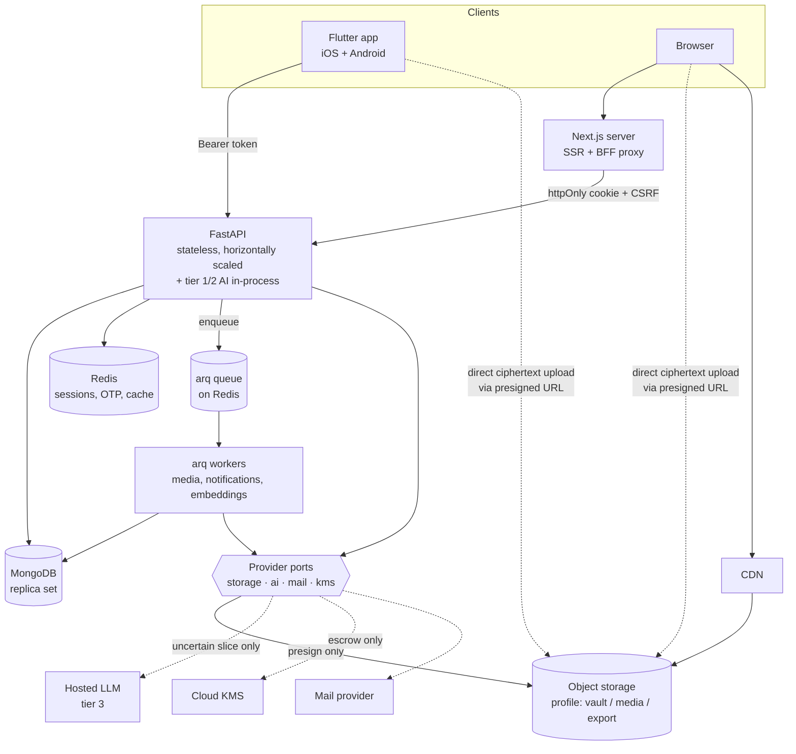

# 01 — Tech Stack

Every choice below is recorded as a decision with the reasoning, the alternatives that were rejected, and the condition under which we would revisit it. A decision without a revisit condition is dogma; we want engineering.

## Summary

| Layer | Choice | Version target |
|---|---|---|
| Mobile app | Flutter + Dart | Flutter 3.35+, Dart 3.9+ |
| Web app | Next.js App Router + TypeScript | Next 15+, TS 5.9+ |
| Web styling | Tailwind CSS (CSS-first, no JS config) | v4+ |
| Backend API | Python + FastAPI | Python 3.13, FastAPI 0.135+ |
| Media workers | Python + arq (Redis queue) | — |
| Primary database | MongoDB | 7+ |
| Cache / ephemeral state | Redis | 7+ |
| Object storage | S3-compatible, Cloudflare R2 by default | — |
| AI — tier 1 / 2 | In-process rules + ONNX Runtime (local, free) | onnxruntime 1.20+ |
| AI — tier 3 | Hosted LLM behind a port, Claude Haiku by default | — |
| Key management | Cloud KMS (envelope encryption for escrow only) | — |
| Package managers | `uv` (Python), `pnpm` (web), `pub` (Flutter) | — |

Four of these — object storage, AI, mail, and KMS — are reached through **provider ports** (Decision 10) rather than being imported directly. Any of them can be swapped by changing an environment variable.

---

## Decision 1 — Backend: Python + FastAPI, not Go

**Chosen: FastAPI.**

### Why

**Conventions transfer at zero cost.** The svakosh backend is already FastAPI, and its conventions are good ones worth keeping: vertical feature slices, a uniform `{success, message, data}` envelope, `Annotated` dependency-injection aliases, opaque rotating refresh tokens with family-based reuse detection, cross-cutting concerns as opt-in dependencies rather than middleware. Rebuilding all of that in Go means re-deriving decisions that are already made and already debugged. That is weeks of work whose output is a system that behaves identically.

**The AI surface is Python-native.** STORY is not incidentally AI-flavoured; recommendation is a listed v1 feature. Community matching, interest embeddings, avatar generation, and content risk signalling all live in an ecosystem — `sentence-transformers`, `numpy`, provider SDKs, vector clients — where Python is the first-class citizen and Go is a second-class binding. Putting the API in Go guarantees a Python sidecar exists anyway, which means two runtimes, two deploy pipelines, and a network hop on the hot recommendation path.

**"Lightning fast" is not a language property at this workload.** STORY's request profile is I/O-bound: read a feed from MongoDB, check a Redis cache, write a comment. In that profile, request latency is dominated by database round-trips and network, not by interpreter overhead. FastAPI on `uvloop` with `httptools` handles tens of thousands of concurrent connections per instance and comfortably serves millions of requests per day. The things that make a social feed feel fast are index design, denormalization, cache hit rate, and payload size — all language-agnostic. Choosing Go would improve the least significant term in the latency equation.

**The genuinely CPU-bound work does not belong in the API process regardless of language.** Video transcoding, image thumbnailing, EXIF stripping, and malware scanning are not request-path operations. They belong behind a queue in a separate worker service, which is where they are going (see Decision 6). That architectural split — not the language — is what keeps the API responsive.

### Rejected: Go

Go would be the right call if the bottleneck were CPU-bound request handling, if we needed sub-millisecond p99 on a compute-heavy path, or if we had no existing Python conventions to inherit. None of those hold. The concrete costs of choosing it: no reuse of the svakosh auth layer, a mandatory Python sidecar for AI, a smaller pool of MongoDB/Motor-equivalent maturity, and slower iteration on a product whose data model will churn heavily through MVP.

### Revisit if

- A profiled endpoint is CPU-bound in Python and cannot be moved to a worker.
- Per-instance memory or connection cost becomes the dominant infrastructure line item.
- The media worker outgrows Python's ergonomics — in which case **rewrite the worker in Go and leave the API alone.** That is a contained, low-risk change, and it is the intended escape hatch.

---

## Decision 2 — Web: Next.js, not Flutter Web

**Chosen: Next.js 15 App Router + TypeScript.**

### Why

**Public stories must be real HTML.** A meaningful share of STORY's growth comes from a public story being linked, previewed in a chat app, and indexed by a search engine. Flutter Web renders to a canvas; there is no document for a crawler to read, no text for a link preview to extract, no headings for a screen reader to navigate. This is not a tuning problem, it is the rendering model.

**Payload and startup.** Flutter Web's CanvasKit renderer ships roughly 1.5–2 MB of WebAssembly and JavaScript before the first pixel. Next.js ships server-rendered HTML with progressive hydration. For a text-reading product on a mid-range Android over 4G, that difference is the entire first-impression.

**Text is the product.** P7 in [00-product-overview.md](00-product-overview.md) makes written prose the core content type. Native text selection, browser find-in-page, OS-level text scaling, copy-paste, and reader modes all work by default in the DOM and all break or degrade on canvas. A long-form reading platform that cannot be text-selected is broken.

**Tailwind v4's CSS-first theming maps directly onto our token contract.** Tailwind v4 has no JavaScript config; themes are declared as CSS custom properties inside `@theme inline`. That is exactly the two-layer structure described in [03-design-tokens.md](03-design-tokens.md), so the generated `tokens.css` drops straight in with no adapter.

### Rejected: Flutter Web

The single argument for Flutter Web is code reuse with the mobile app. In practice that reuse is smaller than it looks: mobile and web share the *design system* and the *API contract*, not the layout code — a phone feed and a desktop three-column layout are different widget trees either way. We capture the real reuse (tokens, icons, API types, business rules) through generated artifacts, and pay nothing for the parts that were never going to be shared.

### Rejected: SvelteKit

SvelteKit is genuinely the better *authoring* experience — smaller runtime, less ceremony, no hook rules, and its `+page.server.ts` model maps onto a BFF as cleanly as Next's route handlers do. It loses on three counts specific to this project, none of them about the framework's quality:

1. **The team's existing conventions are the reference project's,** and the colocation rule in [02](02-repo-structure-and-conventions.md) (`_components`, `_lib`, `_assets`) is transplanted from it. Next's App Router honours the `_` prefix identically, so the convention ports with zero translation.
2. **Ecosystem depth on the two things that will hurt.** A WASM Argon2id worker and streaming WebCrypto for the browser vault are both fiddly; React has more prior art to copy from when they break at 2am.
3. **Hiring and continuity.** For a solo or small team building something that has to outlive the initial burst of enthusiasm, the larger pool is worth more than the nicer syntax.

Revisit if the web app is still unstarted when Phase 9 begins and none of the three reasons still hold — the API contract and the token file are framework-agnostic by construction, so this decision is genuinely reversible until the first component is written.

### Rejected: plain React SPA (Vite)

Fails the same test Flutter Web fails: no server-rendered HTML means no link previews and no indexable public story pages, which is the single reason the web app exists at all.

### Revisit if

- The web app becomes an authenticated-only tool with no public surface and no SEO requirement, and team capacity makes a single Dart codebase decisively cheaper.

---

## Decision 3 — Mobile: Flutter

**Chosen: Flutter,** as specified. Confirmed as a good fit for reasons worth recording.

Single codebase for iOS and Android with genuinely native-feeling performance; complete control over rendering, which matters because STORY's visual identity is custom rather than platform-default; and a strong crypto story — `cryptography`, `argon2`, and platform keychain access via `flutter_secure_storage` — which is non-negotiable given that vault encryption happens on-device.

### Supporting library decisions

| Concern | Choice | Why |
|---|---|---|
| State management | **Riverpod** (`flutter_riverpod` + `riverpod_annotation`) | Compile-time safe, no `BuildContext` dependency for reads, trivially testable, first-class async state. Preferred over BLoC: less ceremony per feature, and our state is mostly server-cache-shaped rather than event-stream-shaped. |
| Routing | **go_router** | Declarative, deep-link native, typed routes via codegen, redirect guards that map cleanly onto our auth gate. |
| HTTP | **dio** | Interceptors are what we need for the token-refresh-and-retry pattern, plus upload/download progress for the vault and request cancellation. |
| Secure storage | **flutter_secure_storage** | iOS Keychain and Android Keystore. Holds the unwrapped UMK and refresh token. Never `SharedPreferences` for secrets. |
| Non-secret prefs | **shared_preferences** | Theme selection, onboarding flags, feed position. |
| Local cache | **drift** (SQLite) | Typed, migratable, supports the offline story cache and vault metadata index. Chosen over Isar for schema-migration maturity. |
| Crypto | **cryptography** + **argon2** | AES-GCM, HKDF, and Argon2id. See [05-security-and-crypto.md](05-security-and-crypto.md). |
| Vector graphics | **flutter_svg** | Renders the generated icon set. |
| Remote images | **cached_network_image** | Backs the single `AppNetworkImage` widget. |
| Codegen | **build_runner**, **freezed**, **json_serializable** | Immutable models, sealed unions for the `Result` type, JSON boundaries. |
| Lints | **very_good_analysis** + custom rules | Strict baseline plus the no-raw-values rules from [03-design-tokens.md](03-design-tokens.md). |
| Testing | **flutter_test**, **mocktail**, **patrol** | Unit, widget, and integration. |

---

## Decision 4 — Primary database: MongoDB

**Chosen: MongoDB 7+ with Motor (async driver).**

### Why

The data is document-shaped. A Story with embedded media references and denormalized author metadata, a vault item with its wrapped key material and label index, a user with nested key and preference sub-documents — these are aggregates that are read and written whole. Modelling them relationally means five joins to render one feed card.

It also matches the existing idiom, so the Mongo access patterns from svakosh — explicit projections on every query, `updated_at` set in the same `$set`, conditional filters for idempotent writes, branching on `modified_count`/`matched_count` to distinguish 404 from 409 — carry over directly.

### What we are fixing from the reference

Svakosh defines **zero indexes in code**; they were provisioned out of band, which means a fresh environment silently runs full collection scans. STORY declares every index in a startup migration that runs on boot and is idempotent. See [07-data-model.md](07-data-model.md).

### Revisit if

Relational integrity across collections becomes a recurring source of bugs, or an analytics workload emerges that wants SQL — in which case add a read replica pipeline into a columnar store rather than migrating the transactional store.

---

## Decision 5 — Cache and ephemeral state: Redis

**Chosen: Redis 7+ with `redis[hiredis]`.**

Redis is the sole store for everything that has a TTL and must not survive a restart in a way that matters:

| Purpose | Key namespace | TTL |
|---|---|---|
| Refresh token records | `ST:RT:<hash>` | Refresh TTL |
| Refresh token families | `ST:RT_FAMILY:<family_id>` | Refresh TTL |
| Rotated-token tombstones (reuse detection) | `ST:RT_REVOKED_HASH:<hash>` | Refresh TTL |
| Access token denylist | `ST:JWT_DENY:<jti>` | Remaining token life |
| Session index per user | `ST:USER_SESSIONS:<user_id>` | Refresh TTL |
| Email OTP | `ST:OTP:<email_hash>` | Lockout window |
| OTP resend cooldown | `ST:OTP_CD:<email_hash>` | Cooldown |
| Rate limit counters | `ST:RL:<scope>:<ident>` | Window |
| Reveal one-time codes | `ST:REVEAL_OTC:<ticket_id>` | 10 min |
| Feed cache | `ST:FEED:<user_id>:<cursor>` | 60 s |

All keys are built by named functions under the single `ST:` prefix — never inline f-strings. This is inherited from svakosh and it is the reason key naming there never drifted.

---

## Decision 6 — Object storage: S3-compatible, Cloudflare R2 by default

**Chosen: the S3 API as the interface, Cloudflare R2 as the default implementation** (via `aioboto3`), behind the `StoragePort` from Decision 10.

### Why the API and not the vendor

The vault is a media store; users re-download their own photos and videos repeatedly. Egress is therefore the line item that grows without bound and has no relationship to revenue, and it is the reason a vendor choice made today can become the reason the product dies in eighteen months. Committing to the *protocol* rather than the *provider* means that number can be renegotiated at any time by changing four environment variables.

### Provider comparison, as of the current pricing

| Provider | Free tier | Storage | Egress | Notes |
|---|---|---|---|---|
| **Cloudflare R2** | 10 GB storage, 1M class-A ops, 10M class-B ops per month | ~$0.015/GB/mo | **$0** | The default. Free egress is decisive for a re-download-heavy vault. |
| **Backblaze B2** | 10 GB storage | ~$0.006/GB/mo | Free up to 3× stored bytes/month, then billed | Cheapest at rest. The best fallback, and a genuine second home. |
| **Hetzner Object Storage** | — | ~€0.005/GB/mo incl. 1 TB traffic | Included | Cheapest overall in the EU if data residency is acceptable. |
| **AWS S3** | 5 GB, 12 months | ~$0.023/GB/mo | **~$0.09/GB** | Rejected as a default purely on egress. Supported by the same adapter. |
| **MinIO** | Self-hosted | Your disk | Your bandwidth | The local-development stand-in. Identical code path. |
| **Cloudinary** | 25 credits/month | — | — | **Wrong tool for the vault.** Its value is transformation and optimization of images it can *read*; vault objects are AES-GCM ciphertext with no filename and no MIME type, so every feature it charges for is inapplicable. Viable only for public story images, and R2 behind a CDN already covers that at lower cost. |

**Recommendation: start on R2's free tier, keep the B2 adapter in the repo and exercised in CI.** The second adapter is not speculative work — it is the thing that makes the first choice safe to make quickly.

### Storage profiles

The vault and public story images have opposite requirements — one must never be publicly reachable, the other must be CDN-cached and hot. So storage is configured as **named profiles**, each independently pointed at a provider:

```bash
STORAGE_PROFILE_VAULT=r2            # private, no public access, presigned only
STORAGE_PROFILE_MEDIA=r2            # public story images, CDN in front
STORAGE_PROFILE_EXPORT=b2           # data exports; cold, cheap, short-lived
```

This is what satisfies the requirement that different classes of data can live on different infrastructure. Moving the vault to B2 while leaving story images on R2 is one variable. The code never names a provider — it names a profile.

### How it is used

- **Client uploads directly via presigned PUT URLs.** Ciphertext never transits the API server. This keeps the API stateless and cheap, and it reinforces that the server is not in the decryption path.
- **Downloads via presigned GET URLs** with short expiry (5 minutes), issued only after the vault item's access check passes.
- **Objects are opaque.** Key format `vault/<user_id>/<item_id>` with no filename, no extension, no content type that reveals anything. The real filename lives encrypted in the item's metadata.
- Vault buckets are private with no public access, ever. Public story images live in a separate profile behind a CDN.

### Revisit if

Stored bytes exceed a few TB, at which point Hetzner or B2 at rest with R2 in front as a cache is worth pricing. The migration is a copy job plus a profile variable, because objects are addressed by key and nothing else — no provider-specific URL is ever persisted in the database.

---

## Decision 7 — Background jobs: arq

**Chosen: arq** (async Redis-backed task queue).

The API process must never do slow work. Anything that is not a database read/write goes on the queue:

| Job | Trigger |
|---|---|
| Image thumbnail + EXIF strip | Story image upload confirmed |
| Video transcode to streaming ladder | Vault video upload confirmed (public story videos are out of scope) |
| Malware scan | Any upload confirmed |
| Scheduled story publish | Cron sweep every minute |
| Interest embedding refresh | User interests changed, or nightly |
| Community recommendation recompute | Nightly per active user |
| Notification fan-out | Story published, comment created |
| Audit log integrity chain verification | Nightly |
| Orphaned object reaping | Nightly |

**Why arq over Celery:** natively async, so it shares the same `async def` code, the same Motor client, and the same Redis connection idioms as the API. Celery's async support is bolted on and its configuration surface is disproportionate to our needs. Redis is already a hard dependency, so arq adds no new infrastructure.

**This worker service is the designated home for a future Go rewrite** if media processing throughput ever becomes the bottleneck (Decision 1's revisit clause).

---

## Decision 8 — Key management: Cloud KMS, for escrow only

A KMS master key is used for exactly two things:

1. Encrypting escrowed vault passcodes so a super_admin can release them through an audited ticket.
2. Encrypting optional user emails at rest, alongside a keyed HMAC blind index.

It is deliberately **not** used for vault file content. Vault DEKs are wrapped by keys derived from user secrets, which is what makes the platform structurally unable to decrypt vault files. Routing them through KMS would hand us the ability we are promising not to have.

The KMS key is not reachable from the API service role. Escrow decryption is a separate, narrowly-scoped service path invoked only by an approved reveal.

---

## Decision 9 — AI runtime: a three-tier cascade, mostly local

**Chosen: deterministic rules → local ONNX classifier → hosted LLM, in that order,** with the hosted tier reached only for content the first two could not resolve confidently. Full specification in [12-ai-layer.md](12-ai-layer.md); this entry records why the runtime is shaped this way.

### Why not "just call an LLM on every story"

Three reasons, in order of severity.

**It puts a vendor on the publish path.** Publishing is the product's core action. If every publish requires a third-party API call, then that vendor's incident is our outage, and their latency is our latency. The cascade means a Tier 3 failure degrades to more items in the review queue rather than a broken app.

**Cost scales with the wrong quantity.** Per-story inference scales with total volume. The cascade scales with the *ambiguous* slice, which is the minority and does not grow proportionally with traffic — a viral day costs almost nothing extra.

**Latency.** A publish button that waits 2–4 seconds on a network round trip feels broken. Tiers 1 and 2 are in-process and resolve most content in tens of milliseconds; the p95 budget of 900 ms in [12](12-ai-layer.md) is only achievable because most requests never leave the box.

### Why Python is now load-bearing, not merely convenient

Decision 1 argued FastAPI partly on the AI surface being Python-native. With the sanity layer promoted to a v1 pillar, that argument strengthens considerably: `onnxruntime`, tokenizers, embedding models, and every provider SDK are first-class in Python and second-class or absent in Go. A Go API would now require a Python sidecar **on the request-blocking publish path**, not merely on a nightly job — two runtimes, two deploy pipelines, and a network hop inside the 900 ms budget.

### Model choices

| Job | Model | Where |
|---|---|---|
| Rules, blocklists, identifier regexes | None — plain Python | In-process |
| Content classification (tier 2) | A small quantized text classifier, ONNX | In-process, CPU |
| Sentence embeddings | A small multilingual embedding model, ONNX | In-process, CPU |
| Ambiguous classification (tier 3) | Claude Haiku by default | Hosted, behind `AIPort` |
| Appeal-assistance summaries for moderators | Claude Sonnet | Hosted, off the request path |

Embeddings are deliberately local and therefore free — they are the highest-volume AI operation in the system (every public story, every interest, every nightly recompute) and paying per token for them would be the largest and least justifiable line in the bill.

### Revisit if

Golden-set accuracy at Tier 2 cannot reach the thresholds in [12](12-ai-layer.md) §10, in which case raise the share routed to Tier 3 and accept the cost — safety thresholds are not negotiable against budget.

---

## Decision 10 — Provider ports: nothing is welded to a vendor

**Chosen: four narrow ports, one adapter per vendor, selected by configuration.** This is P9 from [00](00-product-overview.md) expressed as architecture.

### The ports

| Port | Methods | Adapters |
|---|---|---|
| `StoragePort` | `presign_put`, `presign_get`, `head`, `delete`, `key_for` | `S3CompatAdapter` (covers R2, B2, S3, MinIO, Hetzner), `LocalDiskAdapter` for tests |
| `AIPort` | `classify`, `embed`, `extract_identifiers` | `Rules`, `LocalOnnx`, `Anthropic`, `OpenAICompat`, `Null` |
| `MailPort` | `send_otp`, `send_security_alert` | `Resend`, `SES`, `SMTP`, `Console` |
| `KmsPort` | `encrypt`, `decrypt`, `key_id` | `CloudKms`, `LocalKeyfile` for development |

```
backend/app/
├── ports/
│   ├── storage.py          Protocol + Profile resolution
│   ├── ai.py               Protocol + Judgement types
│   ├── mail.py
│   └── kms.py
└── adapters/
    ├── storage_s3.py
    ├── ai_local.py
    ├── ai_anthropic.py
    ├── mail_resend.py
    └── kms_cloud.py
```

### The rules that make this actually work

1. **No vendor SDK is imported outside `adapters/`.** A CI grep enforces it — `aioboto3`, `anthropic`, and any mail SDK appearing anywhere else fails the build. Without this check, the abstraction leaks within a month and the port becomes decorative.
2. **A port is chosen by configuration, resolved once at startup, and injected.** No `if provider == "r2"` anywhere in a controller.
3. **Every adapter passes the same contract test suite.** A new adapter is not "done" because it compiles; it is done when it passes the tests the previous adapter passed. This is what makes a swap safe rather than merely possible.
4. **Ports are narrow on purpose.** `StoragePort` has five methods, `AIPort` has three. A port with twenty methods is a vendor SDK wearing a costume, and the twenty-first method will be the one only one vendor supports.
5. **No vendor-specific value is ever persisted.** The database stores an object *key* and a profile name, never a URL, a region, or a bucket host. This is what makes a provider migration a copy job rather than a data migration.

### What this deliberately does not include

No generic "cloud abstraction layer", no plugin registry, no dynamic loading, no configuration DSL. Four Protocols, a handful of adapter files, and a factory function that reads settings. The entire mechanism is under 200 lines. **The moment it needs a diagram to explain, it has failed** — the goal is the ability to change vendors cheaply, not a framework.

---

## Backend dependency list

Managed with **uv**. `uv add` / `uv remove` only — never `pip install`. `pyproject.toml` and `uv.lock` are committed together in the same commit.

```toml
[project]
requires-python = ">=3.13"
dependencies = [
    # Web framework
    "fastapi>=0.135.1",
    "uvicorn[standard]>=0.42.0",       # includes uvloop + httptools
    "python-multipart>=0.0.20",
    # Data
    "motor>=3.6",                       # async MongoDB
    "redis[hiredis]>=5.0",
    "pydantic>=2.12",
    "pydantic-settings>=2.13.1",
    # Auth & crypto
    "argon2-cffi>=25.1.0",              # password + passcode hashing, KDF
    "pyjwt>=2.12.1",
    "cryptography>=49.0.0",             # AES-GCM, HKDF
    # Storage & jobs
    "aioboto3>=15.0.0",                 # S3-compatible: R2, B2, MinIO — adapters/ only
    "arq>=0.27",
    # AI — tiers 1 and 2 are local and mandatory
    "onnxruntime>=1.20",                # local classifier + embeddings, CPU
    "tokenizers>=0.21",
    "numpy>=2.1",                       # vector math for recommendations
    "pyyaml>=6.0",                      # rubric files
    # Media
    "pillow>=11.0",
    # Observability
    "structlog>=25.0",
    "sentry-sdk[fastapi]>=2.0",
    # Utilities
    "python-ulid>=3.0",
    "httpx>=0.28.1",
]

[project.optional-dependencies]
# Tier 3 providers. Installed per environment, never both, never required.
anthropic = ["anthropic>=0.40"]
openai_compat = ["openai>=1.60"]

[dependency-groups]
dev = [
    "ruff>=0.14",
    "pytest>=8.4",
    "pytest-asyncio>=1.0",
    "mongomock-motor>=0.0.36",
    "fakeredis>=2.26",
]
```

Notes on what is deliberately absent: no `python-dotenv` (pydantic-settings reads `.env` natively — svakosh carried it redundantly), no ORM, no `celery`, no LangChain or any agent framework (the AI surface is three method calls behind a Protocol — a framework here would add a dependency graph larger than the feature). Every declared dependency must be imported somewhere; a CI check enforces this, because svakosh accumulated three unused declarations.

**Tier 3 provider SDKs are optional extras**, so a deployment that runs with `AI_TIER3_ENABLED=false` — which is a fully functional, fully safe configuration — installs neither of them.

Type checking is **ruff** for lint/format plus **Pyright** in strict mode via `pyrightconfig.json`. Unlike the reference, ruff runs in CI, not only in the editor.

## Web dependency list

Managed with **pnpm**.

```jsonc
{
  "dependencies": {
    "next": "^15.5.0",
    "react": "^19.2.0",
    "react-dom": "^19.2.0",
    "tailwind-merge": "^3.5.0",
    "zod": "^4.0.0"
  },
  "devDependencies": {
    "@tailwindcss/postcss": "^4.1.0",
    "tailwindcss": "^4.1.0",
    "typescript": "^5.9.0",
    "eslint": "^9.0.0",
    "eslint-config-next": "^15.5.0",
    "eslint-config-prettier": "^10.0.0",
    "prettier": "^3.6.0",
    "prettier-plugin-tailwindcss": "^0.6.0",
    "husky": "^9.1.0",
    "lint-staged": "^16.0.0",
    "vitest": "^3.0.0",
    "@playwright/test": "^1.50.0"
  }
}
```

Runtime dependencies are kept deliberately small — the same discipline svakosh applied with three runtime deps. No component library (we build our own per [04-component-library.md](04-component-library.md)), no state library (server components plus URL state), no HTTP client (native `fetch`), no icon package (generated from our own SVG sources). `eslint-config-prettier` is actually wired into the config array, which the reference declared but never connected.

---

## Infrastructure topology



Four properties of this topology matter:

**The API is stateless.** All session state lives in Redis, so instances scale horizontally with no affinity and no sticky sessions.

**Ciphertext bypasses the API.** Clients upload and download vault content directly against R2 using short-lived presigned URLs. The API authorizes but never handles vault bytes, which both removes a bandwidth bottleneck and structurally removes the server from the plaintext path.

**Two auth transports, one auth system.** The browser uses httpOnly cookies plus a double-submit CSRF token, proxied through the Next.js server so tokens are never exposed to client JavaScript. The Flutter app uses `Authorization: Bearer` with the refresh token in the platform keychain. The backend reads the cookie first and falls back to the header — one code path, both clients. See [08-api-contract.md](08-api-contract.md).

**Every external vendor sits behind one box.** Storage, the hosted model, mail, and KMS are all reached through the ports of Decision 10. Nothing else in the diagram knows which vendor is on the other side, which is why the right-hand column can be replaced without redrawing the left.

## Environments

| Environment | Purpose | Notes |
|---|---|---|
| `local` | Development | `docker compose` brings up MongoDB, Redis, and MinIO (R2 stand-in). API runs with reload. |
| `staging` | Pre-production verification | Production topology at minimum scale. Seeded with synthetic data only — never a production dump, since even encrypted vault ciphertext should not be copied. |
| `production` | Live | Multi-instance API, MongoDB replica set, managed Redis with persistence, R2, real KMS. |

Environment is selected by a single `API_ENV` variable. Secrets come from the platform's secret manager, never from a committed file. A `.env.example` listing every required key with placeholder values is committed and kept in sync by a CI check — svakosh whitelisted this file in `.gitignore` but never created it, so new contributors had no template.
