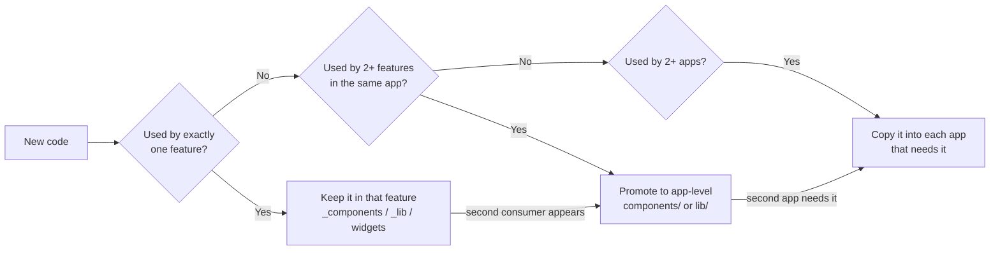

# 02 — Repository Structure & Conventions

The single organizing idea in this repository: **code lives as close as possible to the only thing that uses it, and moves outward only when a second thing needs it.** Everything below is a consequence of that rule.

## 1. Monorepo layout

```
story/
├── backend/                  FastAPI API + workers
│   ├── Dockerfile            The deployed image
│   ├── docker-compose.yml    Deploy stack: API + MongoDB + Redis
│   ├── docker-compose.dev.yml    Local MongoDB + Redis only
│   ├── Makefile
│   └── .env.example
├── app/                      Flutter mobile app
│   └── Makefile
├── web/                      Next.js, users, :3100
├── admin/                    Next.js, staff, :3200
├── docs/                     This documentation set
└── README.md
```

**Every project is self-contained.** A project owns its `Makefile`, its `.gitignore`, its container files, its `.env.example`, its dependency manifest and its own generated assets. The repository root carries no configuration at all — no root `Makefile`, no root compose file, no root `.gitignore`, no shared `packages/` or `tools/` directory. Anything a project needs lives inside that project, even where that means the same file exists twice.

**There is no root `.gitignore`.** Each project ignores its own build output, caches and `.env`. `docs/` has no `.gitignore` because it produces nothing — it is markdown and only markdown. Junk that lands at the repository root itself, or in `docs/`, is excluded per clone through `.git/info/exclude`; a pattern there without a slash matches at any depth, so one `.DS_Store` line covers the whole tree. The tradeoff: that exclusion is local and is not shared with other clones. On a fresh clone, run `printf '.DS_Store\n' >> .git/info/exclude`.

**Why, given the obvious cost.** A root-level shared directory couples every project to the root and to each other: `web` cannot be deployed, copied or handed to someone without dragging `packages/` and `tools/` along, and a change to a shared script silently alters three consumers at once. Duplication is the cheaper failure. Two copies of a 60-line token file that drift are a diff anyone can read; a shared build graph that nobody can trace is not. The tradeoff is accepted deliberately: **web and admin can drift, and keeping them aligned is a review responsibility, not a build guarantee.**

**Each project uses its own ecosystem's task runner.** `backend/` and `app/` carry a `Makefile` — `make help` lists that project's targets. `web/` and `admin/` use `package.json` scripts, because a Makefile in a Next.js project is a foreign object. The verbs line up regardless: `setup`/`install`, `dev`, `check`, `build`.

**Where cross-project work lives.** Two tasks genuinely span projects. `app`'s `make e2e` boots the API from `../backend`, waits for `/v1/health/ready`, runs the Flutter suite against it and tears it down; it lives in `app/` because the suite being run is the app's. Nothing else reaches across a project boundary.

## 2. `backend/` — FastAPI

```
backend/
├── app/
│   ├── main.py                     App instance, lifespan, middleware, router mounting
│   ├── config.py                   Settings (pydantic-settings) + get_settings()
│   ├── responses.py                ok_response / err_response envelope
│   ├── error_handlers.py           register_exception_handlers(app)
│   ├── logging.py                  structlog configuration + redaction processor
│   ├── db/
│   │   ├── mongo.py                Client lifecycle, MongoDatabase DI alias
│   │   ├── redis.py                Client lifecycle, RedisClient DI alias
│   │   ├── indexes.py              Every index declaration, applied on boot
│   │   └── keys.py                 Every Redis key builder function
│   ├── core/
│   │   ├── security.py             Password/passcode hashing, JWT, token families
│   │   ├── crypto.py               AES-GCM, HKDF, blind index, KMS envelope
│   │   ├── deps.py                 CurrentClaims, require_role, csrf_protect, rate_limit
│   │   ├── ids.py                  ULID generation with typed prefixes
│   │   └── errors.py               Error code catalogue
│   ├── ports/                      Vendor-neutral Protocols — see 01 Decision 10
│   │   ├── storage.py              StoragePort + profile resolution
│   │   ├── ai.py                   AIPort + Judgement types
│   │   ├── mail.py                 MailPort
│   │   ├── kms.py                  KmsPort
│   │   └── factory.py              Config → adapter, resolved once at startup
│   ├── adapters/                   THE ONLY PLACE A VENDOR SDK MAY BE IMPORTED
│   │   ├── storage_s3.py           R2, B2, S3, MinIO, Hetzner
│   │   ├── storage_local.py
│   │   ├── ai_rules.py             Tier 1
│   │   ├── ai_local.py             Tier 2 — ONNX
│   │   ├── ai_anthropic.py         Tier 3
│   │   ├── ai_openai_compat.py     Tier 3 alternative
│   │   ├── mail_resend.py
│   │   └── kms_cloud.py
│   ├── ai/                         The sanity layer itself — see 12
│   │   ├── cascade.py              Tier orchestration and the verdict merge
│   │   ├── checks.py               safety / fit / exposure / care
│   │   ├── rubrics/*.yaml          Versioned rule sets and prompt fragments
│   │   └── models/                 Downloaded ONNX artifacts (gitignored)
│   ├── api/
│   │   ├── router.py               Mounts every feature router under API_PREFIX
│   │   └── endpoints/
│   │       ├── health/
│   │       ├── auth/
│   │       ├── users/
│   │       ├── communities/
│   │       ├── connections/
│   │       ├── stories/
│   │       ├── comments/
│   │       ├── moderation/
│   │       ├── vault/
│   │       ├── tickets/
│   │       ├── notifications/
│   │       └── admin/
│   └── workers/
│       ├── settings.py             arq WorkerSettings
│       ├── media.py
│       ├── notifications.py
│       ├── recommendations.py
│       ├── embeddings.py
│       └── maintenance.py
├── tests/
│   ├── conftest.py
│   └── <feature>/
├── pyproject.toml
├── uv.lock
├── pyrightconfig.json
├── Dockerfile
├── .env.example
└── README.md
```

### The feature-slice quintet

Every folder under `api/endpoints/` contains at most these five files, each with a fixed and non-negotiable role:

| File | Role | Must not |
|---|---|---|
| `router.py` | `APIRouter`, paths, status codes, dependency lists, envelope wrapping | Contain business logic or touch the database |
| `controllers.py` | All business logic and all database access. Returns plain dicts/lists | Import `ok_response` or know about HTTP shape beyond raising `HTTPException` |
| `models.py` | Pydantic request models and feature-local types | Define response envelopes |
| `utils.py` | Pure, stateless helpers for this feature | Reach into another feature |
| `constants.py` | Collection names, limits, static data | Hold anything configurable (that belongs in `config.py`) |

The file is named `router.py` in every feature. Svakosh used `routes.py` for auth and `router.py` elsewhere; that inconsistency is not carried over. Every feature folder has an `__init__.py` — auth in the reference did not, and it worked only by accident of namespace packages.

### Layer discipline

**Thin routers, fat controllers.** This is the reference's pattern and it is kept, with one addition: controllers must not accept `Request` or `Response` unless they genuinely need cookies or client IP, and infrastructure arguments are keyword-only. That makes controller signatures self-documenting and testable.

```python
# router.py — the canonical shape
@router.post("/stories", status_code=status.HTTP_201_CREATED,
             dependencies=[Depends(csrf_protect), Depends(rate_limit(20, 60))])
async def create_story(body: CreateStoryRequest, claims: CurrentClaims, mongo: MongoDatabase):
    data = await controllers.create_story(body, claims=claims, mongo=mongo)
    return ok_response("Story saved as draft.", data=data)
```

**What we add that the reference lacked: a repository seam for the two collections that matter.** Svakosh's controllers call Motor directly, which makes them untestable without a live MongoDB. That is acceptable for simple CRUD, and we keep it for most features. But `vault` and `audit_logs` get a thin repository module (`repository.py`, a sixth permitted file in those two slices only) because their correctness is security-critical and must be unit-testable in isolation. Everywhere else, direct Motor access in the controller is correct and idiomatic.

## 3. `app/` — Flutter

```
app/
├── lib/
│   ├── main.dart
│   ├── app.dart                     Root widget, theme + router wiring
│   ├── core/
│   │   ├── result.dart              Result<T> sealed union (never-throw contract)
│   │   ├── api/
│   │   │   ├── api_client.dart       dio instance, interceptors, refresh-and-retry
│   │   │   └── endpoints.dart        Every path string, one place
│   │   ├── crypto/
│   │   │   ├── key_manager.dart      UMK lifecycle, KEK derivation
│   │   │   └── vault_cipher.dart     Per-file encrypt/decrypt streams
│   │   ├── storage/
│   │   │   ├── secure_store.dart     Keychain/Keystore wrapper
│   │   │   ├── prefs.dart            Non-secret preferences
│   │   │   └── cache_db.dart         drift database
│   │   ├── errors/
│   │   ├── utils/
│   │   └── constants/
│   ├── theme/
│   │   ├── tokens.g.dart            GENERATED — do not edit
│   │   ├── app_theme.dart           ThemeData assembly from tokens
│   │   ├── theme_controller.dart    Active theme + persistence
│   │   └── context_ext.dart         context.tokens accessor
│   ├── components/                  Shared design-system widgets only
│   │   ├── buttons/
│   │   ├── inputs/
│   │   ├── surfaces/                Card, Modal, Sheet
│   │   ├── feedback/                Toast, Loader, Skeleton, EmptyState
│   │   ├── navigation/              AppBar, BottomNav, Tabs
│   │   └── media/                   AppNetworkImage, AppIcon
│   ├── features/
│   │   ├── onboarding/
│   │   ├── feed/
│   │   ├── story/
│   │   ├── community/
│   │   ├── connection/
│   │   ├── vault/
│   │   ├── profile/
│   │   ├── settings/
│   │   └── tickets/
│   ├── routing/
│   │   ├── router.dart              go_router configuration
│   │   ├── routes.dart              Typed route constants
│   │   └── guards.dart              Auth + onboarding redirects
│   └── gen/
│       ├── icons.g.dart             GENERATED
│       └── assets.g.dart            GENERATED
├── assets/
│   ├── images/
│   └── fonts/
├── test/
├── integration_test/
├── analysis_options.yaml
└── pubspec.yaml
```

### Feature folder shape

Every feature under `features/` uses the same four-directory structure. This is the Flutter translation of the reference's `_components` / `_lib` colocation rule:

```
features/vault/
├── data/
│   ├── vault_repository.dart        API calls for this feature
│   └── vault_local_source.dart      drift queries for this feature
├── models/
│   ├── vault_item.dart              freezed models
│   └── vault_visibility.dart        Feature enums
├── providers/
│   ├── vault_list_provider.dart     Riverpod providers
│   └── vault_unlock_provider.dart
├── screens/
│   ├── vault_home_screen.dart       Routable screens
│   └── vault_item_screen.dart
└── widgets/
    ├── vault_tile.dart              Widgets used ONLY by this feature
    └── passcode_pad.dart
```

Mapping to the reference conventions: `widgets/` is `_components/`, `models/` + `data/` + `providers/` together are `_lib/`, and `screens/` are the `+page.svelte` equivalents.

## 4. `web/` — Next.js

```
web/
├── src/
│   ├── app/
│   │   ├── layout.tsx
│   │   ├── globals.css                Imports tokens.css, defines @theme inline
│   │   ├── (auth)/
│   │   │   ├── signin/
│   │   │   └── signup/
│   │   ├── (app)/                     Authenticated route group
│   │   │   ├── layout.tsx             Auth guard + chrome
│   │   │   ├── feed/
│   │   │   ├── story/[id]/
│   │   │   ├── communities/
│   │   │   ├── vault/
│   │   │   └── settings/
│   │   ├── s/[slug]/                  Public story pages — SSR, indexable
│   │   └── api/                       BFF proxy routes only
│   ├── components/                    Shared design-system components
│   ├── features/                      Cross-route feature modules
│   ├── lib/
│   │   ├── api/client.ts              apiCall + Result<T>
│   │   ├── server/backend.ts          Server-only backend fetch + refresh retry
│   │   ├── auth/cookies.ts            Cookie names, forwarding, safe redirect
│   │   ├── utils/cn.ts
│   │   └── config/
│   ├── styles/
│   │   └── tokens.css                 GENERATED — do not edit
│   └── gen/
│       └── icons/                     GENERATED
├── public/
├── eslint.config.js
├── .prettierrc
├── tsconfig.json
├── next.config.ts
└── package.json
```

### Route-local colocation

Next.js App Router ignores folders prefixed with `_`, exactly as SvelteKit does. The reference convention carries over unchanged:

```
src/app/(app)/vault/
├── page.tsx
├── _components/
│   ├── VaultGrid.tsx
│   └── PasscodeDialog.tsx
├── _lib/
│   ├── types.ts
│   ├── const.ts
│   ├── helper.ts
│   └── service.ts          Feature API calls wrapping apiCall
└── _assets/
    └── vault-empty.svg
```

What goes in `_lib`, by file — this is a closed list:

| File | Contents |
|---|---|
| `types.ts` | TypeScript types for this route's domain |
| `const.ts` | Static config: tab definitions, option lists, column definitions, limits |
| `helper.ts` | Pure functions: formatters, derivations, validators |
| `service.ts` | Feature API calls, each a one-line wrapper over `apiCall` |

## 5. The promotion rule

**Something becomes shared the moment a second consumer needs it, and not one moment sooner.**



Promotion preserves internal shape. A promoted feature folder keeps its `widgets` + `models` + `data` structure and only changes address — svakosh's `lib/components/watchlist/` is the model here, having kept its components, `service.ts`, and `types.ts` together after promotion.

**Do not pre-promote.** A component in `components/` that has one caller is a lie about its generality, and it will grow props for hypothetical cases that never arrive.

## 5a. Code style: what to follow, what not

These are binding on every language in the repository — Python, Dart, TypeScript.

### No comments. No docstrings.

**Source files contain code only.** No inline comments, no block comments, no docstrings, no section banners, no `TODO`, no commented-out code. The single exception is the generated-file banner in §7, which is machine-written.

The reasoning lives in these twelve documents, and it lives there because a comment and the code beside it drift apart the moment either is edited, and the reader has no way to tell which one is lying. A document is versioned, reviewed, and searched as a unit; a comment is not.

What replaces a comment:

| You were about to write | Write this instead |
|---|---|
| `# check if the user is blocked` | A function named `ensure_not_blocked()` |
| `# 900 = presign TTL in seconds` | A constant named `PRESIGN_UPLOAD_TTL_SECONDS = 900` |
| `# this is O(n²) but n is small` | A note in the relevant doc, and a test asserting the bound |
| `# noqa: S104` | A `per-file-ignores` entry in `pyproject.toml` |
| `// TODO: handle the empty case` | A failing test, or nothing |
| A docstring explaining why | A section in the doc that owns that decision |

If a piece of code genuinely cannot be understood without prose, that is a signal to rename or split it, not to annotate it. If the reasoning is architectural, it belongs in `docs/` and the PR that adds the code updates the doc in the same commit.

**Test names carry the intent.** `test_refresh_token_hash_does_not_reveal_the_token` needs no docstring; `test_hash_2` would need three. A test whose name does not say what it proves is misnamed.

### Follow

- **One response shape.** `{success, message, data}` on every backend response; `TResult` / `Result<T>` on every client call. No endpoint and no client call may invent a second shape.
- **Named constants over literals.** Every number and string with meaning gets a name in `constants.py` or `const.ts`.
- **Explicit projections.** Every Mongo read names the fields it wants.
- **Small, single-purpose functions.** A function that needs a comment to divide it into parts is two functions.
- **Errors as data.** One `ErrorCode` enum, one status and one sentence per code, defined together.
- **Custom components.** The design system is ours — see [04](04-component-library.md). A UI element gets built once, in one place, and reused.
- **Dates through one helper.** `utc_now()` on the backend, the equivalent on each client. See [07](07-data-model.md) §1.

### Do not

- **Do not add a package for something small.** Every dependency needs a reason that could not be met in under ~50 lines of our own code. Runtime dependency lists stay short by policy, not by accident ([01](01-tech-stack.md)).
- **Do not add a UI component library.** No Material-style kit on web, no `flutter_bloc`-adjacent widget packs, no icon packages — icons are generated from our own SVGs.
- **Do not use a raw value where a token exists.** No hex, no px, no ad-hoc `TextStyle`. Enforced by `design-guard`.
- **Do not build a second way to do something that already has one way.** A second date helper, a second HTTP wrapper, a second response envelope, or a second button component is a defect regardless of how good it is.
- **Do not leave dead code.** Delete it. Git remembers.
- **Do not silence a linter inline.** Configure the exception centrally so it is visible and countable.
- **Do not write production code without a failing test first.** See [11](11-mvp-roadmap.md) cross-phase practices.

## 6. Naming conventions

### Files and directories

| Context | Convention | Examples |
|---|---|---|
| Python modules | `snake_case.py` | `error_handlers.py`, `vault_repository.py` |
| Dart files | `snake_case.dart` | `vault_tile.dart`, `key_manager.dart` |
| Generated Dart | `*.g.dart` | `tokens.g.dart`, `icons.g.dart` |
| React components | `PascalCase.tsx` | `VaultGrid.tsx`, `StoryCard.tsx` |
| TS modules | `kebab-case.ts` | `backend-fetch.ts`, `safe-redirect.ts` |
| Single-word TS modules | lowercase | `client.ts`, `types.ts`, `const.ts` |
| Directories (all platforms) | `kebab-case` or `snake_case`, never mixed within a platform | `design-tokens/`, `vault_item/` |
| Route segments | `kebab-case` | `/settings/active-sessions` |
| Route-private folders | `_` prefix | `_components/`, `_lib/`, `_assets/` |
| Route groups | parentheses | `(app)`, `(auth)` |

### Code identifiers

| Thing | Convention | Examples |
|---|---|---|
| Python classes | `PascalCase` | `AccessClaims`, `VaultItem` |
| Python functions/vars | `snake_case` | `create_access_token`, `wrapped_dek` |
| Python constants | `SCREAMING_SNAKE_CASE` | `MAX_VAULT_ITEMS`, `OTP_TTL_SECONDS` |
| Dart classes | `PascalCase` | `VaultRepository`, `AppTokens` |
| Dart members | `camelCase` | `unlockVault`, `wrappedDek` |
| Dart constants | `camelCase` with `k`-free naming | `maxVaultItems` (not `kMaxVaultItems`) |
| TS cross-module types | `T` prefix + `PascalCase` | `TResult`, `TStoryVisibility`, `TVaultItem` |
| TS component-local types | bare `PascalCase` | `Props`, `Variant`, `Option` |
| TS constants | `SCREAMING_SNAKE_CASE` | `ACCESS_COOKIE`, `STORY_MAX_LENGTH` |
| Event handler functions | `handle` prefix | `handleClose`, `handleSubmit` |
| Callback props | `on` + `PascalCase` | `onClose`, `onSelect`, `onCheckedChange` |
| Boolean state props | `is` / `has` / `can` / `show` prefix | `isOpen`, `hasNote`, `canPublish`, `showClose` |

The `T`-prefix rule is stated as the reference *implied* but never wrote down: **`T` prefix for types crossing a module boundary, bare `PascalCase` for types local to one component.** Svakosh applied this to roughly 70% of its types by instinct; here it is a rule.

### The wire format rule

**Every field on the wire is `snake_case`.** The API is the contract, MongoDB documents are `snake_case`, and Python is `snake_case`, so the boundary conversion happens once, in the client:

- Flutter: `json_serializable` with `@JsonKey(name: 'wrapped_dek')` or a `FieldRename.snake` default, exposing `camelCase` Dart members.
- Web: hand-written types keep `snake_case` keys, matching the reference's practice of writing `snake_case` payload keys inline.

Never negotiate this per endpoint. One rule, no exceptions.

### Domain vocabulary

The glossary in [00-product-overview.md](00-product-overview.md) is binding on code. A Story is `story` in every collection name, route path, model class, and variable — never `post`, `entry`, or `confession`. A CI grep fails the build on banned synonyms in `backend/app/` and `app/lib/`.

## 7. Generated code

**There is none.** Every file in this repository is written by hand.

The design tokens were generated once, from a shared `tokens.json` through a Python script, into CSS for web and admin. That pipeline was removed: 127 lines of source produced 89 lines of output that was committed anyway and changed perhaps twice a year, and it put a Python dependency inside two Node projects. The three token files are now peers, each maintained by hand:

| File | Consumer |
|---|---|
| `app/lib/theme/tokens.dart` | Flutter |
| `web/src/styles/tokens.css` | Next.js, users |
| `admin/src/styles/tokens.css` | Next.js, staff |

The cost is real and is accepted: **nothing prevents the three drifting.** Changing one colour means editing three files, and within each CSS file every light-theme value appears twice — once under the explicit `[data-theme='paper']` selector, once under the `prefers-color-scheme` default. Six edits for one hex. Nothing warns you; this paragraph is the only record, and keeping the three aligned is a review responsibility.

The icon and API-type generators described in earlier drafts were never built. Icons come from Material's bundled set; API models are hand-written alongside their repositories.

**They are committed, not gitignored.** Committing means a fresh clone builds without running codegen, reviewers see the effect of a token change in the diff, and a drift between source and output is a visible conflict rather than a silent inconsistency. CI runs each generator and fails if `git diff --exit-code` is non-empty.

## 8. Git conventions

### Branches

`main` is always deployable. Work happens on `feat/<short-slug>`, `fix/<short-slug>`, or `chore/<short-slug>`. Squash merge into `main`; the PR title becomes the commit message.

### Commit prefixes

Carried forward from the reference, which followed them consistently:

| Prefix | Use when |
|---|---|
| `feat:` | New behavior a user or client can rely on |
| `fix:` | Bug fix, no new behavior |
| `refactor:` | Internal structure changed, external behavior identical |
| `perf:` | Performance work, same contract |
| `style:` | Formatting, logs, copy, OpenAPI text only |
| `docs:` | Documentation only |
| `test:` | Tests only |
| `chore:` | Dependencies, CI, tooling |

Scope is optional and is the feature slice: `feat(vault): add hidden item label search`.

### Rules

- `pyproject.toml` and `uv.lock` are committed in the same commit. Same for `package.json`/`pnpm-lock.yaml` and `pubspec.yaml`/`pubspec.lock`.
- A token change and its regenerated outputs are one commit.
- Never commit `.env`. `.env.example` is committed and must list every key the app reads.

## 9. Quality gates

### Local — pre-commit hook via husky + lint-staged

Fast checks only, so the hook stays under a couple of seconds:

| Pattern | Action |
|---|---|
| `backend/**/*.py` | `ruff check --fix`, `ruff format` |
| `web/**/*.{ts,tsx}` | `eslint --fix --max-warnings 0`, `prettier --write` |
| `app/**/*.dart` | `dart format`, `dart analyze --fatal-infos` on changed files |
| `**/*.{json,md,yml}` | `prettier --write` |

### CI — every pull request

| Job | Steps |
|---|---|
| `backend` | `uv sync --frozen` → `ruff check` → `ruff format --check` → `pyright` → `pytest` → unused-dependency check |
| `web` | `pnpm install --frozen-lockfile` → `tsc --noEmit` → `eslint --max-warnings 0` → `prettier --check` → `vitest run` → `next build` |
| `app` | `flutter pub get` → `dart format --set-exit-if-changed` → `flutter analyze --fatal-infos` → `flutter test` |
| `codegen-drift` | Run all four generators, fail if `git diff --exit-code` is dirty |
| `design-guard` | Fail on raw hex, raw px, raw `TextStyle`, raw `BoxShadow`, or non-token Tailwind arbitrary values outside token files ([03-design-tokens.md](03-design-tokens.md)) |
| `vocab-guard` | Fail on banned domain synonyms (`post`, `confession`, `archetype`) in source |
| `secret-guard` | Fail if `.env.example` is missing a key that `config.py` requires, or if a secret pattern appears in a diff |
| `port-guard` | Fail if a vendor SDK (`aioboto3`, `anthropic`, `openai`, any mail SDK) is imported outside `backend/app/adapters/`. This is what keeps [01](01-tech-stack.md) Decision 10 real rather than aspirational — without it the abstraction leaks within a month |
| `ai-eval` | Run the golden set from [12](12-ai-layer.md) §10. Fails on any threshold regression, and **hard-fails on a single false block in the emotional-distress slice** |
| `comment-guard` | Fail on any comment, docstring, or inline linter suppression in `backend/app/`, `app/lib/`, or `web/src/`, excluding generated-file banners (§5a) |

`ai-eval` runs on any change to `app/ai/**`, to a rubric file, or to a model or provider setting — and on nothing else, because it is the only slow job in the matrix.

`--max-warnings 0` throughout. A warning nobody must fix is a warning nobody will fix.

### Merge requirements

All CI jobs green, one approving review, branch up to date with `main`. No exceptions for "small" changes — the reference's CI ran only an import smoke test with an incomplete environment, and it was silently failing; gates that can pass while broken are worse than no gates.

## 10. Local development

There is no root `Makefile`. Work inside the project you are changing; `make help` lists that project's targets.

```bash
cd backend
make services-up   # mongod + redis natively, or: make docker-up for containers
make setup         # uv sync, copies .env.example → .env
make dev           # uvicorn with reload on :9000
make check         # ruff check + pytest (make format-check is separate)

cd app
make setup         # flutter pub get
make check         # flutter analyze + flutter test
make run           # on the connected device
make e2e           # boots ../backend on story_e2e, runs the full suite, tears down

cd web             # or: cd admin
pnpm install
cp .env.example .env
pnpm dev -p 3100   # 3200 for admin
```

Reference data — categories, communities and interests — seeds itself from `backend/app/db/seed.py` on every startup, so there is no seed command.

Each deployable owns its container files. The backend keeps `Dockerfile`, `docker-compose.yml` (the full deploy stack) and `docker-compose.dev.yml` (MongoDB and Redis only) inside `backend/`; the repository root carries no container configuration at all. `make services-up` runs MongoDB and Redis natively on macOS, so Docker is optional for day-to-day work — `docker compose -f backend/docker-compose.dev.yml up -d` is the equivalent for anyone who prefers containers.
