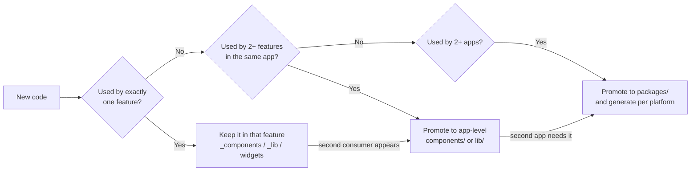

# 02 — Repository Structure & Conventions

The single organizing idea in this repository: **code lives as close as possible to the only thing that uses it, and moves outward only when a second thing needs it.** Everything below is a consequence of that rule.

## 1. Monorepo layout

```
story/
├── app/                      Flutter mobile app
├── web/                      Next.js web app
├── backend/                  FastAPI API + arq workers
├── packages/
│   ├── design-tokens/        tokens.json — the single source of design truth
│   ├── icons/                SVG sources + generators
│   └── api-types/            Generated TS + Dart models from the OpenAPI schema
├── docs/                     This documentation set
├── tools/                    Repo-level scripts (codegen, checks, release)
├── .github/workflows/        CI
├── docker-compose.yml        Local MongoDB + Redis + MinIO
├── Makefile                  The only entry point developers need to memorize
└── README.md
```

**Why a monorepo.** The design tokens, the icon set, and the API types are shared artifacts that must never drift between the three apps. In separate repositories, keeping them in sync requires publishing packages and bumping versions — a process that will be skipped under deadline, and drift will follow. In one repository, a token change and its three consumers land in one commit and one CI run.

**`Makefile` is the interface.** No developer should need to remember `uv run arq app.workers.settings.WorkerSettings`. Targets: `make setup`, `make dev`, `make tokens`, `make icons`, `make types`, `make lint`, `make test`, `make check`.

## 2. `backend/` — FastAPI

```
backend/
├── app/
│   ├── main.py                     App instance, lifespan, middleware, router mounting
│   ├── config.py                   Settings (pydantic-settings) + get_settings()
│   ├── responses.py                ok_response / err_response envelope
│   ├── error_handlers.py           register_exception_handlers(app)
│   ├── logging.py                  structlog configuration + redaction processor
│   ├── db/
│   │   ├── mongo.py                Client lifecycle, MongoDatabase DI alias
│   │   ├── redis.py                Client lifecycle, RedisClient DI alias
│   │   ├── indexes.py              Every index declaration, applied on boot
│   │   └── keys.py                 Every Redis key builder function
│   ├── core/
│   │   ├── security.py             Password/passcode hashing, JWT, token families
│   │   ├── crypto.py               AES-GCM, HKDF, blind index, KMS envelope
│   │   ├── deps.py                 CurrentClaims, require_role, csrf_protect, rate_limit
│   │   ├── ids.py                  ULID generation with typed prefixes
│   │   ├── errors.py               Error code catalogue
│   │   └── storage.py              R2 presigning
│   ├── api/
│   │   ├── router.py               Mounts every feature router under API_PREFIX
│   │   └── endpoints/
│   │       ├── health/
│   │       ├── auth/
│   │       ├── users/
│   │       ├── communities/
│   │       ├── connections/
│   │       ├── stories/
│   │       ├── comments/
│   │       ├── vault/
│   │       ├── tickets/
│   │       ├── notifications/
│   │       └── admin/
│   └── workers/
│       ├── settings.py             arq WorkerSettings
│       ├── media.py
│       ├── notifications.py
│       ├── recommendations.py
│       └── maintenance.py
├── tests/
│   ├── conftest.py
│   └── <feature>/
├── pyproject.toml
├── uv.lock
├── pyrightconfig.json
├── Dockerfile
├── .env.example
└── README.md
```

### The feature-slice quintet

Every folder under `api/endpoints/` contains at most these five files, each with a fixed and non-negotiable role:

| File | Role | Must not |
|---|---|---|
| `router.py` | `APIRouter`, paths, status codes, dependency lists, envelope wrapping | Contain business logic or touch the database |
| `controllers.py` | All business logic and all database access. Returns plain dicts/lists | Import `ok_response` or know about HTTP shape beyond raising `HTTPException` |
| `models.py` | Pydantic request models and feature-local types | Define response envelopes |
| `utils.py` | Pure, stateless helpers for this feature | Reach into another feature |
| `constants.py` | Collection names, limits, static data | Hold anything configurable (that belongs in `config.py`) |

The file is named `router.py` in every feature. Svakosh used `routes.py` for auth and `router.py` elsewhere; that inconsistency is not carried over. Every feature folder has an `__init__.py` — auth in the reference did not, and it worked only by accident of namespace packages.

### Layer discipline

**Thin routers, fat controllers.** This is the reference's pattern and it is kept, with one addition: controllers must not accept `Request` or `Response` unless they genuinely need cookies or client IP, and infrastructure arguments are keyword-only. That makes controller signatures self-documenting and testable.

```python
# router.py — the canonical shape
@router.post("/stories", status_code=status.HTTP_201_CREATED,
             dependencies=[Depends(csrf_protect), Depends(rate_limit(20, 60))])
async def create_story(body: CreateStoryRequest, claims: CurrentClaims, mongo: MongoDatabase):
    data = await controllers.create_story(body, claims=claims, mongo=mongo)
    return ok_response("Story saved as draft.", data=data)
```

**What we add that the reference lacked: a repository seam for the two collections that matter.** Svakosh's controllers call Motor directly, which makes them untestable without a live MongoDB. That is acceptable for simple CRUD, and we keep it for most features. But `vault` and `audit_logs` get a thin repository module (`repository.py`, a sixth permitted file in those two slices only) because their correctness is security-critical and must be unit-testable in isolation. Everywhere else, direct Motor access in the controller is correct and idiomatic.

## 3. `app/` — Flutter

```
app/
├── lib/
│   ├── main.dart
│   ├── app.dart                     Root widget, theme + router wiring
│   ├── core/
│   │   ├── result.dart              Result<T> sealed union (never-throw contract)
│   │   ├── api/
│   │   │   ├── api_client.dart       dio instance, interceptors, refresh-and-retry
│   │   │   └── endpoints.dart        Every path string, one place
│   │   ├── crypto/
│   │   │   ├── key_manager.dart      UMK lifecycle, KEK derivation
│   │   │   └── vault_cipher.dart     Per-file encrypt/decrypt streams
│   │   ├── storage/
│   │   │   ├── secure_store.dart     Keychain/Keystore wrapper
│   │   │   ├── prefs.dart            Non-secret preferences
│   │   │   └── cache_db.dart         drift database
│   │   ├── errors/
│   │   ├── utils/
│   │   └── constants/
│   ├── theme/
│   │   ├── tokens.g.dart            GENERATED — do not edit
│   │   ├── app_theme.dart           ThemeData assembly from tokens
│   │   ├── theme_controller.dart    Active theme + persistence
│   │   └── context_ext.dart         context.tokens accessor
│   ├── components/                  Shared design-system widgets only
│   │   ├── buttons/
│   │   ├── inputs/
│   │   ├── surfaces/                Card, Modal, Sheet
│   │   ├── feedback/                Toast, Loader, Skeleton, EmptyState
│   │   ├── navigation/              AppBar, BottomNav, Tabs
│   │   └── media/                   AppNetworkImage, AppIcon
│   ├── features/
│   │   ├── onboarding/
│   │   ├── feed/
│   │   ├── story/
│   │   ├── community/
│   │   ├── connection/
│   │   ├── vault/
│   │   ├── profile/
│   │   ├── settings/
│   │   └── tickets/
│   ├── routing/
│   │   ├── router.dart              go_router configuration
│   │   ├── routes.dart              Typed route constants
│   │   └── guards.dart              Auth + onboarding redirects
│   └── gen/
│       ├── icons.g.dart             GENERATED
│       └── assets.g.dart            GENERATED
├── assets/
│   ├── images/
│   ├── icons/                       GENERATED from packages/icons
│   └── fonts/
├── test/
├── integration_test/
├── analysis_options.yaml
└── pubspec.yaml
```

### Feature folder shape

Every feature under `features/` uses the same four-directory structure. This is the Flutter translation of the reference's `_components` / `_lib` colocation rule:

```
features/vault/
├── data/
│   ├── vault_repository.dart        API calls for this feature
│   └── vault_local_source.dart      drift queries for this feature
├── models/
│   ├── vault_item.dart              freezed models
│   └── vault_visibility.dart        Feature enums
├── providers/
│   ├── vault_list_provider.dart     Riverpod providers
│   └── vault_unlock_provider.dart
├── screens/
│   ├── vault_home_screen.dart       Routable screens
│   └── vault_item_screen.dart
└── widgets/
    ├── vault_tile.dart              Widgets used ONLY by this feature
    └── passcode_pad.dart
```

Mapping to the reference conventions: `widgets/` is `_components/`, `models/` + `data/` + `providers/` together are `_lib/`, and `screens/` are the `+page.svelte` equivalents.

## 4. `web/` — Next.js

```
web/
├── src/
│   ├── app/
│   │   ├── layout.tsx
│   │   ├── globals.css                Imports tokens.css, defines @theme inline
│   │   ├── (auth)/
│   │   │   ├── signin/
│   │   │   └── signup/
│   │   ├── (app)/                     Authenticated route group
│   │   │   ├── layout.tsx             Auth guard + chrome
│   │   │   ├── feed/
│   │   │   ├── story/[id]/
│   │   │   ├── communities/
│   │   │   ├── vault/
│   │   │   └── settings/
│   │   ├── s/[slug]/                  Public story pages — SSR, indexable
│   │   └── api/                       BFF proxy routes only
│   ├── components/                    Shared design-system components
│   ├── features/                      Cross-route feature modules
│   ├── lib/
│   │   ├── api/client.ts              apiCall + Result<T>
│   │   ├── server/backend.ts          Server-only backend fetch + refresh retry
│   │   ├── auth/cookies.ts            Cookie names, forwarding, safe redirect
│   │   ├── utils/cn.ts
│   │   └── config/
│   ├── styles/
│   │   └── tokens.css                 GENERATED — do not edit
│   └── gen/
│       └── icons/                     GENERATED
├── public/
├── eslint.config.js
├── .prettierrc
├── tsconfig.json
├── next.config.ts
└── package.json
```

### Route-local colocation

Next.js App Router ignores folders prefixed with `_`, exactly as SvelteKit does. The reference convention carries over unchanged:

```
src/app/(app)/vault/
├── page.tsx
├── _components/
│   ├── VaultGrid.tsx
│   └── PasscodeDialog.tsx
├── _lib/
│   ├── types.ts
│   ├── const.ts
│   ├── helper.ts
│   └── service.ts          Feature API calls wrapping apiCall
└── _assets/
    └── vault-empty.svg
```

What goes in `_lib`, by file — this is a closed list:

| File | Contents |
|---|---|
| `types.ts` | TypeScript types for this route's domain |
| `const.ts` | Static config: tab definitions, option lists, column definitions, limits |
| `helper.ts` | Pure functions: formatters, derivations, validators |
| `service.ts` | Feature API calls, each a one-line wrapper over `apiCall` |

## 5. The promotion rule

**Something becomes shared the moment a second consumer needs it, and not one moment sooner.**



Promotion preserves internal shape. A promoted feature folder keeps its `widgets` + `models` + `data` structure and only changes address — svakosh's `lib/components/watchlist/` is the model here, having kept its components, `service.ts`, and `types.ts` together after promotion.

**Do not pre-promote.** A component in `components/` that has one caller is a lie about its generality, and it will grow props for hypothetical cases that never arrive.

## 6. Naming conventions

### Files and directories

| Context | Convention | Examples |
|---|---|---|
| Python modules | `snake_case.py` | `error_handlers.py`, `vault_repository.py` |
| Dart files | `snake_case.dart` | `vault_tile.dart`, `key_manager.dart` |
| Generated Dart | `*.g.dart` | `tokens.g.dart`, `icons.g.dart` |
| React components | `PascalCase.tsx` | `VaultGrid.tsx`, `StoryCard.tsx` |
| TS modules | `kebab-case.ts` | `backend-fetch.ts`, `safe-redirect.ts` |
| Single-word TS modules | lowercase | `client.ts`, `types.ts`, `const.ts` |
| Directories (all platforms) | `kebab-case` or `snake_case`, never mixed within a platform | `design-tokens/`, `vault_item/` |
| Route segments | `kebab-case` | `/settings/active-sessions` |
| Route-private folders | `_` prefix | `_components/`, `_lib/`, `_assets/` |
| Route groups | parentheses | `(app)`, `(auth)` |

### Code identifiers

| Thing | Convention | Examples |
|---|---|---|
| Python classes | `PascalCase` | `AccessClaims`, `VaultItem` |
| Python functions/vars | `snake_case` | `create_access_token`, `wrapped_dek` |
| Python constants | `SCREAMING_SNAKE_CASE` | `MAX_VAULT_ITEMS`, `OTP_TTL_SECONDS` |
| Dart classes | `PascalCase` | `VaultRepository`, `AppTokens` |
| Dart members | `camelCase` | `unlockVault`, `wrappedDek` |
| Dart constants | `camelCase` with `k`-free naming | `maxVaultItems` (not `kMaxVaultItems`) |
| TS cross-module types | `T` prefix + `PascalCase` | `TResult`, `TStoryVisibility`, `TVaultItem` |
| TS component-local types | bare `PascalCase` | `Props`, `Variant`, `Option` |
| TS constants | `SCREAMING_SNAKE_CASE` | `ACCESS_COOKIE`, `STORY_MAX_LENGTH` |
| Event handler functions | `handle` prefix | `handleClose`, `handleSubmit` |
| Callback props | `on` + `PascalCase` | `onClose`, `onSelect`, `onCheckedChange` |
| Boolean state props | `is` / `has` / `can` / `show` prefix | `isOpen`, `hasNote`, `canPublish`, `showClose` |

The `T`-prefix rule is stated as the reference *implied* but never wrote down: **`T` prefix for types crossing a module boundary, bare `PascalCase` for types local to one component.** Svakosh applied this to roughly 70% of its types by instinct; here it is a rule.

### The wire format rule

**Every field on the wire is `snake_case`.** The API is the contract, MongoDB documents are `snake_case`, and Python is `snake_case`, so the boundary conversion happens once, in the client:

- Flutter: `json_serializable` with `@JsonKey(name: 'wrapped_dek')` or a `FieldRename.snake` default, exposing `camelCase` Dart members.
- Web: generated types in `packages/api-types` keep `snake_case` keys, matching the reference's practice of writing `snake_case` payload keys inline.

Never negotiate this per endpoint. One rule, no exceptions.

### Domain vocabulary

The glossary in [00-product-overview.md](00-product-overview.md) is binding on code. A Story is `story` in every collection name, route path, model class, and variable — never `post`, `entry`, or `confession`. A CI grep fails the build on banned synonyms in `backend/app/` and `app/lib/`.

## 7. Generated code

Four generated artifacts, all with the same rules: **never edited by hand, always committed, always regenerated by CI to verify they match their source.**

| Artifact | Source | Generator | Output |
|---|---|---|---|
| Design tokens | `packages/design-tokens/tokens.json` | `make tokens` | `app/lib/theme/tokens.g.dart`, `web/src/styles/tokens.css` |
| Icons | `packages/icons/svg/*.svg` | `make icons` | `app/lib/gen/icons.g.dart` + `app/assets/icons/`, `web/src/gen/icons/*.tsx` |
| API types | Backend OpenAPI schema | `make types` | `packages/api-types/*.ts`, `app/lib/gen/api_models.g.dart` |
| Flutter assets | `app/assets/` | `build_runner` | `app/lib/gen/assets.g.dart` |

Generated files carry a header banner:

```
// GENERATED FILE — DO NOT EDIT.
// Source: packages/design-tokens/tokens.json
// Regenerate: make tokens
```

**They are committed, not gitignored.** Committing means a fresh clone builds without running codegen, reviewers see the effect of a token change in the diff, and a drift between source and output is a visible conflict rather than a silent inconsistency. CI runs each generator and fails if `git diff --exit-code` is non-empty.

## 8. Git conventions

### Branches

`main` is always deployable. Work happens on `feat/<short-slug>`, `fix/<short-slug>`, or `chore/<short-slug>`. Squash merge into `main`; the PR title becomes the commit message.

### Commit prefixes

Carried forward from the reference, which followed them consistently:

| Prefix | Use when |
|---|---|
| `feat:` | New behavior a user or client can rely on |
| `fix:` | Bug fix, no new behavior |
| `refactor:` | Internal structure changed, external behavior identical |
| `perf:` | Performance work, same contract |
| `style:` | Formatting, logs, copy, OpenAPI text only |
| `docs:` | Documentation only |
| `test:` | Tests only |
| `chore:` | Dependencies, CI, tooling |

Scope is optional and is the feature slice: `feat(vault): add hidden item label search`.

### Rules

- `pyproject.toml` and `uv.lock` are committed in the same commit. Same for `package.json`/`pnpm-lock.yaml` and `pubspec.yaml`/`pubspec.lock`.
- A token change and its regenerated outputs are one commit.
- Never commit `.env`. `.env.example` is committed and must list every key the app reads.

## 9. Quality gates

### Local — pre-commit hook via husky + lint-staged

Fast checks only, so the hook stays under a couple of seconds:

| Pattern | Action |
|---|---|
| `backend/**/*.py` | `ruff check --fix`, `ruff format` |
| `web/**/*.{ts,tsx}` | `eslint --fix --max-warnings 0`, `prettier --write` |
| `app/**/*.dart` | `dart format`, `dart analyze --fatal-infos` on changed files |
| `**/*.{json,md,yml}` | `prettier --write` |

### CI — every pull request

| Job | Steps |
|---|---|
| `backend` | `uv sync --frozen` → `ruff check` → `ruff format --check` → `pyright` → `pytest` → unused-dependency check |
| `web` | `pnpm install --frozen-lockfile` → `tsc --noEmit` → `eslint --max-warnings 0` → `prettier --check` → `vitest run` → `next build` |
| `app` | `flutter pub get` → `dart format --set-exit-if-changed` → `flutter analyze --fatal-infos` → `flutter test` |
| `codegen-drift` | Run all four generators, fail if `git diff --exit-code` is dirty |
| `design-guard` | Fail on raw hex, raw px, raw `TextStyle`, raw `BoxShadow`, or non-token Tailwind arbitrary values outside token files ([03-design-tokens.md](03-design-tokens.md)) |
| `vocab-guard` | Fail on banned domain synonyms (`post`, `confession`) in source |
| `secret-guard` | Fail if `.env.example` is missing a key that `config.py` requires, or if a secret pattern appears in a diff |

`--max-warnings 0` throughout. A warning nobody must fix is a warning nobody will fix.

### Merge requirements

All CI jobs green, one approving review, branch up to date with `main`. No exceptions for "small" changes — the reference's CI ran only an import smoke test with an incomplete environment, and it was silently failing; gates that can pass while broken are worse than no gates.

## 10. Local development

```bash
make setup     # installs uv, pnpm, flutter deps; copies .env.example → .env
make dev       # docker compose up (mongo, redis, minio) + API with reload + worker
make tokens    # regenerate design tokens for both platforms
make icons     # regenerate icon sets
make types     # regenerate API types from the running backend's OpenAPI schema
make check     # everything CI runs, locally
```

`docker-compose.yml` provides MongoDB, Redis, and MinIO. MinIO stands in for R2 — the S3-compatible API means the storage code path is identical, so presigned upload and download are exercised locally exactly as in production.
