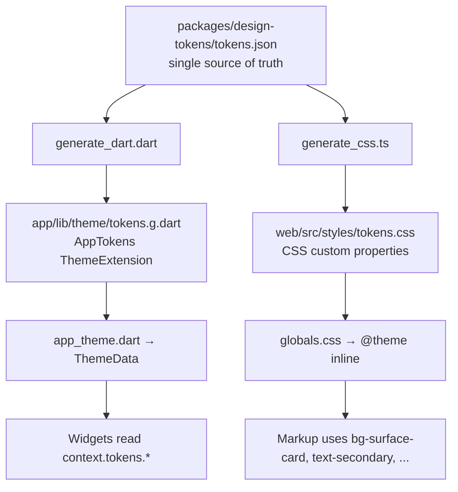
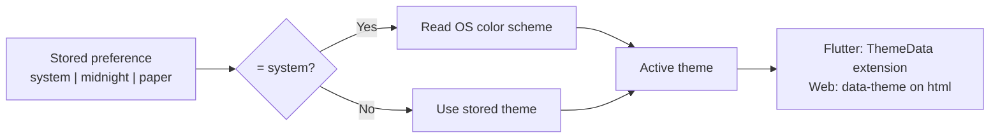

# 03 — Design Tokens

> One JSON file defines every color, size, weight, duration, and shadow in the product. Two generators turn it into Flutter and CSS. Nothing else in the codebase is allowed to contain a raw visual value.

This is principle **P5** from [00-product-overview.md](00-product-overview.md), and it is enforced by CI rather than by review discipline.

## 1. The architecture



**Two layers, on both platforms.** Layer one is the raw value keyed by theme. Layer two is the semantic name that consumers actually reference. A consumer never sees a hex code, and swapping a theme rewrites layer one while layer two is untouched. This is the pattern from the reference project's `app.css`, generalized to cover every token category rather than color alone, and extended to Flutter.

**Why not let each platform define its own theme?** Because they will diverge within a month. A designer changes a card background on web, nobody changes it in Flutter, and now the two products are visibly different. One file, two generated outputs, one CI check for drift.

## 2. `tokens.json` schema

```jsonc
{
  "$schema": "./tokens.schema.json",
  "meta": {
    "version": 1,
    "defaultTheme": "midnight"
  },

  // Theme-dependent values. Every theme MUST define every key in this block.
  // The generator fails the build if a theme is missing a key.
  "themes": {
    "midnight": { "color": { /* ... */ } },
    "paper":    { "color": { /* ... */ } }
  },

  // Theme-independent values. Identical in every theme.
  "typography": { /* families, scale, weights */ },
  "space":      { /* 4pt grid */ },
  "radius":     { /* corner radii */ },
  "elevation":  { /* shadow definitions */ },
  "border":     { /* stroke widths */ },
  "size":       { /* control heights, icon sizes, avatars */ },
  "zIndex":     { /* stacking order */ },
  "motion":     { /* durations, easings */ },
  "opacity":    { /* states */ },
  "breakpoint": { /* web only */ }
}
```

Rules the generator enforces:

1. Every theme defines the identical set of color keys. A missing key fails the build — it can never silently fall back.
2. Token names are `camelCase` leaves under `dotted.groups`. The group structure becomes the naming in both outputs.
3. Colors are `#RRGGBB` or `#RRGGBBAA`. Never `rgba()` strings — the generator emits platform-correct forms from a single hex.
4. Every dimension is an integer in logical pixels. No `rem`, no `em`, no percentages.
5. No token may reference another token. Aliasing happens in the semantic layer, not in the source data — this keeps the file a flat description of facts rather than a small programming language.

---

## 3. Color tokens

### 3.1 The four-rung scale

Every semantic color family exposes exactly five values. This is the strongest idea carried over from the reference project, where a component variant *is* a color family and every family answers the same five questions:

| Rung | Question it answers | Typical alpha |
|---|---|---|
| `base` | What color is the text, icon, or solid fill? | 1.00 |
| `muted` | What color is the border at rest? | 0.45 |
| `subtle` | What color is the background at rest? | 0.10 |
| `hover` | What color is the background when pressed or hovered? | 0.18 |
| `contrast` | What color is text sitting *on top of* `base`? | 1.00 |

A component therefore never needs to know which family it is rendering. `Button(variant: danger)` reads `danger.subtle` for its background, `danger.muted` for its border, `danger.base` for its label, and `danger.hover` for the pressed state. Adding a sixth variant is a data change, not a code change.

The alpha values are consistent across families — the reference had `primary` at 0.05/0.08 while `success` was at 0.10/0.16, an accidental inconsistency that made variants look unrelated.

### 3.2 Theme: `midnight` (default)

Dark by default. STORY is used at night, by people who are not performing, and a dark surface with a soft violet accent is deliberately unlike Instagram's saturated warmth or LinkedIn's corporate blue.

```jsonc
"midnight": {
  "color": {
    "bg": {
      "base":     "#0A0A0F",
      "subtle":   "#101017",
      "elevated": "#16161F"
    },
    "surface": {
      "card":   "#14141C",
      "modal":  "#1A1A24",
      "sheet":  "#1A1A24",
      "inset":  "#0D0D13",
      "raised": "#1F1F2A"
    },
    "overlay": {
      "scrim":  "#050508B8",
      "hover":  "#EDECF20F",
      "press":  "#EDECF21A"
    },
    "text": {
      "primary":   "#EDECF2",
      "secondary": "#A5A3B5",
      "tertiary":  "#6F6D80",
      "disabled":  "#4A4956",
      "inverse":   "#0A0A0F"
    },
    "border": {
      "subtle":  "#EDECF210",
      "default": "#EDECF21F",
      "strong":  "#EDECF238",
      "focus":   "#9B8CFF"
    },
    "accent":  { "base": "#9B8CFF", "muted": "#9B8CFF73", "subtle": "#9B8CFF1A", "hover": "#9B8CFF2E", "contrast": "#0A0A0F" },
    "success": { "base": "#5FD0A0", "muted": "#5FD0A073", "subtle": "#5FD0A01A", "hover": "#5FD0A02E", "contrast": "#052017" },
    "warning": { "base": "#F2B45A", "muted": "#F2B45A73", "subtle": "#F2B45A1A", "hover": "#F2B45A2E", "contrast": "#1F1403" },
    "danger":  { "base": "#F2726B", "muted": "#F2726B73", "subtle": "#F2726B1A", "hover": "#F2726B2E", "contrast": "#1F0705" },
    "info":    { "base": "#6BAEF2", "muted": "#6BAEF273", "subtle": "#6BAEF21A", "hover": "#6BAEF22E", "contrast": "#04121F" },
    "neutral": { "base": "#A5A3B5", "muted": "#A5A3B573", "subtle": "#A5A3B514", "hover": "#A5A3B524", "contrast": "#0A0A0F" },

    "vault": {
      "locked":   "#D9A94A",
      "unlocked": "#5FD0A0",
      "hidden":   "#7E8AA3"
    },
    "story": {
      "draft":     "#6F6D80",
      "private":   "#9B8CFF",
      "public":    "#5FD0A0",
      "scheduled": "#F2B45A"
    }
  }
}
```

### 3.3 Theme: `paper`

Light. Warm off-white rather than pure white, because long-form reading on `#FFFFFF` at night is unpleasant. The accent darkens to `#5B45E0` to hold a 4.5:1 contrast ratio against light surfaces — a token pair is not required to be the same hex across themes, only the same *name*.

```jsonc
"paper": {
  "color": {
    "bg": {
      "base":     "#FBFAF8",
      "subtle":   "#F3F1ED",
      "elevated": "#FFFFFF"
    },
    "surface": {
      "card":   "#FFFFFF",
      "modal":  "#FFFFFF",
      "sheet":  "#FFFFFF",
      "inset":  "#F3F1ED",
      "raised": "#FFFFFF"
    },
    "overlay": {
      "scrim":  "#1A182066",
      "hover":  "#1A18200A",
      "press":  "#1A182014"
    },
    "text": {
      "primary":   "#1A1820",
      "secondary": "#55525F",
      "tertiary":  "#85818F",
      "disabled":  "#B0ADB8",
      "inverse":   "#FBFAF8"
    },
    "border": {
      "subtle":  "#1A182012",
      "default": "#1A182021",
      "strong":  "#1A18203D",
      "focus":   "#5B45E0"
    },
    "accent":  { "base": "#5B45E0", "muted": "#5B45E066", "subtle": "#5B45E014", "hover": "#5B45E024", "contrast": "#FFFFFF" },
    "success": { "base": "#12805C", "muted": "#12805C66", "subtle": "#12805C14", "hover": "#12805C24", "contrast": "#FFFFFF" },
    "warning": { "base": "#9A6512", "muted": "#9A651266", "subtle": "#9A651214", "hover": "#9A651224", "contrast": "#FFFFFF" },
    "danger":  { "base": "#C2352D", "muted": "#C2352D66", "subtle": "#C2352D14", "hover": "#C2352D24", "contrast": "#FFFFFF" },
    "info":    { "base": "#1C6BB0", "muted": "#1C6BB066", "subtle": "#1C6BB014", "hover": "#1C6BB024", "contrast": "#FFFFFF" },
    "neutral": { "base": "#55525F", "muted": "#55525F66", "subtle": "#55525F0F", "hover": "#55525F1A", "contrast": "#FFFFFF" },

    "vault": { "locked": "#8A6410", "unlocked": "#12805C", "hidden": "#5A6478" },
    "story": { "draft": "#85818F", "private": "#5B45E0", "public": "#12805C", "scheduled": "#9A6512" }
  }
}
```

### 3.4 Adding a theme

Copy a theme block, change the values, add the key. No code change anywhere. This is what makes the requirement "multiple themes supported, one place to change" literally true — a third theme (`ember`, `high-contrast`, an accessibility variant) is a pure data addition.

A `high-contrast` theme is a planned obligation, not a nice-to-have, and it is the reason `border.strong` and `text.tertiary` exist as separate tokens rather than being computed opacities.

---

## 4. Typography

Absolute pixel values, deliberately. The reference set `html { font-size: 0.875rem }`, which silently rescaled every `rem` in the app by 0.875 — an invisible multiplier that nobody reading a component could see. Flutter has no `rem` at all. Absolute values from day one mean the same number produces the same rendered size on both platforms.

```jsonc
"typography": {
  "family": {
    "sans":    "Inter",        // all UI text
    "reading": "Newsreader",   // story body only — long-form prose
    "mono":    "JetBrains Mono" // passcodes, recovery kits, one-time codes
  },
  "weight": {
    "regular":  400,
    "medium":   500,
    "semibold": 600
  },
  "scale": {
    "display":   { "size": 32, "lineHeight": 40, "letterSpacing": -0.4, "weight": "semibold", "family": "sans" },
    "titleLg":   { "size": 24, "lineHeight": 32, "letterSpacing": -0.3, "weight": "semibold", "family": "sans" },
    "titleMd":   { "size": 20, "lineHeight": 28, "letterSpacing": -0.2, "weight": "semibold", "family": "sans" },
    "titleSm":   { "size": 17, "lineHeight": 24, "letterSpacing": -0.1, "weight": "medium",   "family": "sans" },
    "bodyLg":    { "size": 16, "lineHeight": 26, "letterSpacing": 0,    "weight": "regular",  "family": "sans" },
    "bodyMd":    { "size": 15, "lineHeight": 24, "letterSpacing": 0,    "weight": "regular",  "family": "sans" },
    "bodySm":    { "size": 13, "lineHeight": 20, "letterSpacing": 0,    "weight": "regular",  "family": "sans" },
    "labelLg":   { "size": 15, "lineHeight": 20, "letterSpacing": 0,    "weight": "medium",   "family": "sans" },
    "labelMd":   { "size": 13, "lineHeight": 18, "letterSpacing": 0.1,  "weight": "medium",   "family": "sans" },
    "labelSm":   { "size": 12, "lineHeight": 16, "letterSpacing": 0.2,  "weight": "medium",   "family": "sans" },
    "caption":   { "size": 11, "lineHeight": 14, "letterSpacing": 0.2,  "weight": "regular",  "family": "sans" },
    "overline":  { "size": 11, "lineHeight": 14, "letterSpacing": 1.2,  "weight": "medium",   "family": "sans", "uppercase": true },
    "reading":   { "size": 17, "lineHeight": 30, "letterSpacing": 0.1,  "weight": "regular",  "family": "reading" },
    "readingLg": { "size": 19, "lineHeight": 34, "letterSpacing": 0.1,  "weight": "regular",  "family": "reading" },
    "code":      { "size": 14, "lineHeight": 22, "letterSpacing": 0.5,  "weight": "regular",  "family": "mono" }
  }
}
```

**Fifteen styles, and that is the complete set.** No component may declare a font size, a line height, or a letter spacing. If a design needs a size that is not here, the answer is either "use the nearest one" or "add it to the scale" — never "write `fontSize: 14.5` at the call site". The reference accumulated ad-hoc arbitrary sizes (`0.625rem`, `0.786rem`, `0.857rem`) precisely because there was no scale to add to.

**Three weights only.** Regular, medium, semibold. Bold and light are excluded: at these sizes on these surfaces they add noise without adding hierarchy, and every extra weight is another variable font axis to ship.

**`reading` is not decoration.** Long-form confessional prose is the core content type (P7). A serif reading face at 17/30 measurably improves sustained reading comfort over a UI sans, and it gives story bodies a visual identity distinct from the chrome around them. `readingLg` is the user-selectable larger reading size in Settings.

**`mono` exists for a security reason.** Passcodes, recovery kits, and one-time codes must be transcribable without ambiguity between `0`/`O` and `1`/`l`/`I`. A monospace face with disambiguated glyphs prevents a user from losing vault access to a typo.

### Dynamic type

The scale is the *base*. Both platforms respect OS text-size settings by scaling the whole ramp, with a clamp so layout does not collapse:

- Flutter: `MediaQuery.textScalerOf(context).clamp(minScaleFactor: 1.0, maxScaleFactor: 1.6)`.
- Web: sizes emit as `rem` in `tokens.css` computed against a `16px` root, so browser zoom and user font settings work. The generator does that conversion; the source file stays in px.

That last point is the one place the two outputs differ in unit, and it is deliberate: px in Dart because Flutter has no relative unit, rem on web so accessibility settings function. Same source number, same rendered default size.

---

## 5. Spacing

A 4-point grid. `space.N` is always `N × 4` logical pixels, which makes the token self-documenting — `space6` is unambiguously 24.

```jsonc
"space": {
  "none": 0,  "half": 2,
  "1": 4,  "2": 8,  "3": 12, "4": 16, "5": 20, "6": 24,
  "7": 28, "8": 32, "10": 40, "12": 48, "14": 56, "16": 64,
  "20": 80, "24": 96
}
```

Semantic aliases for the recurring cases, so layout intent is visible in the code:

```jsonc
"spaceAlias": {
  "gutter":        16,   // screen horizontal padding, mobile
  "gutterWide":    24,   // screen horizontal padding, tablet/desktop
  "sectionGap":    32,   // between major page sections
  "cardPadding":   16,
  "listItemGap":   12,
  "inlineGap":     8,    // between an icon and its label
  "stackGap":      12    // default vertical rhythm in a form
}
```

The reference had no spacing tokens at all and relied on Tailwind's default scale, which at its 14px root produced non-obvious real values. Named aliases mean a change to screen padding is one token, not a search-and-replace across every screen.

---

## 6. Radius, borders, elevation

```jsonc
"radius": {
  "none": 0, "xs": 4, "sm": 8, "md": 12, "lg": 16, "xl": 24, "full": 9999
},

"border": {
  "hairline": 1,
  "thick": 2,
  "focusRing": 2,
  "focusOffset": 2
},

"elevation": {
  "e0": { "shadows": [] },
  "e1": { "shadows": [{ "x": 0, "y": 1, "blur": 2,  "spread": 0,  "color": "#00000029" }] },
  "e2": { "shadows": [{ "x": 0, "y": 4, "blur": 12, "spread": -2, "color": "#0000003D" },
                      { "x": 0, "y": 1, "blur": 3,  "spread": 0,  "color": "#00000029" }] },
  "e3": { "shadows": [{ "x": 0, "y": 12, "blur": 32, "spread": -8, "color": "#0000005C" },
                      { "x": 0, "y": 4,  "blur": 8,  "spread": -2, "color": "#00000038" }] },
  "e4": { "shadows": [{ "x": 0, "y": 24, "blur": 56, "spread": -12, "color": "#00000070" }] }
}
```

Radius assignment, fixed by component so surfaces stay consistent:

| Radius | Used by |
|---|---|
| `xs` | Chips, badges, inline tags |
| `sm` | Inputs, small buttons, list rows |
| `md` | Buttons, dropdown panels, toasts |
| `lg` | Cards, modals, media thumbnails |
| `xl` | Bottom sheets (top corners only), story cards |
| `full` | Avatars, switches, pill tabs, FAB |

Elevation assignment:

| Level | Used by |
|---|---|
| `e0` | Flat surfaces, list rows |
| `e1` | Cards at rest |
| `e2` | Dropdowns, popovers, toasts, raised cards |
| `e3` | Modals, bottom sheets |
| `e4` | Full-screen overlays, drawers |

The reference had **zero** shadow tokens and six distinct arbitrary shadow values written inline across components. Five named levels replace them.

---

## 7. Sizes

Every fixed dimension a component can have, so no widget ever hardcodes a height.

```jsonc
"size": {
  "control": { "sm": 36, "md": 44, "lg": 52 },
  "icon":    { "xs": 14, "sm": 16, "md": 20, "lg": 24, "xl": 32 },
  "avatar":  { "xs": 24, "sm": 32, "md": 40, "lg": 56, "xl": 96 },
  "touchTarget": { "min": 44 },
  "appBar":   { "height": 56 },
  "bottomNav":{ "height": 60 },
  "sheet":    { "handleWidth": 36, "handleHeight": 4, "maxHeightPercent": 92 },
  "modal":    { "widthSm": 320, "widthMd": 420, "widthLg": 560 },
  "divider":  { "thickness": 1 },
  "content":  { "maxReadingWidth": 680 }
}
```

`touchTarget.min` at 44 is the accessibility floor for both platforms; the design guard flags any interactive component whose resolved height is below it. `content.maxReadingWidth` at 680 caps story body line length on web — unbounded line length is the most common failure of text-heavy sites.

---

## 8. Z-index

```jsonc
"zIndex": {
  "base": 0,
  "raised": 10,
  "sticky": 100,
  "appBar": 200,
  "dropdown": 300,
  "drawer": 400,
  "sheet": 500,
  "modal": 600,
  "toast": 700,
  "tooltip": 800
}
```

**Ordered correctly and deliberately.** The reference put its header at `z-[1050]` and its modals at `z-[110]`, meaning the header painted over every modal — a real, shipped bug caused by nine hardcoded z-values with no shared ordering. Here the order is data, the gaps are 10× to leave room for insertions, and a component may only reference a named level.

Toast above modal is intentional: a toast confirming an action taken inside a modal must be visible without dismissing the modal.

---

## 9. Motion and opacity

```jsonc
"motion": {
  "duration": { "instant": 0, "fast": 120, "base": 200, "slow": 320, "slowest": 480 },
  "easing": {
    "standard": [0.2, 0.0, 0.0, 1.0],
    "enter":    [0.05, 0.7, 0.1, 1.0],
    "exit":     [0.3, 0.0, 0.8, 0.15],
    "spring":   [0.34, 1.56, 0.64, 1.0]
  }
},

"opacity": {
  "disabled": 0.38,
  "hover": 0.06,
  "press": 0.12,
  "skeleton": 0.08,
  "ghostIcon": 0.05
}
```

Assignment: `fast` for state changes on a control (hover, press, switch), `base` for entering and leaving elements (toast, dropdown, tab indicator), `slow` for large surfaces (sheets, drawers, page transitions), `slowest` for onboarding and celebration only.

**Reduced motion is a hard requirement, not an option.** When the OS requests reduced motion, all durations resolve to `instant` and transforms are replaced by opacity fades. This matters more here than on most products: users arrive at STORY in distress, and motion can be an accessibility barrier. Both platforms read the OS flag centrally in the theme layer, so no individual component needs to handle it.

---

## 10. Generated output — Flutter

`packages/design-tokens/generate_dart.dart` emits `app/lib/theme/tokens.g.dart`: an immutable `ThemeExtension` with one const instance per theme.

```dart
// GENERATED FILE — DO NOT EDIT.
// Source: packages/design-tokens/tokens.json
// Regenerate: make tokens

@immutable
class AppTokens extends ThemeExtension<AppTokens> {
  const AppTokens({
    required this.color,
    required this.text,
    required this.space,
    required this.radius,
    required this.elevation,
    required this.size,
    required this.zIndex,
    required this.motion,
    required this.opacity,
  });

  final AppColors color;
  final AppTextStyles text;
  final AppSpace space;
  final AppRadius radius;
  final AppElevation elevation;
  final AppSize size;
  final AppZIndex zIndex;
  final AppMotion motion;
  final AppOpacity opacity;

  static const midnight = AppTokens(
    color: AppColors(
      bgBase: Color(0xFF0A0A0F),
      surfaceCard: Color(0xFF14141C),
      surfaceModal: Color(0xFF1A1A24),
      textPrimary: Color(0xFFEDECF2),
      textSecondary: Color(0xFFA5A3B5),
      borderSubtle: Color(0x10EDECF2),
      accent: AppColorFamily(
        base: Color(0xFF9B8CFF),
        muted: Color(0x739B8CFF),
        subtle: Color(0x1A9B8CFF),
        hover: Color(0x2E9B8CFF),
        contrast: Color(0xFF0A0A0F),
      ),
      // ... every key
    ),
    // ... every group
  );

  static const paper = AppTokens(/* ... */);

  static const Map<String, AppTokens> byName = {
    'midnight': midnight,
    'paper': paper,
  };

  @override
  AppTokens copyWith({ /* ... */ }) => /* ... */;

  @override
  AppTokens lerp(ThemeExtension<AppTokens>? other, double t) => /* ... */;
}

@immutable
class AppColorFamily {
  const AppColorFamily({
    required this.base, required this.muted, required this.subtle,
    required this.hover, required this.contrast,
  });
  final Color base, muted, subtle, hover, contrast;
}
```

`lerp` is implemented, so switching themes animates every color rather than snapping.

Consumption is always through one extension getter, defined once in `theme/context_ext.dart`:

```dart
extension AppThemeContext on BuildContext {
  AppTokens get tokens => Theme.of(this).extension<AppTokens>()!;
}
```

```dart
// Correct
Container(
  padding: EdgeInsets.all(context.tokens.space.cardPadding),
  decoration: BoxDecoration(
    color: context.tokens.color.surfaceCard,
    borderRadius: BorderRadius.circular(context.tokens.radius.lg),
    border: Border.all(color: context.tokens.color.borderSubtle),
    boxShadow: context.tokens.elevation.e1,
  ),
  child: Text('Story', style: context.tokens.text.titleMd),
)

// Rejected by CI
Container(
  padding: const EdgeInsets.all(16),
  decoration: BoxDecoration(
    color: const Color(0xFF14141C),
    borderRadius: BorderRadius.circular(16),
  ),
  child: const Text('Story', style: TextStyle(fontSize: 20)),
)
```

`app_theme.dart` also maps tokens onto Flutter's built-in `ColorScheme` and `TextTheme`, so Material widgets we do not wrap (dialogs, date pickers, text selection handles) inherit the theme instead of showing Material defaults.

---

## 11. Generated output — Web

`generate_css.ts` emits `web/src/styles/tokens.css` — layer one, raw values, keyed by theme via a `data-theme` attribute:

```css
/* GENERATED FILE — DO NOT EDIT. */

:root,
[data-theme='midnight'] {
  color-scheme: dark;

  --bg-base: #0a0a0f;
  --surface-card: #14141c;
  --surface-modal: #1a1a24;
  --text-primary: #edecf2;
  --text-secondary: #a5a3b5;
  --border-subtle: rgb(237 236 242 / 0.06);

  --accent-base: #9b8cff;
  --accent-muted: rgb(155 140 255 / 0.45);
  --accent-subtle: rgb(155 140 255 / 0.10);
  --accent-hover: rgb(155 140 255 / 0.18);
  --accent-contrast: #0a0a0f;
  /* ... */
}

[data-theme='paper'] {
  color-scheme: light;
  --bg-base: #fbfaf8;
  --surface-card: #ffffff;
  /* ... */
}
```

`globals.css` is layer two — the semantic mapping Tailwind v4 turns into utility classes:

```css
@import 'tailwindcss';
@import './tokens.css';

@theme inline {
  --color-bg-base: var(--bg-base);
  --color-surface-card: var(--surface-card);
  --color-surface-modal: var(--surface-modal);
  --color-text-primary: var(--text-primary);
  --color-text-secondary: var(--text-secondary);
  --color-border-subtle: var(--border-subtle);

  --color-accent: var(--accent-base);
  --color-accent-muted: var(--accent-muted);
  --color-accent-subtle: var(--accent-subtle);
  --color-accent-hover: var(--accent-hover);

  --font-sans: 'Inter', ui-sans-serif, system-ui, sans-serif;
  --font-reading: 'Newsreader', Georgia, serif;
  --font-mono: 'JetBrains Mono', ui-monospace, monospace;

  --text-title-md: 1.25rem;
  --text-title-md--line-height: 1.75rem;
  --text-title-md--letter-spacing: -0.0125em;
  --text-body-md: 0.9375rem;
  --text-body-md--line-height: 1.5rem;

  --spacing-gutter: 1rem;
  --spacing-card-padding: 1rem;

  --radius-sm: 0.5rem;
  --radius-md: 0.75rem;
  --radius-lg: 1rem;
  --radius-xl: 1.5rem;

  --shadow-e1: 0 1px 2px 0 rgb(0 0 0 / 0.16);
  --shadow-e2: 0 4px 12px -2px rgb(0 0 0 / 0.24), 0 1px 3px 0 rgb(0 0 0 / 0.16);
  --shadow-e3: 0 12px 32px -8px rgb(0 0 0 / 0.36), 0 4px 8px -2px rgb(0 0 0 / 0.22);

  --z-index-dropdown: 300;
  --z-index-modal: 600;
  --z-index-toast: 700;
}
```

Markup then uses only token-derived classes:

```tsx
// Correct
<article className="rounded-lg border border-border-subtle bg-surface-card p-card-padding shadow-e1">
  <h2 className="text-title-md text-text-primary">{story.title}</h2>
  <p className="mt-3 font-reading text-reading text-text-secondary">{story.body}</p>
</article>

// Rejected by CI
<article className="rounded-[16px] border border-white/5 bg-[#14141c] p-4">
  <h2 className="text-[20px] text-white">{story.title}</h2>
</article>
```

The root font size stays at the browser default of 16px. The generator converts px to rem on this side only, which is why `titleMd` at 20px emits as `1.25rem`.

---

## 12. Theme switching and persistence

Three user-visible options: `System`, `Midnight`, `Paper`. `System` follows the OS.



**Flutter.** `ThemeController` (a Riverpod `Notifier`) holds the preference, persists it to `shared_preferences`, and exposes `ThemeMode` plus the resolved `AppTokens`. `MaterialApp` receives `theme`, `darkTheme`, and `themeMode`, so `System` works without custom logic. Theme changes animate over `motion.duration.base` because `AppTokens.lerp` is implemented.

**Web.** The preference is stored in a cookie, not `localStorage`. This is the load-bearing detail: the cookie is readable during server rendering, so the correct `data-theme` is present in the initial HTML and there is no flash of the wrong theme. A `localStorage` implementation cannot avoid that flash without a blocking inline script, and a blocking script on every page load is a worse trade. `System` resolution uses `prefers-color-scheme` with the cookie as an override.

The reference project had the token layer ready for themes but never implemented switching — there was no store, no persistence, and a decorative toggle wired to nothing. Theme switching is built in the first UI phase here, precisely because retrofitting it after two hundred widgets exist is where the hardcoded values creep in.

---

## 13. Enforcement: the design guard

A CI job, `design-guard`, that fails the build. Not a lint warning, not a review checklist.

### Flutter — custom lint rules

Implemented as a `custom_lint` plugin in `packages/design-tokens/lint/`:

| Rule | Fails on | Allowed only in |
|---|---|---|
| `no_raw_color` | `Color(0x...)`, `Colors.*` | `tokens.g.dart` |
| `no_raw_text_style` | `TextStyle(` with `fontSize`, `fontWeight`, or `fontFamily` | `tokens.g.dart` |
| `no_raw_spacing` | Numeric literal in `EdgeInsets`, `SizedBox`, `Gap` | `tokens.g.dart` |
| `no_raw_radius` | Numeric literal in `BorderRadius`, `Radius` | `tokens.g.dart` |
| `no_raw_shadow` | `BoxShadow(` | `tokens.g.dart` |
| `no_raw_duration` | `Duration(milliseconds:` | `tokens.g.dart` |
| `no_theme_of_color` | `Theme.of(context).colorScheme.*` | `app_theme.dart` |

`0`, `1`, and `2` are permitted as spacing literals, since `EdgeInsets.zero` equivalents and hairline borders are unambiguous and forcing tokens there produces noise.

### Web — ESLint plus a grep gate

| Rule | Fails on |
|---|---|
| `no-restricted-syntax` on `className` | Arbitrary values matching a color (`bg-[#...]`, `text-[rgb(...)]`) |
| `no-restricted-syntax` on `className` | Arbitrary px sizes (`text-[14px]`, `p-[13px]`, `rounded-[7px]`) |
| Grep gate | Any hex color in `.tsx`/`.ts` outside `src/styles/` |
| Grep gate | Any inline `style={{ color`, `style={{ background`, `style={{ fontSize` |

Tailwind's own opacity modifiers (`bg-accent/10`) are permitted, since they resolve against a token. Arbitrary *values* are not.

### The escape hatch

There is exactly one, and it is loud:

```dart
// design-token-exempt: <reason> — approved by <name> on <date>
```

The guard honours the comment, and a separate CI step counts exemptions and fails if the total increases without a corresponding entry in `docs/exemptions.md`. Exemptions are visible, attributable, and budgeted — which is what stops them becoming the default.

---

## 14. What is deliberately not tokenized

Being explicit prevents arguments later.

- **Copy and strings.** Localization concern, separate system.
- **Icon geometry.** Icons are SVG assets, not tokens. See [04-component-library.md](04-component-library.md).
- **Component-internal layout.** How a `StoryCard` arranges its children is component logic. Which *tokens* it uses for spacing and color is token-governed.
- **One-off illustration and empty-state artwork.** Assets with their own palettes, referenced through `AppImages`.
- **Breakpoints on Flutter.** Flutter uses layout-based responsive decisions rather than fixed breakpoints. Web gets `breakpoint.sm/md/lg/xl` tokens; the mobile app does not need them.
