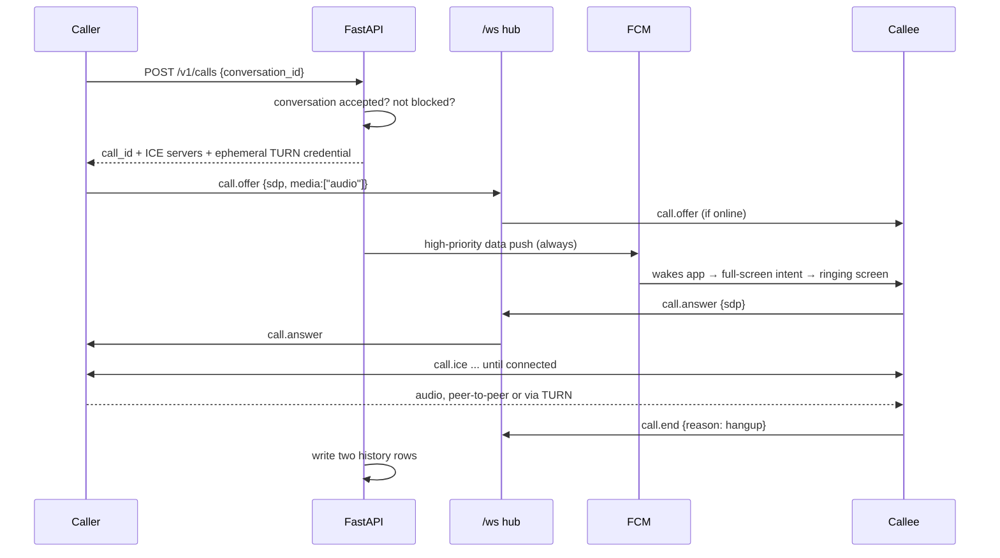

# 17 — Voice calling

> The server half is built: call setup, the six signaling types, ephemeral TURN
> credentials, per-participant history, deletes, retention and its sweeper —
> 60 tests. The relay config exists but is not deployed, and no client code has
> been written, so **no call has ever been placed**. Sections say which is which.
> It covers 1:1 voice calls between people who already have an accepted
> conversation: how a call is offered, how the audio travels, what happens on a
> bad network, what the call history stores, and how it is deleted. Video is not
> in scope, and §10 is the contract that keeps it a later addition rather than a
> rewrite.

## 1. What this reuses

Most of a calling feature is already in this repository. That is the reason
this document is short.

| Piece | Where it already lives | What calling adds |
|---|---|---|
| Authenticated realtime socket | `app/realtime/hub.py`, `/ws` + ticket | six message types |
| Cross-instance fanout | `app/realtime/bus.py`, Redis `ST:WS` | nothing |
| Presence — "can they be rung now" | `hub.is_online(user_id)` | nothing |
| Waking a closed phone | `push_fcm.py`, `priority: high` / `apns-priority: 10` | one payload type |
| Identity keys | `chat_crypto.dart`, X25519, published to `chat_identities` | fingerprint binding |
| Trust boundary — who may contact whom | accepted conversations in `chat_conversations` | reused verbatim |
| Native notification channels | `MainActivity.kt` | a call channel |
| Native method channels | `story/secure_screen` | `story/call_ui` |

Signaling is normally the bulk of a calling backend. Ours is built, in
production, and horizontally scalable. What is genuinely missing is the media
engine, a relay, and two screens.

## 2. Decisions, and why

**Voice only.** P7 in [00](00-product-overview.md) names faces before voices as
identifying. A 720p video call is roughly 1.35 GB per relayed hour against
29 MB for voice — about 46× the bandwidth, on our own egress — and it doubles
the call screen. Video stays out of v1 and §10 keeps the door open.

**Only between accepted conversations.** P7 says voices identify people, and
this product exists so people can say things they cannot say elsewhere. A voice
call is therefore held to the bar chat already uses: both parties have an
accepted conversation. No new trust model, no new machinery, and the rule is
already enforced in one place.

The first call an account places shows a one-time notice: a voice is
recognisable to anyone who knows you. Informed, once, then never again.

**No system dialer integration.** Android's `ConnectionService` would put STORY
calls in the system call log, where anyone holding the phone can read them.
On an anonymity product that is a leak, not a feature.

**One new package.** `flutter_webrtc` is a thin Dart binding over **libwebrtc**,
Google's C++ media engine — the same one inside Chrome, Meet, Signal and
WhatsApp. Writing the alternative means writing an Opus codec, an echo
canceller and an ICE stack; the hand-rolled path still ships libwebrtc, just
with glue we maintain forever. This is capability Dart cannot express at any
effort level, which is the boundary the no-dependency rule in
[02](02-repo-structure-and-conventions.md) §5a is meant to protect.

Everything else — the ringing notification, the foreground service, the
permission prompt — is Kotlin in the pattern `MainActivity.kt` already uses.

## 3. The signaling protocol

Six message types over the existing `/ws`. Every one carries `call_id`.

| Type | Direction | Payload |
|---|---|---|
| `call.offer` | caller → callee | `conversation_id`, `media`, `sdp` |
| `call.answer` | callee → caller | `sdp` |
| `call.ice` | both | `candidate` |
| `call.update` | both | `media`, `sdp?` — mute now, video later |
| `call.end` | both | `reason` |
| `call.state` | server → client | `state` |

`reason` is one of `hangup`, `declined`, `busy`, `timeout`, `failed`.
`state` is one of `ringing`, `offline`, `timeout`.

**`media` is a list from the first line of code.** `["audio"]` today. Never an
`is_audio` boolean — see §10.

## 4. The lifecycle



The push is sent whether or not the socket is connected. A socket that looks
alive but is on a dead mobile link is the common failure, and a duplicate ring
is cheaper than a missed call.

**Ring timeout is 45 seconds**, held server-side as a Redis key with a TTL. On
expiry the server emits `call.state{timeout}` to both sides and writes the
history rows as `missed`. Nothing about a ringing call is stored in MongoDB —
a call that never connected should not survive a server restart.

## 5. Media

Opus, mono, ~32 kbps. The settings that matter on a bad network:

| Problem | Setting |
|---|---|
| Packet loss | Opus **in-band FEC** plus PLC — intelligible through ~20% loss |
| Silence wasting uplink | **DTX** — falls to ~2 kbps when nobody is speaking |
| Congestion | libwebrtc adapts; cap `maxaveragebitrate` at 32000 |
| Wi-Fi ↔ mobile handover | **ICE restart**, rather than dropping the call |
| Restrictive Wi-Fi | **TURN over TLS on 443** — indistinguishable from HTTPS |
| Jitter | libwebrtc's adaptive jitter buffer |

None of this is code we write. Echo cancellation, noise suppression and gain
control are libwebrtc defaults and should be left on.

## 6. NAT traversal, and an honest latency problem

Most calls connect phone-to-phone. Between 10% and 20% cannot — symmetric NAT
and carrier-grade NAT are common on Indian mobile networks — and those relay
through TURN.

**coturn runs as one more container beside the API.** Free software, no vendor,
no per-minute fee. Relayed voice costs our own egress only: ~29 MB per
call-hour, about **$0.003/hour**, and 100 GB/month covers roughly 3,400
relayed voice-hours.

**Credentials must be ephemeral.** coturn's REST auth mints an HMAC
username/password pair valid for ~5 minutes, issued by `POST /v1/calls`. The
APK is public on GitHub; a static TURN secret compiled into it is an open relay
for the internet, billed to us.

### 6.1 The Stockholm problem

The API runs in `eu-north-1`. Measured round trip from India is **~150 ms**.

| Path | One-way mouth-to-ear | Feel |
|---|---|---|
| Peer-to-peer, two Indian phones | ~30–60 ms + ~60 ms buffer/codec ≈ **100 ms** | transparent |
| Relayed via Stockholm | ~150 ms + ~60 ms ≈ **210 ms** | noticeable; people talk over each other |

ITU-T G.114 puts the transparent ceiling at 150 ms one-way. The majority of
calls are fine. The relayed minority is not, because audio between two people
in India flies to Sweden and back.

**This is accepted for v1, and instrumented rather than guessed.** Every call
records whether it relayed. A relay in `ap-south-1` costs money and is only
worth buying once the measured relay rate says so.

## 7. Call history

**One row per participant per call.** Two people can hold different retention
settings, and one shared row cannot expire at two different times. Deleting
your copy must not touch theirs. This mirrors `DELETE /messages/{id}/mine`,
which already exists.

```
calls
  _id                ULID
  call_id            shared by both rows
  owner_id           whose history this is
  peer_id
  conversation_id
  direction          in | out
  outcome            answered | missed | declined | busy | failed
  media              ["audio"]
  relayed            bool          — feeds the §6.1 decision
  started_at
  connected_at       null when never answered
  ended_at
  duration_seconds   0 unless answered
  expires_at         computed at insert from the owner's setting
```

Indexes:

| Index | Keys | Serves |
|---|---|---|
| `ix_owner_time` | `owner_id` ASC, `started_at` DESC | the history list |
| `ix_expiry` | `expires_at` ASC, partial on `{expires_at: {$type: "date"}}` | the retention sweep |

The retention index is partial because "keep forever" stores `null`, and rows
that can never expire have no business in the index the sweeper scans.

The server sees that a call happened, between whom, and for how long, because
it relays the signaling. Encrypting the row would be theatre. What it never
sees is audio: peer-to-peer it never touches the media, and relayed it forwards
ciphertext that coturn holds no key to.

## 8. Deletion and retention

Deletion is **real deletion** — `delete_many`, never a `deleted_at` flag. A
call row has no bytes in object storage behind it, so erasing the row erases
the record.

| Action | Endpoint |
|---|---|
| One | `DELETE /v1/calls/{call_id}` |
| Selected | `POST /v1/calls/delete` `{call_ids: [...]}` |
| All | `POST /v1/calls/delete` `{all: true}` |

Every one scopes to `owner_id` from the token. There is no endpoint that can
reach another account's history.

**Retention** is `expires_at`, stamped at insert from the owner's setting:

| Setting | `expires_at` |
|---|---|
| 24 hours | `started_at + 1d` |
| 7 days | `started_at + 7d` |
| 30 days *(default)* | `started_at + 30d` |
| Keep forever | `null` |

Changing the setting restamps existing rows, so shortening it takes effect on
history already recorded. That is the behaviour a person expects from a privacy
control; the alternative silently keeps old rows under the old rule.

A sweeper deletes expired rows hourly. It is one entry in the `jobs()` table in
`app/workers/scheduler.py`, in the same shape as the vault sweeper, so the
wiring is assertable in a test.

## 9. The screens

**History** lives as a third chip on the Messages screen —
`Chats | Calls | Requests`. No new bottom-nav destination: calls are rarer than
any existing tab and belong beside the conversations they came from. Long-press
enters multi-select, the gesture the app already uses.

**Ringing** is a notification with `fullScreenIntent` and `category=call` on a
high-importance channel, with **Answer** and **Decline** actions. On Android
this *is* a ringing screen over the lockscreen; it is a notification flag, not
a telecom integration.

Two Android requirements that are easy to miss:

- **`USE_FULL_SCREEN_INTENT`.** Since Android 14 this is auto-granted only to
  apps whose core function is calling or alarms. STORY qualifies once it has
  calling, but the declaration is reviewed by Play.
- **`FOREGROUND_SERVICE_MICROPHONE`.** An in-progress call must run a typed
  foreground service or the OS takes the microphone when the app backgrounds.
  This is the difference between a call that survives switching apps and one
  that dies.

Also needed: `RECORD_AUDIO` at runtime, requested at the first call rather than
at install.

**In-call** shows the peer, call state, duration, mute, speaker, and end. It
does not show an avatar large enough to imply video, and it reserves a slot
that renders nothing today — see §10.

## 10. Keeping video a later addition

Three commitments, all free today. Breaking any one of them turns video from an
addition into surgery.

1. **`media` is always a list**, in every signaling message and every stored
   row. Video is `["audio","video"]`. Never an `is_audio` boolean, never a
   second endpoint.
2. **Renegotiation works from day one.** A mid-call re-offer is exactly the
   audio→video upgrade mechanism. Build one-shot offer/answer only and the
   upgrade needs rework. Test it on day one by exercising `call.update`.
3. **`call.update` ships immediately**, carrying mute today. Upgrading to video
   is then a new payload on an existing message, not a new mechanism.

Deliberately **not** done in advance: pre-adding inactive video transceivers,
building a camera preview behind a flag, or abstracting a "media kind" strategy
class. Those cost complexity now for a feature that may never come.

## 11. What this does not build

| Not built | Why |
|---|---|
| Group calls | Needs an SFU — a second server, and a different cost model |
| Call recording | Storage, legal exposure, and an anonymity disaster |
| System call log entry | Identifies the app to anyone holding the phone |
| CallKit / PushKit | iOS is scaffolded but has never shipped a build |
| Custom DSP | libwebrtc's echo canceller is better than one we would write |
| Multi-region TURN | Buy it when §6.1's measurement says to, not before |
| Ringing state in MongoDB | A call that never connected should not outlive a restart |

## 12. Build order

Each step ends somewhere testable. Backend first, because the app cannot be
exercised without it.

1. `calls` collection, indexes, `POST /v1/calls`, ephemeral TURN credentials
2. Six signaling types in `app/api/endpoints/realtime/controllers.py`
3. History endpoints — list, delete one, delete selected, delete all
4. Retention setting, `expires_at` stamping, restamp-on-change, sweeper in `jobs()`
5. coturn container, TLS on 443, REST auth secret in `.env`
6. `flutter_webrtc` peer connection wrapper under `lib/core/webrtc/`
7. Kotlin: call channel, full-screen intent, foreground service, `story/call_ui`
8. Call screens and the Calls tab
9. Relay-rate instrumentation, then revisit §6.1

Per [02](02-repo-structure-and-conventions.md) §5a, no production code without
a failing test first. The signaling types, the retention stamping, the sweeper
and the delete scoping are all pure functions of state and are tested without a
device. What needs a device is the media path, which is libwebrtc's to get
right, not ours.
