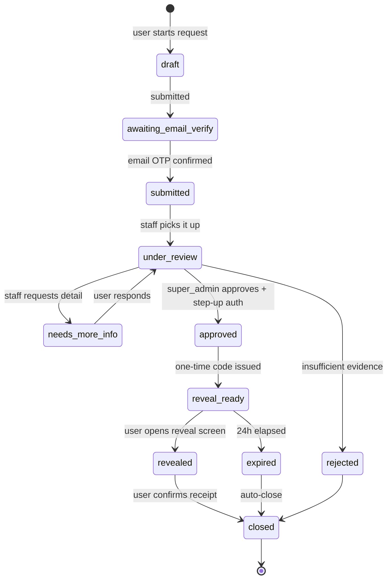

# 06 — Recovery & Admin Flows

> Every privileged action in this system is a ticket, every ticket is visible to the affected user, and every step is written to an append-only log. There is no back channel.

This document specifies what happens when something goes wrong: a forgotten password, a forgotten passcode, a suspected compromise. It is the operational counterpart to [05-security-and-crypto.md](05-security-and-crypto.md).

## 1. The recovery matrix

Four things can be lost, and they have four different outcomes. Being explicit about this table is the single most important thing in this document, because it is what the interface must communicate before a user is in trouble rather than after.

| Lost | Account recoverable? | Vault recoverable? | Path |
|---|---|---|---|
| **Password**, email set | Yes | **No** — permanent loss | Email OTP → set new password → UMK is destroyed |
| **Password**, no email | **No** | No | Nothing. The account is unreachable. |
| **Passcode**, email set | Account was never lost | Yes | Passcode release ticket → super_admin → 24h reveal |
| **Passcode**, no email | Account was never lost | **No** | No ticket can be opened without a verified email |
| **Label** of a hidden item | Account fine | **No** — that item only | Nothing. The label is not stored in readable form. |
| **Device**, credentials known | Yes | Yes | Sign in on a new device; the UMK re-derives from the password |

Two rows deserve emphasis.

**Password reset destroys the vault.** `KEK_pw` is derived from the password, and it is the only thing that unwraps the UMK. A reset means the new password derives a different `KEK_pw`, which cannot unwrap the stored `wrapped_umk`. There is no server-side copy of the UMK — that is the entire point of R2 in the security document. This is not a bug to be fixed later; it is the guarantee working correctly.

**A password *change* is completely different from a password *reset*.** During a change, the user supplies their current password, so the client can unwrap the UMK and immediately re-wrap it under the new `KEK_pw`. The vault survives. This distinction must be reflected in the interface: "Change password" and "Forgot password" are different flows with different warnings, and they must never be merged into one screen.

## 2. Account recovery — email only

As decided: email is the sole recovery path, and it is optional. A user who never adds one has an unrecoverable account, by design.

### 2.1 Flow

```mermaid
sequenceDiagram
    participant U as User
    participant A as API
    U->>A: POST /auth/password-reset/request { username }
    A->>A: Look up user; check for a verified email
    A-->>U: 200 always — generic message, no enumeration
    A->>A: If email exists → decrypt, send 6-digit OTP (10 min TTL)
    U->>A: POST /auth/password-reset/verify { username, otp }
    A-->>U: reset_token (single-use, 10 min, bound to user + OTP)
    Note over U: Client shows the PERMANENT VAULT LOSS warning<br/>and requires explicit typed confirmation
    U->>A: POST /auth/password-reset/complete { reset_token, new_password,<br/>new_salt_pw, new_wrapped_umk }
    A->>A: Verify token; hash new password; replace user_keys row
    A->>A: Revoke ALL sessions; mark every vault item as orphaned
    A->>A: Write audit entry; send security notification
    A-->>U: 200 — must sign in again
```

Note step `new_wrapped_umk`: the client generates a **brand-new UMK** and wraps it under the new password. The old `wrapped_umk` is replaced, not deleted-and-null, so the account has a functioning key hierarchy for future vault items. Existing items keep their `wrapped_dek` values, which are now permanently undecryptable.

### 2.2 What "orphaned" means

Vault items whose keys can no longer be derived are marked `key_state: "orphaned"` rather than deleted. Three reasons:

1. **Honesty.** The user can still see that 43 items existed, with their sizes and dates. Silently deleting them would look like the platform lost their data.
2. **Grief.** These are memories of people who may be gone. The user should decide when they are erased, not us.
3. **Auditability.** A support conversation about "where did my files go" is answerable.

The items are shown in a distinct "Unrecoverable" section with plain copy explaining what happened and a bulk delete action. They still count against quota, and an automated reminder at 90 days offers deletion. They are never counted as recoverable and there is no "try again" affordance, because there is nothing to try.

### 2.3 The warning

This is the highest-stakes copy in the product. It must appear **before** the OTP is even requested, not after the reset succeeds.

> **Resetting your password will permanently delete everything in your Vault.**
>
> Your Vault is encrypted with a key that only your password can unlock. We do not have a copy — that is what keeps it private, and it is why we cannot recover it.
>
> You have **43 items** using **1.2 GB**. After this reset they cannot be opened again, by you or by anyone.
>
> If you still remember your password, go back and use **Change password** instead. Your Vault will be kept.
>
> To continue, type **DELETE MY VAULT** below.

The typed confirmation is deliberate friction. A checkbox is clicked reflexively; a phrase must be read. The item count and size are fetched live so the loss is concrete rather than abstract.

### 2.4 Enumeration resistance

`POST /auth/password-reset/request` returns the same `200` with the same message and within the same time envelope in all three cases: the username does not exist, the username exists with no email, and the username exists with a verified email. Otherwise the endpoint is a free oracle for "is this handle registered", which for an anonymity product is a genuine leak.

The message is: *"If that account has a verified email, we've sent a code to it."*

## 3. The optional Vault Recovery Kit

Recommended, opt-in, and **never stored server-side**. It is the only way for a user to survive a forgotten password with their vault intact, and it preserves split-knowledge because the platform never holds it.

### 3.1 Construction

```
recovery_phrase   = BIP-39 style, 24 words from a 2048-word list  (256 bits)
KEK_recovery      = Argon2id(recovery_phrase, salt_recovery, params_A)
recovery_blob     = nonce || AES-256-GCM(KEK_recovery, UMK,
                                          aad = "story.recovery.v1|" || user_id)
```

The `recovery_blob` **may** be stored server-side (it is useless without the phrase, which we never see), and this is what makes the kit convenient: the user needs to keep only 24 words, not a file. Whether to store it is a user choice presented at creation:

| Option | Server stores | User keeps | Trade-off |
|---|---|---|---|
| **Words only** (recommended) | `recovery_blob` + `salt_recovery` | 24 words | Convenient. A server compromise plus a phrase compromise is required. |
| **Fully offline** | Nothing | A downloaded `.storykey` file containing blob + salt + words | Nothing to steal from us. Losing the file loses the option. |

### 3.2 When it is offered

At **first vault use**, not at signup. Signup already asks a user to remember a password and accept terms; adding a 24-word ceremony there produces a screen everyone skips. When someone is about to encrypt their first irreplaceable memory, the offer lands.

The flow: display the words in a `mono` type style, six rows of four, numbered. Require the user to confirm three randomly chosen words by position before proceeding. Offer copy-to-clipboard with a 60-second auto-clear, and a print view. Never screenshot-able (`FLAG_SECURE`).

Users who decline are asked once more, later, and then never again. A persistent nag on a security feature trains people to dismiss security prompts.

### 3.3 Using it

```
1. POST /auth/vault-recovery/request { username } → returns salt_recovery + recovery_blob
2. Client: user enters 24 words → derive KEK_recovery → unwrap UMK
3. Client: if the AEAD tag verifies, the UMK is recovered
4. Client: re-wrap UMK under the current KEK_pw and PUT the new wrapped_umk
```

Step 1 is rate-limited hard (3 per hour per username) and requires a valid session **or** a completed password reset — the blob is not secret, but handing it out freely invites offline attacks against weak phrases.

This flow is what turns "password reset destroys your vault" into "password reset destroys your vault unless you kept your Recovery Kit". After a reset, if a recovery blob exists, the client offers the recovery step immediately rather than leaving the user to discover it.

## 4. Passcode release — the ticket flow

This is the flow specified in the requirements: a user who has forgotten their vault passcode can request the list of passcodes they set, released by a super_admin through a fully tracked, verified, and audited process.

### 4.1 Why it is safe

The passcode is escrowed under a KMS key precisely so this flow can exist. It is safe because a released passcode is **one of two required halves** — the releaser has no password, therefore no UMK, therefore no ability to decrypt anything. A user receiving their own passcode back can decrypt, because they are the one party who has both halves.

Everything below exists to ensure that a release only ever reaches the account's actual owner, and that any attempt to abuse the mechanism is visible.

### 4.2 Preconditions

A ticket cannot be opened unless **all** of these hold:

1. The user has a **verified email**. Without it there is no out-of-band channel and no identity signal beyond the session, so no ticket is possible.
2. The user has an **active session** (they know the password — this is the whole reason the release is safe).
3. The account is not `blocked`.
4. No other passcode ticket is currently open for this user.
5. The account is at least 7 days old, and the email has been verified for at least 48 hours. This closes the obvious attack: steal credentials, add an attacker-controlled email, immediately request a release.

Precondition 5 is the one most likely to be argued away for user-experience reasons. It should not be. It is the primary defence against a stolen-credential escalation, and 48 hours is the window in which the login alert and the "email added" notification reach the real owner.

### 4.3 Lifecycle



Every transition writes an audit entry. Both the user and staff see the same timeline, with staff-internal notes marked and hidden from the user side.

### 4.4 Step by step

**Step 1 — User opens the ticket.**
`POST /tickets` with `type: "passcode_release"` and a free-text reason. The preconditions in §4.2 are checked; failures return a specific, actionable message ("Verify your email in Settings before requesting a passcode release").

**Step 2 — User verifies email for this ticket.**
A fresh OTP, specific to this ticket, is sent. This is intentionally *in addition to* the account's existing verified state: it proves the requester controls the mailbox **right now**, not that they controlled it at some point in the past. Ticket state moves to `submitted`.

**Step 3 — Routing.**
| Ticket type | Handled by |
|---|---|
| `passcode_release` | **super_admin only** |
| `account_locked` | `admin` |
| `content_appeal` | `moderator`, escalates to `admin` |
| `data_export` | `admin` |
| `account_deletion` | `admin` |
| `security_incident` | `admin`, escalates to `super_admin` |

A ticket type is never re-routable downward. An `admin` cannot take a `passcode_release`, and the API enforces this at the dependency level, not with an `if` inside a controller.

**Step 4 — Review.**
The assignee sees the ticket, the user's account metadata (creation date, last login, device history, email verification age), and the full audit trail. They do **not** see: the escrowed passcodes, any vault item metadata, any story content, or the email address in plaintext (it is masked). Reviewing a ticket is not a licence to browse an account.

The reviewer may request more information, which moves the ticket to `needs_more_info` and notifies the user.

**Step 5 — Approval with step-up authentication.**
Approving a `passcode_release` requires, in one session, all of:

1. The super_admin's password re-entered (session age is irrelevant; approval always re-authenticates).
2. A TOTP code from their registered authenticator.
3. An email OTP sent to the super_admin's own verified staff address.
4. A typed justification of at least 50 characters.

Requirements 1–3 are three independent factors. Requirement 4 exists because a justification field that accepts "ok" is decoration; 50 characters forces a sentence that a later reviewer can evaluate.

**Optional four-eyes.** A configuration flag (`REQUIRE_DUAL_APPROVAL`) makes a second super_admin's independent approval mandatory. It should be enabled the moment there is more than one super_admin. Until then, the single-approver path is documented as a known concentration of trust.

**Step 6 — Reveal preparation.**
On approval:
- The escrowed passcodes are decrypted through the narrow escrow service path and re-encrypted under a **one-time reveal key** derived from a freshly generated 8-character alphanumeric code (`reveal_otc`).
- The `reveal_otc` is stored in Redis as an Argon2id hash under `ST:REVEAL_OTC:<ticket_id>` with a 24-hour TTL, and displayed to the super_admin **once**.
- The super_admin communicates the code to the user through the ticket's messaging thread.
- A `reveal_token` is generated, single-use, 24-hour TTL, and its URL is sent to the user by email and in-app.

The passcode plaintext is **never** written to MongoDB, never logged, and exists only as the reveal-key-encrypted blob attached to the ticket, which is destroyed when the ticket closes or expires.

**Step 7 — The reveal screen.**
To open it, the user must satisfy three checks in one sitting:

| Check | Why |
|---|---|
| A valid, live session for the ticket's owner | Proves possession of the password |
| A fresh email OTP | Proves current control of the mailbox |
| The `reveal_otc` from the super_admin | Proves the out-of-band channel reached the right person |

**The account password is deliberately not one of the checks**, which was an open question in the requirements. The reasoning: the user is already in a live session, so the password has already been proven — asking again adds no security. What it *does* add is a screen, reachable from an emailed link, that asks for the account password. That is the exact shape of every credential-phishing page ever built, and training users that "support flows sometimes ask for your password" is a permanent, unfixable vulnerability. The super_admin-issued one-time code provides the same third factor without that side effect.

On success: the passcodes are decrypted client-side using the `reveal_otc`, displayed in `mono` type, with a copy button and a downloadable text file. The screen is `FLAG_SECURE`, has a visible 10-minute countdown, and closes itself when the timer expires.

**Step 8 — Close.**
The user confirms receipt, which closes the ticket, destroys the encrypted reveal blob, deletes the `reveal_otc` from Redis, and writes the final audit entry. If the 24-hour link expires unused, the ticket auto-closes with the same cleanup and the user may open a new one.

### 4.5 The user's view

At every point the user sees a `TicketStatusCard` with the current state, a timeline of everything that has happened with timestamps, who acted (by staff role and staff ID, not by personal name), and what happens next. There is no state in which a user is left wondering.

They also receive a notification on every transition. A ticket that sits in `under_review` for three days sends a "still working on it" update on day two, because silence during a security process reads as abandonment.

### 4.6 As built in the MVP

The user opens the ticket from **Vault → Recovery** (app: `/vault/recovery`, web: `/vault/recovery`). Both surfaces show the same three things: what recovery can and cannot do, the state of any request they have opened, and the staff actions that touched their account.

| Endpoint | Role | What it returns |
|---|---|---|
| `POST /v1/tickets` | user | Opens one ticket per type. A second open ticket of the same type is `TICKET_ALREADY_OPEN`. |
| `GET /v1/tickets` | user | Only the caller's own tickets. |
| `GET /v1/security-activity` | user | Audit entries whose target is the caller and whose `visible_to_target` is true. |
| `GET /v1/admin/vault/{username}/passcodes` | **super_admin only** | `label`, `scope`, `created_at`, `last_used_at`, `failed_attempts`, `locked_until`. Never the hash, the salt, the KDF params, or the escrow payload. |
| `POST /v1/admin/vault/{username}/release` | **super_admin only** | Requires an open `passcode_release` ticket belonging to that account and a justification of at least 50 characters. Moves the ticket to `reveal_ready` and writes `passcode_release.approved` to the audit log with the justification attached. |

`moderator` and `admin` both receive `403 ROLE_REQUIRED` on the two admin routes. There is no `/items`, `/keys`, or `/decrypt` route under `/admin/vault` — a test asserts all three are `404`, so adding one is a visible act.

The admin surface exposes this at `/vault`, visible in the nav only to `super_admin`, and the page redirects any other role to `/queue`. That redirect is convenience; the backend role dependency is the control.

#### Step-up authentication

A release also requires a TOTP code, verified against the acting staff member's own authenticator. RFC 6238, SHA-1, 6 digits, 30-second step, ±1 step of drift tolerance. No vendor, no SMS, no cost: the secret is generated and verified by this server, and the staff member holds it in any free authenticator app.

| Endpoint | What it does |
|---|---|
| `POST /v1/auth/totp/setup` | Staff only. Generates a secret and returns it once with a provisioning URI. Refused with `TOTP_ALREADY_ENABLED` if one is active. |
| `POST /v1/auth/totp/confirm` | Verifies the first code, activates, and returns 8 single-use backup codes. Shown once. |
| `GET /v1/auth/totp` | Status only — never the secret, never the codes. |
| `POST /v1/auth/totp/disable` | Removes the authenticator. **Requires a current code**, TOTP or backup. |

Requiring a code to *remove* the factor is the part that makes requiring one to *use* it worth anything. Without it a stolen session simply deletes the authenticator, enrols its own, and approves the release — the control would look present and do nothing. `POST .../setup` is refused with `TOTP_ALREADY_ENABLED` while one is active, so there is no re-enrollment path around it either.

Both transitions are written to the audit log as `totp.enabled` and `totp.disabled`, so a swap cannot happen quietly.

The code is bound to the release request itself rather than to a step-up session, because a 5-minute step-up window can approve several releases and a code bound to one request cannot. Verified codes are written to `ST:TOTP_USED:{user_id}:{code}` for 90 seconds, so the same code cannot be replayed inside its own validity window. A backup code is deleted from the account the moment it is accepted.

Listing passcode names does **not** require a code. Reading metadata is not the dangerous act; approving a release is.

**Still not built, and deliberately named here rather than assumed**: IP allowlisting for the admin surface and the 30-minute idle timeout described in §5.2.

## 5. Roles and permissions

Five roles at full scope. A user has exactly one.

| Role | Description | Ships in |
|---|---|---|
| `user` | Default. Every account. | Phase 1 |
| `admin` | Handles account, export, and deletion tickets. No escrow access. | Phase 1 |
| `super_admin` | Handles passcode releases. The only role with escrow release capability. | Phase 1 |
| `moderator` | Handles content reports and appeals. No account access. | Phase 6 |
| `system` | Internal, non-interactive. Used by workers. Cannot authenticate. | Phase 6 |

The `role` enum in [07](07-data-model.md) carries only the first three until the moderation queue exists. **Adding an unreachable role early is worse than adding it late** — it appears in the permission matrix, in tests, and in admin dropdowns as a capability that silently does nothing.

### 5.1 Permission matrix

| Capability | user | moderator | admin | super_admin |
|---|---|---|---|---|
| Read own data | ✅ | ✅ | ✅ | ✅ |
| Read another user's stories (public) | ✅ | ✅ | ✅ | ✅ |
| Read another user's private stories | ❌ | ❌ | ❌ | ❌ |
| Read reported content in a moderation queue | ❌ | ✅ | ✅ | ✅ |
| Read **held** content awaiting review | ❌ | ✅ | ✅ | ✅ |
| Resolve a hold, or overturn a block on appeal | ❌ | ✅ | ✅ | ✅ |
| Change a moderation rubric | ❌ | ❌ | ❌ | ❌ — a rubric change is a code review, not a runtime action |
| Read another user's vault item **metadata** | ❌ | ❌ | ❌ | ❌ |
| Decrypt another user's vault content | ❌ | ❌ | ❌ | ❌ |
| Read another user's email plaintext | ❌ | ❌ | ❌ | ❌ |
| See account metadata (created, last login, devices) | own | ❌ | ✅ | ✅ |
| Block / unblock an account | ❌ | ❌ | ✅ | ✅ |
| Remove a story for policy violation | own | ✅ | ✅ | ✅ |
| Handle content tickets | ❌ | ✅ | ✅ | ✅ |
| Handle account tickets | ❌ | ❌ | ✅ | ✅ |
| **Release escrowed passcodes** | ❌ | ❌ | ❌ | ✅ |
| Change a user's password | ❌ | ❌ | ❌ | ❌ |
| Authenticate as a user | ❌ | ❌ | ❌ | ❌ |
| Read the audit log | own entries | ❌ | ✅ | ✅ |
| Modify or delete the audit log | ❌ | ❌ | ❌ | ❌ |
| Grant or change roles | ❌ | ❌ | ❌ | ✅ |

Six rows are `❌` for every role including `super_admin`, and they are the load-bearing ones:

- **Nobody can decrypt vault content.** Not a policy — an absence of capability. There is no endpoint, no admin tool, no script.
- **Nobody can read a private story.** Private means private to the author. Moderation operates only on reported content and on content the sanity layer held before publication — and a private story is never held, because there is no audience to protect.
- **Nobody can change a moderation rubric at runtime.** Rubrics are versioned files reviewed and merged like code, and every decision records the version that produced it. A staff-editable rule set would mean a decision nobody could later reconstruct, and an appeal nobody could answer.
- **Nobody can read an email in plaintext.** Staff tools show `d••••k@g••••.com`.
- **Nobody can change a user's password or log in as them.** There is no impersonation feature. This satisfies R4 and it is why passcode escrow is safe.
- **Nobody can modify the audit log.** Including the role that can read all of it.

### 5.2 Enforcement

Role checks are dependencies, never inline conditionals:

```python
@router.post("/admin/tickets/{ticket_id}/approve-release",
             dependencies=[Depends(require_role("super_admin")),
                           Depends(require_step_up("password", "totp", "email_otp")),
                           Depends(csrf_protect),
                           Depends(rate_limit(5, 3600))])
async def approve_passcode_release(...): ...
```

The reference project put `role` in its JWT claims and then never built a role-checking dependency, leaving every check to be written by hand at each site — which means the check that gets forgotten is invisible. `require_role` and `require_step_up` are written once and applied declaratively, so a missing check is a missing line in a dependency list that a reviewer can see.

**Staff accounts have separate hard requirements**: mandatory TOTP, no `user` role capabilities on the same account (staff hold a distinct account for their own personal use), IP allowlisting for the admin surface, a 30-minute idle session timeout, and a mandatory quarterly access review.

## 6. The audit log

### 6.1 Properties

**Append-only.** No update path, no delete path. The MongoDB user that the API connects with has `insert` and `find` on `audit_logs` and nothing else — enforced at the database role level, not in application code, so a code bug cannot bypass it.

**Hash-chained.** Each entry stores the hash of the previous entry, so a deletion or modification anywhere in the chain is detectable:

```
entry_hash = SHA256(prev_hash || entry_id || actor_id || action ||
                    target_id || occurred_at || canonical_json(details))
```

A nightly job walks the chain and alerts on any break. The chain head is additionally written to an external append-only store (a separate account's object storage with object-lock enabled), so an attacker who controls the database cannot rewrite history and recompute the chain silently.

**Retained for 7 years** for security events, 90 days for routine reads.

### 6.2 Entry schema

```jsonc
{
  "_id": "aud_01J9X...",
  "prev_hash": "sha256:...",
  "entry_hash": "sha256:...",
  "occurred_at": "2026-08-04T10:30:00.000Z",

  "actor": {
    "user_id": "usr_01J9X...",      // or "system"
    "role": "super_admin",
    "staff_id": "stf_004",          // stable staff reference, not a personal name
    "ip_prefix": "203.0.113.0/24",
    "device_fingerprint": "fp_..."
  },
  "action": "passcode_release.approved",
  "target": {
    "kind": "user",
    "id": "usr_01J8B..."
  },
  "ticket_id": "tkt_01J9Y...",
  "outcome": "success",             // success | denied | error
  "details": {
    "justification": "...",
    "step_up_factors": ["password", "totp", "email_otp"],
    "dual_approval_by": null,
    "passcode_count": 3
  },
  "visible_to_target": true
}
```

`details` **never** contains a secret. Not the passcode, not the reveal code, not the email. The redaction processor from [05-security-and-crypto.md](05-security-and-crypto.md) applies to audit writes as well.

`visible_to_target` controls whether the affected user sees the entry in their own security log. It is `true` for everything a user has a right to know — which is everything that touches their account. It is `false` only for entries about a staff member's own session hygiene.

### 6.3 Audited actions

| Category | Actions |
|---|---|
| Authentication | `auth.signin`, `auth.signin_failed`, `auth.signout`, `auth.token_reuse_detected`, `auth.new_device` |
| Credentials | `password.changed`, `password.reset_requested`, `password.reset_completed`, `passcode.created`, `passcode.changed`, `passcode.lockout` |
| Recovery | `recovery_kit.created`, `recovery_kit.used`, `vault.orphaned` |
| Email | `email.added`, `email.verified`, `email.removed` |
| Vault | `vault.item_created`, `vault.item_deleted`, `vault.unlocked`, `vault.unlock_failed`, `vault.exported` |
| Tickets | `ticket.created`, `ticket.assigned`, `ticket.info_requested`, `ticket.rejected`, `ticket.approved`, `ticket.closed` |
| Escrow | `passcode_release.approved`, `passcode_release.reveal_issued`, `passcode_release.revealed`, `passcode_release.expired` |
| Staff | `staff.role_granted`, `staff.role_revoked`, `staff.step_up_failed`, `staff.admin_login` |
| Moderation | `content.reported`, `content.removed`, `content.restored`, `account.blocked`, `account.unblocked` |
| Sanity layer | `content.held`, `content.blocked`, `content.hold_resolved`, `content.appeal_opened`, `content.appeal_overturned`, `content.hold_expired` |

Sanity-layer entries carry `details: {rule, rubric_versions, tier_reached, review_id}` and are `visible_to_target: true` — an author can see, in their own security log, exactly what was decided about their writing and on what basis. **A moderation action a user cannot see is indistinguishable from shadowbanning**, which is the practice this product exists in opposition to.

Vault item *content* is never audited (there is nothing readable to audit), but every *access* is — which is how a user can see whether their vault was opened while they were away.

### 6.4 The user's security log

Settings contains a **Security activity** screen showing every `visible_to_target` entry for that user, in plain language:

> **Passcode released to you** — 4 Aug 2026, 11:14
> Approved by staff member STF-004 after you verified your email. Your list of 3 passcodes was made available for 24 hours. You opened it at 11:31.

This is the mechanism that makes escrow trustworthy rather than merely policy-bound. The requirement was explicit: if a staff member misuses the capability, there is a record, and the user sees it. A user who finds a release they did not request has direct evidence of insider abuse and a one-tap path to secure their account and open a `security_incident` ticket.

## 7. Data export and deletion

Not in v1 scope as features, but the design must not preclude them, and regulation will eventually require them.

**Export.** A ticket-based flow producing a single archive: profile, stories, comments, community memberships, connections, and vault items **as ciphertext** with their wrapped keys and salts. The vault portion is only usable by someone with the password and passcodes — which is correct, and which means the export itself is not a new attack surface. Delivered as a 24-hour single-use download link.

**Deletion.** Two tiers:

| Tier | Effect |
|---|---|
| **Deactivate** | Account hidden, stories unpublished, sessions revoked. Reversible within 30 days by signing in. |
| **Delete** | Irreversible after a 14-day grace period. Purges `users`, `user_keys`, `user_passcodes`, `vault_items`, stored objects, `devices`, `connections`, `notifications`. Stories are hard-deleted; comments on other users' stories are anonymized to a tombstone author rather than deleted, so conversation threads do not develop holes. |

`audit_logs` entries **survive deletion**, with the `user_id` retained. This is a deliberate and defensible exception: the log's integrity is a security control that protects other users, and its entries contain no personal content — only identifiers and action names. The privacy policy will state this.

Deletion requires the password plus, if set, an email OTP. Vault items are purged from object storage by the maintenance worker with a verification pass, and the deletion is only marked complete once objects are confirmed gone.

## 8. Incident response

**Detection triggers**, each paging on-call: refresh-token reuse spikes, escrow releases above baseline, failed step-up authentications, audit chain breaks, anomalous vault download volume, and any KMS decrypt call not originating from an approved ticket.

**The last one is the important one.** A KMS decrypt of escrowed material without a corresponding approved ticket is, by definition, an insider attack or a compromised service credential. It has no legitimate cause, so it pages immediately rather than being logged for review.

**Breach communication.** If any user data is exposed, affected users are notified within 72 hours through in-app notification and email where available, with a plain statement of what was exposed and — critically — what was not. In the likely case of a database compromise, the honest and reassuring message is that vault contents were ciphertext and remain unreadable, and this document is the reason we will be able to say that truthfully.

A public transparency report, published annually, will state: number of escrow releases, number of legal requests received, number complied with, and the standing fact that vault content cannot be produced under any request because we cannot decrypt it.
