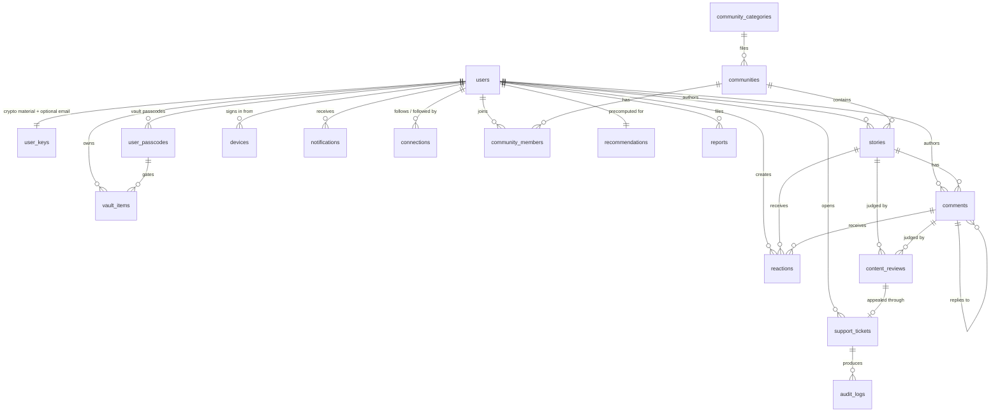

# 07 — Data Model

Twenty MongoDB collections. Every field, every type, every index, and the reasoning behind the shape of each document.

## 1. Conventions

These apply to every collection without exception.

**Identifiers.** Each document has a `_id` that is a **ULID string with a typed prefix**, not an `ObjectId`. ULIDs are lexicographically sortable by creation time, URL-safe, and 26 characters, and the prefix makes an ID self-describing in a log or a bug report.

| Prefix | Collection |
|---|---|
| `usr_` | users |
| `sto_` | stories |
| `cmt_` | comments |
| `com_` | communities |
| `vit_` | vault_items |
| `tkt_` | support_tickets |
| `aud_` | audit_logs |
| `not_` | notifications |
| `dev_` | devices |
| `rep_` | reports |
| `pcd_` | user_passcodes |
| `rev_` | content_reviews |
| `med_` | media |
| `psh_` | push_tokens |

`community_categories` and `interests` are the two exceptions: their `_id` **is** their slug, because the slug is the natural key, is stable, and appears in URLs and in configuration files where an opaque ULID would be unreadable.

Generated by `app/core/ids.py`:

```python
def new_id(prefix: str) -> str:
    return f"{prefix}_{ULID().str}"
```

The reference project used `ObjectId` with a custom Pydantic `PyObjectId` wrapper, which works but leaks a MongoDB implementation detail into every API response and requires conversion at every boundary. Strings need no conversion, no custom core schema, and no `arbitrary_types_allowed`.

**Timestamps — one format, no exceptions.** This is a hard rule because date drift is the most common and most expensive inconsistency in a document store: once two formats exist, every query, every sort, and every comparison becomes conditional.

| Layer | Format |
|---|---|
| MongoDB | BSON `Date`. **Never** a string, never an epoch integer, never a formatted date. |
| Python | `datetime` that is always timezone-aware and always UTC. |
| API wire | ISO-8601 UTC with a `Z` suffix and millisecond precision: `2026-08-05T11:14:32.000Z`. |
| Precision | Milliseconds. BSON `Date` holds nothing finer, so anything more is a lie. |
| Naming | An instant ends in `_at`. A duration ends in `_seconds` or `_ms`. A date-only value does not exist — if it looks date-only, it is an instant at UTC midnight. |

Every timestamp comes from exactly one helper:

```python
# app/core/time.py
def utc_now() -> datetime:
    return datetime.now(UTC).replace(microsecond=(...))  # truncated to ms
```

`datetime.now()` without a tzinfo, `datetime.utcnow()` (naive, deprecated), `time.time()`, and any manual `strftime` on a stored value are **lint failures**. A naive datetime written to Mongo is silently interpreted as UTC on the way in and comes back tz-aware, so the bug does not appear until something compares the two — which is exactly the class of failure this rule exists to prevent.

Every collection has `created_at` and `updated_at`. `updated_at` is set in the same `$set` as any mutation — never in a separate write. Nullable timestamps use `_at` suffixes throughout (`published_at`, `verified_at`, `deleted_at`). The one exception is `media`, which has no `updated_at` because nothing ever mutates a row: it is written once and deleted once.

**Soft delete.** Content collections use `deleted_at: datetime | None`. A non-null value means deleted; every read query filters on it. Security collections (`user_keys`, `user_passcodes`, `audit_logs`) never soft-delete, and neither does `media` — a row there stands for bytes on a disk, so leaving a tombstone behind would leave the bytes too.

**Field naming.** `snake_case` everywhere, matching the wire format and Python. No abbreviations except the established ones (`dek`, `umk`, `kek`, `otp`, `tnc`).

**Enums** are stored as lowercase strings and typed in Python as `Literal`, not `Enum` — `Annotated[Literal["draft", "public"], BeforeValidator(strip_lower)]`, so input is normalized then constrained. This is the reference project's approach and it is the right one for a document store where the value is a string on the wire anyway.

**Denormalization is deliberate and enumerated.** Author display name and avatar seed are copied into `stories` so a feed renders in one query. Every denormalized field is listed in §17 with its refresh trigger, so nobody has to guess whether a field is authoritative.

**No cross-collection transactions in v1.** Where a multi-document invariant matters (a story's comment count, a community's member count), it is maintained by an atomic `$inc` in the same operation that creates the child document, and reconciled nightly by a maintenance job. Introducing multi-document transactions costs a replica-set requirement on every write path for a consistency guarantee our counters do not need.

---

## 2. `users`

The account. Deliberately thin — no email, no phone, no personal fields at all.

| Field | Type | Default | Notes |
|---|---|---|---|
| `_id` | `str` (`usr_…`) | generated | Immutable. Used in every foreign key. |
| `username` | `str` | required | Unique. `^[a-z0-9_]{3,20}$`. The sign-in handle. |
| `username_lower` | `str` | derived | Redundant lowercase copy for the unique index; `username` is already lowercase, but this makes the index intent explicit and survives a future case-preserving change. |
| `display_name` | `str` | = `username` | 1–40 chars. Non-unique, changeable. Shown on stories. |
| `avatar_seed` | `str` | generated | Server-issued seed the client renders an avatar from. Never a URL, never an upload. |
| `password_hash` | `str` | required | Argon2id PHC string, includes parameters. |
| `role` | `"user" \| "admin" \| "super_admin"` | `"user"` | `moderator` is added when the moderation queue ships; `system` when workers need an identity. See [06](06-recovery-and-admin-flows.md). |
| `status` | `"active" \| "deactivated" \| "pending_deletion"` | `"active"` | Lifecycle only. **Blocking is not a status** — see `blocked`. |
| `blocked` | `bool` | `false` | Staff-applied block. Checked at sign-in and on every authenticated request. |
| `blocked_reason` | `str \| None` | `None` | Internal only, never returned to the user. |
| `blocked_at` | `datetime \| None` | `None` | |
| `referral_code` | `str` | generated | **Unique.** 6 characters from `ABCDEFGHJKLMNPQRSTUVWXYZ23456789` — Crockford-style, ambiguous glyphs removed. This user's own code, given to others. |
| `referred_by` | `str \| None` | `None` | The `referral_code` of the referring user, captured at signup. Stored as the code, not the `user_id`, so the join is against the same value the user typed. |
| `login_info` | `LoginInfo \| None` | `None` | Most recent sign-in. `None` until the first sign-in after signup. |
| `tnc` | `{accepted: bool, version: str, accepted_at: datetime}` | required | Terms acceptance with version. |
| `interests` | `list[str]` | `[]` | Interest slugs. Drives community and people recommendations. |
| `bio` | `str \| None` | `None` | Max 200 chars. Text only; no links (link-in-bio is an identity vector). |
| `counts` | `{stories: int, connections: int, followers: int, communities: int}` | zeros | Denormalized. Maintained by `$inc`. |
| `prefs` | `{theme: str, reading_size: str, notify_in_app: bool, notify_email: bool}` | see below | `theme`: `system\|midnight\|paper`. `reading_size`: `reading\|readingLg`. |
| `onboarding` | `{interests_done: bool, first_story_done: bool, recovery_kit_offered: bool}` | all `false` | Drives the onboarding gate and the one-time Recovery Kit offer. |
| `last_login_at` | `datetime \| None` | `None` | |
| `last_active_at` | `datetime \| None` | `None` | Coarse — written at most once per hour to avoid a write per request. |
| `created_at` / `updated_at` | `datetime` | now | |
| `deleted_at` | `datetime \| None` | `None` | |

Embedded `LoginInfo`:

| Field | Type | Notes |
|---|---|---|
| `logged_in_at` | `datetime` | |
| `ip_prefix` | `str` | **Truncated before storage** — `/24` for IPv4, `/48` for IPv6. A full IP is a durable identifier and storing one would violate R6 in [05](05-security-and-crypto.md). Enough for abuse handling, not enough to locate a person. |
| `platform` | `"ios" \| "android" \| "web"` | |
| `os_version` | `str \| None` | Major version only, e.g. `"iOS 18"`. |
| `app_version` | `str \| None` | |
| `device_model` | `str \| None` | e.g. `"Pixel 8"`. |
| `fingerprint` | `str` | Coarse hash of the four fields above. Matches the `devices` collection. |

**Indexes**

| Keys | Options |
|---|---|
| `{username_lower: 1}` | `unique` |
| `{referral_code: 1}` | `unique` |
| `{referred_by: 1, created_at: -1}` | "Who did this code bring in", `sparse` |
| `{blocked: 1, created_at: -1}` | Admin listing, `partialFilterExpression: {blocked: true}` |
| `{status: 1, created_at: -1}` | Admin listing |
| `{interests: 1}` | Recommendation queries |
| `{last_active_at: -1}` | Active-user sweeps, `sparse` |

**Why `blocked` is a boolean and not a `status` value.** The original schema carried `status: "blocked"`, which meant blocking and account lifecycle shared one field — so blocking a deactivated account destroyed the knowledge that it was deactivated, and unblocking had to guess what to restore. They are orthogonal facts and now live in orthogonal fields. Every read path checks `blocked` independently of `status`.

**Why the referral code is alphanumeric rather than six digits.** Six digits is one million codes, which is both too few to stay collision-free for long and small enough to enumerate exhaustively in minutes. On a platform whose entire premise is that accounts cannot be discovered, an enumerable per-account identifier is a real leak. Six characters from a 32-symbol alphabet is roughly a billion codes, generated with `secrets`, retried on the unique-index collision, and never derived from anything about the user.

`login_info` holds only the **most recent** sign-in. Session history belongs in `devices` and the audit log, which already exist for that purpose; duplicating it here would produce an unbounded array on the hottest document in the system.

**What is absent, and why.** No `email`, no `phone`, no `full_name`, no `dob`, no `gender`, no `address`, no `pan`, no `kyc`. The reference project's `User` document carried all of those; here every one of them would violate R6 in [05](05-security-and-crypto.md). The optional email lives in `user_keys` in unreadable form, because it is recovery material rather than profile data — and putting it there means a leaked `users` collection contains no contactable identifier at all.

**A note on the original draft schema.** The requirement sketched `{user_id: "USR001", email, email_verified, password, tnc, avatar: "😀"}`. Four changes: `user_id` splits into an immutable `_id` and a mutable `username`; `email`/`email_verified` move to `user_keys` encrypted; `password` becomes `password_hash` so the field name cannot lie about its contents; and `avatar` becomes `avatar_seed`, since storing a rendered emoji fixes the avatar system to emoji forever, whereas a seed lets the rendering strategy evolve (emoji today, generated illustration tomorrow) without a migration.

---

## 3. `user_keys`

One document per user. All cryptographic material and the optional email. **This collection is the most sensitive in the system** and is the reason the security review checklist exists.

| Field | Type | Default | Notes |
|---|---|---|---|
| `_id` | `str` | = `user_id` | One-to-one with `users`; using the user id as `_id` makes the lookup a primary-key hit. |
| `user_id` | `str` | required | Redundant but explicit. |
| `salt_pw` | `bytes` (16) | required | Salt for `KEK_pw` derivation. Client-generated. |
| `wrapped_umk` | `bytes` | required | `nonce ‖ AES-256-GCM(KEK_pw, UMK)`. |
| `umk_version` | `int` | `1` | Increments on password change (re-wrap) or reset (new UMK). |
| `kdf` | `{algo: str, memory_kib: int, iterations: int, parallelism: int}` | see [05](05-security-and-crypto.md) | Stored so parameters can be raised later. |
| `label_key_version` | `int` | `1` | Version of the UMK-derived HMAC key used for vault labels. |
| `recovery` | `{enabled: bool, salt: bytes \| None, blob: bytes \| None, created_at: datetime \| None, mode: "server_stored" \| "offline" \| None}` | `{enabled: false}` | The optional Vault Recovery Kit. `blob` is present only in `server_stored` mode. |
| `email_index` | `str \| None` | `None` | `HMAC-SHA256(EMAIL_INDEX_KEY, normalized_email)`, hex. Deterministic — supports the unique index and exact lookup. |
| `email_ciphertext` | `bytes \| None` | `None` | KMS-envelope AES-256-GCM of the normalized address. Randomized. |
| `email_masked` | `str \| None` | `None` | Precomputed `d••••k@g••••.com` for display, so no read path needs to decrypt. |
| `email_verified` | `bool` | `false` | |
| `email_verified_at` | `datetime \| None` | `None` | The passcode-ticket precondition needs this to be at least 48 hours old. |
| `email_added_at` | `datetime \| None` | `None` | |
| `created_at` / `updated_at` | `datetime` | now | |

**Indexes**

| Keys | Options |
|---|---|
| `{email_index: 1}` | `unique`, `sparse` — enforces one account per address without storing the address |
| `{email_verified: 1, email_verified_at: 1}` | Ticket precondition checks, `sparse` |

**Why `email_masked` is stored rather than computed.** Computing it requires a KMS decrypt, and Settings displays it on every page load. Storing the masked form means the read path never touches KMS, which both reduces cost and shrinks the number of code paths with decrypt permission down to one: the mail sender.

**Why the email lives here and not in `users`.** Blast radius. A query bug, an over-broad projection, or an admin tool that dumps `users` cannot leak recovery material, because there is none in that collection. Sensitive material is concentrated in one place that has exactly two legitimate readers.

---

## 4. `user_passcodes`

Vault passcodes. A user may have several — one general vault passcode plus per-item passcodes for the most sensitive items.

| Field | Type | Default | Notes |
|---|---|---|---|
| `_id` | `str` (`pcd_…`) | generated | |
| `user_id` | `str` | required | |
| `label` | `str` | required | User-chosen name for this passcode, e.g. "Main vault". Plaintext — it names the passcode, not its value. |
| `scope` | `"vault" \| "item"` | `"vault"` | `vault` applies to all items without their own; `item` is referenced by a specific item. |
| `passcode_hash` | `str` | required | Argon2id PHC string. Used to verify entry before attempting a decrypt. |
| `salt_pc` | `bytes` (16) | required | Salt for `KEK_pc` derivation. |
| `kdf` | `{algo, memory_kib, iterations, parallelism}` | see [05](05-security-and-crypto.md) | |
| `escrow_ciphertext` | `bytes` | required | KMS-envelope encryption of the passcode plaintext. Releasable only by an approved ticket. |
| `escrow_key_id` | `str` | required | KMS key version, so rotation is trackable. |
| `hint` | `bytes \| None` | `None` | Optional user hint, encrypted under the UMK. Readable only after any successful unlock. |
| `failed_attempts` | `int` | `0` | Mirrors the Redis counter for durability across restarts. |
| `locked_until` | `datetime \| None` | `None` | |
| `last_used_at` | `datetime \| None` | `None` | |
| `created_at` / `updated_at` | `datetime` | now | |

**Indexes**

| Keys | Options |
|---|---|
| `{user_id: 1, scope: 1}` | |
| `{user_id: 1, label: 1}` | `unique` |

**The escrow is the whole point of this collection and it is safe for one reason:** `escrow_ciphertext` yields a passcode, and a passcode alone derives `KEK_pc`, and `KEK_pc` alone cannot produce `KEK_item` — that needs the UMK too, which needs the password. The `❌` in every "decrypt another user's vault content" cell of the permission matrix is a statement about this document's insufficiency.

`passcode_hash` exists separately from the escrow so that verifying a passcode entry does not require a KMS call on every unlock.

---

## 5. `stories`

The core content unit.

| Field | Type | Default | Notes |
|---|---|---|---|
| `_id` | `str` (`sto_…`) | generated | |
| `author_id` | `str` | required | → `users._id`. The only identity a story stores; name and face are read from that row. |
| `title` | `str \| None` | `None` | Max 120 chars. Optional — many stories have no title. |
| `body` | `str` | required | 1–20,000 chars. Plain text with a minimal formatting allowlist. Emoji permitted. |
| `excerpt` | `str` | derived | First 240 chars, server-computed, so feeds never transfer full bodies. |
| `visibility` | `"draft" \| "private" \| "public" \| "scheduled"` | `"draft"` | **Default is `draft`** as specified — publishing is always an explicit act. |
| `community_id` | `str \| None` | `None` | → `communities._id`. Required when `visibility` is `public`. |
| `slug` | `str \| None` | `None` | Opaque URL slug for public stories. Random, not derived from the title — a title-derived slug leaks content into the URL. |
| `media` | `list[StoryMedia]` | `[]` | Embedded, max 4. See below. |
| `counts` | `{likes: int, comments: int, shares: int, views: int}` | zeros | Maintained by `$inc`. |
| `likers` | `[str]` | absent | Up to three `users._id`, newest first — the faces under a story card. Ids only; the names and faces come from `users`. |
| `reading_minutes` | `int` | derived | For the "6 min read" affordance. |
| `language` | `str \| None` | `None` | Detected, used for feed filtering. |
| `moderation` | `Moderation` | see below | The sanity-layer state. Replaces the earlier `content_flags`. |
| `embedding` | `list[float] \| None` | `None` | Local model output. Present only for `public` stories — never for drafts or private stories. |
| `scheduled_for` | `datetime \| None` | `None` | Required when `visibility` is `scheduled`. |
| `published_at` | `datetime \| None` | `None` | Set once, on first publish. Stored to minute precision — see the timing-correlation measure in [05](05-security-and-crypto.md). |
| `edited_at` | `datetime \| None` | `None` | |
| `created_at` / `updated_at` | `datetime` | now | |
| `deleted_at` | `datetime \| None` | `None` | |

Embedded `Moderation`:

| Field | Type | Default | Notes |
|---|---|---|---|
| `state` | `"unreviewed" \| "allowed" \| "held" \| "blocked"` | `"unreviewed"` | A story is `unreviewed` for its entire life as a draft. |
| `verdict` | `"allow" \| "warn" \| "redirect" \| "hold" \| "block" \| None` | `None` | The last verdict from the sanity layer. |
| `rule` | `str \| None` | `None` | Dotted rule id, e.g. `"safety.doxxing"`. Cited to the user verbatim. |
| `review_id` | `str \| None` | `None` | → `content_reviews._id`. The full record. |
| `fit_score` | `float \| None` | `None` | 0–1 against the target community's rubric. |
| `fit_override` | `bool` | `false` | The author chose "publish here anyway" after a `redirect`. |
| `exposure_spans` | `int` | `0` | How many self-identifying spans were found. The spans themselves live on the review, not here. |
| `exposure_ack` | `bool` | `false` | The author was warned and chose to keep them. Suppresses re-warning on edit. |
| `risk_signal` | `bool` | `false` | Care signal. Surfaces helpline resources **to the author only**. Never removes, hides, downranks, or reports content. |
| `appeal_ticket_id` | `str \| None` | `None` | → `support_tickets._id` for a `content_appeal`. |

**`moderation` replaces the earlier `content_flags: {risk_signal, reviewed}`.** Two booleans could express "we looked at it" but not *what was decided, by which rule, at which rubric version, and whether the author overrode it* — and every one of those is needed to render an honest explanation to the user, to handle an appeal, and to feed a corrected example back into the golden set. A moderation system whose decision is not reconstructible from the record is a system that cannot be audited or improved.

**`embedding` is stored on the story rather than in a separate vector collection.** At MVP volume, similarity is computed by the nightly worker over a projection of this field, which is a NumPy operation on a few hundred thousand vectors — well within one process. A dedicated vector database is a Phase-10 concern, and the field's presence here makes that migration a backfill rather than a redesign.

Embedded `StoryMedia`:

| Field | Type | Notes |
|---|---|---|
| `media_id` | `str` | |
| `kind` | `"image"` | Images only in v1; no video posts (P7). |
| `object_key` | `str` | Object key in the `media` storage profile. |
| `width` / `height` | `int` | For layout without a fetch. |
| `blur_hash` | `str` | Placeholder while loading. |
| `alt` | `str \| None` | Author-supplied alt text. |
| `exif_stripped` | `bool` | Must be `true` before the story can publish. |

**Indexes**

| Keys | Options |
|---|---|
| `{author_id: 1, created_at: -1}` | Author's own list |
| `{author_id: 1, visibility: 1, created_at: -1}` | Author filtering by tab |
| `{community_id: 1, published_at: -1}` | Community feed. `partialFilterExpression: {visibility: "public", deleted_at: null}` |
| `{published_at: -1}` | Global feed. Same partial filter. |
| `{slug: 1}` | `unique`, `sparse` — public page lookup |
| `{visibility: 1, scheduled_for: 1}` | The publish sweep. `partialFilterExpression: {visibility: "scheduled"}` |
| `{title: "text", body: "text"}` | Search. Weighted 3:1 toward title. Partial-filtered to public. |
| `{"moderation.state": 1, created_at: 1}` | The hold queue and the 24-hour auto-resolve sweep. `partialFilterExpression: {"moderation.state": "held"}` |

**The feed indexes must also exclude held and blocked content.** The partial filter on the two feed indexes is therefore `{visibility: "public", deleted_at: null, "moderation.state": "allowed"}` — a held story is not filtered out after fetching, it is never fetched. This is the same reasoning as the hidden-vault-item guarantee in §12: a presentation-layer filter is one forgotten `if` away from leaking, whereas a query that never selects the document cannot leak it even through a raw API response.

**Partial indexes are load-bearing here.** The global feed index covers only public, non-deleted stories, which for a platform where most stories are drafts or private keeps the index a fraction of collection size. The reference project defined no indexes at all; feed queries at any real volume would have been full scans.

**Why `excerpt` is stored rather than computed at read time.** A feed page returns 20 stories. Computing 20 excerpts from 20 full bodies means transferring 20 full bodies out of MongoDB. Storing the excerpt lets the feed projection exclude `body` entirely.

---

## 6. `comments`

| Field | Type | Default | Notes |
|---|---|---|---|
| `_id` | `str` (`cmt_…`) | generated | |
| `story_id` | `str` | required | → `stories._id` |
| `author_id` | `str \| None` | required | → `users._id`. `None` after the author deletes their account — the comment becomes a tombstone so threads keep their shape. |
| `parent_id` | `str \| None` | `None` | One level of nesting only. Deeper threads become unreadable on a phone. |
| `body` | `str` | required | 1–2,000 chars. |
| `counts` | `{likes: int, replies: int}` | zeros | |
| `is_tombstone` | `bool` | `false` | Renders as "A deleted account". |
| `moderation` | `{state, verdict, rule, review_id}` | `state: "allowed"` | The safety gate only — no fit check (a comment inherits its story's room) and no inline exposure check. Same four fields as a story's, so one renderer handles both. |
| `created_at` / `updated_at` | `datetime` | now | |
| `deleted_at` | `datetime \| None` | `None` | |

**Indexes**

| Keys | Options |
|---|---|
| `{story_id: 1, created_at: 1}` | Thread rendering. `partialFilterExpression: {deleted_at: null}` |
| `{story_id: 1, parent_id: 1, created_at: 1}` | Reply rendering |
| `{author_id: 1, created_at: -1}` | The author's own comment history |

---

## 7. `reactions`

Likes on stories and comments. A separate collection rather than an embedded array, because an embedded array on a story with 50,000 likes is a 50,000-element document.

| Field | Type | Notes |
|---|---|---|
| `_id` | `str` | `{user_id}:{target_kind}:{target_id}` — a **deterministic composite id**, which makes the unique constraint free and makes an idempotent like a single `upsert`. |
| `user_id` | `str` | |
| `target_kind` | `"story" \| "comment"` | |
| `target_id` | `str` | |
| `kind` | `"like"` | One reaction type in v1. Deliberate: a reaction palette invites performance, and this is not a performance platform. |
| `created_at` | `datetime` | |

**Indexes**

| Keys | Options |
|---|---|
| `{target_kind: 1, target_id: 1, created_at: -1}` | "Who liked this" |
| `{user_id: 1, created_at: -1}` | The user's own likes |

`_id` carries the uniqueness constraint, so no additional unique index is needed. Liking is `update_one(..., upsert=True)`; unliking is `delete_one`. Both are idempotent, which means a double-tap or a retried request cannot corrupt the count.

---

## 8. `community_categories`

The top level of the taxonomy from [00](00-product-overview.md) §6.1. Seeded reference data — one row per area of life.

| Field | Type | Default | Notes |
|---|---|---|---|
| `_id` | `str` | required | The slug itself, e.g. `"job-search"`. `^[a-z0-9-]{3,32}$`. |
| `name` | `str` | required | Display name, e.g. "Job search". |
| `description` | `str` | required | Max 200 chars. Shown on the browse screen. |
| `tone` | `"reflective" \| "supportive" \| "practical" \| "open"` | required | Selects copy, default sort, and the fit-check rubric ([12](12-ai-layer.md)). |
| `icon` | `str` | required | Generated icon name from `packages/icons`. |
| `accent_token` | `str` | `"accent"` | Token *name*, never a hex. |
| `sort_order` | `int` | `100` | Manual ordering on the browse screen. |
| `status` | `"active" \| "hidden"` | `"active"` | `hidden` retires a category without breaking existing communities. |
| `created_at` / `updated_at` | `datetime` | now | |

**Indexes:** `{status: 1, sort_order: 1}`.

**This collection exists because the previous design had the taxonomy as a code enum,** `archetype: Literal["grief" | "sacrifice" | "professional" | "loneliness" | "healing" | "other"]`. That was correct for a product about four personas and wrong for a product about categories of life. Adding "job search" to an enum is a code change, a deploy, a Dart regeneration, a TypeScript regeneration, and a data migration for every existing document; adding it here is one seed row. Any taxonomy that is expected to grow belongs in a collection, and the test of "expected to grow" is simply whether a non-engineer could reasonably want to add one.

`tone` remains a closed enum, and correctly so — it is not a label, it is a **behavioural switch**. Each value corresponds to a rubric file, a set of copy strings, and a default sort. A fifth tone is genuinely a code change, because something has to be written for it to mean anything.

---

## 9. `communities`

The room. No owner, no admin, no page — per P3 in [00](00-product-overview.md).

| Field | Type | Default | Notes |
|---|---|---|---|
| `_id` | `str` (`com_…`) | generated | |
| `slug` | `str` | required | Unique. `^[a-z0-9-]{3,40}$`. |
| `name` | `str` | required | |
| `description` | `str` | required | Max 300 chars. Also fed to the fit-check rubric as room-specific context. |
| `category_id` | `str` | required | → `community_categories._id`. |
| `tone_override` | `"reflective" \| "supportive" \| "practical" \| "open" \| None` | `None` | Rarely used. A room that genuinely differs from its shelf, e.g. a practical room inside `grief` about probate and paperwork. |
| `icon` | `str` | required | Generated icon name from `packages/icons`. |
| `accent_token` | `str` | inherits category | Token *name*, never a hex. |
| `interests` | `list[str]` | `[]` | Interest slugs used for matching. |
| `member_directory` | `bool` | `false` | Whether members are listed to each other. See below. |
| `is_curated` | `bool` | `true` | v1 communities are platform-curated. User-created communities are a later phase. |
| `counts` | `{members: int, stories: int}` | zeros | |
| `rules` | `list[str]` | `[]` | Displayed on join, and supplied verbatim to the fit-check rubric. |
| `fit_threshold` | `{warn: float, redirect: float}` | `{0.65, 0.35}` | Per-room override of the fit-check bands in [12](12-ai-layer.md) §2.2. A broad room loosens them; a narrow, fragile room tightens them. |
| `status` | `"active" \| "archived"` | `"active"` | |
| `created_at` / `updated_at` | `datetime` | now | |

**Indexes**

| Keys | Options |
|---|---|
| `{slug: 1}` | `unique` |
| `{category_id: 1, status: 1, "counts.members": -1}` | Browse within a category, popular first |
| `{interests: 1, status: 1}` | Recommendation |
| `{"counts.members": -1}` | Global popular listing |

**`accent_token` holds a token name, not a color.** A community whose brand color was stored as `#9B8CFF` would break the moment a new theme shipped, because it would keep rendering a dark-theme violet on a light background. Storing `"accent"` or `"success"` means the community's color resolves through the active theme like everything else.

**`member_directory` is the honest answer to a real tension.** In `grief`, listing members would be a violation — nobody there wants to be browsable. In `job-search` and `starting-over`, being findable is much of the point; a room where nobody can see who else is present is not useful for either. So it is a per-room flag, defaulting to `false`, and even when `true` the directory shows only what a story already shows: display name, avatar, and joined-at. **Never a sortable, filterable, rankable people list** — that is the mechanic §7 of [00](00-product-overview.md) forbids, and the distinction between "you can see who is here" and "you can shop through who is here" is exactly where the dating-app line sits.

---

## 10. `community_members`

| Field | Type | Notes |
|---|---|---|
| `_id` | `str` | `{user_id}:{community_id}` — deterministic composite |
| `user_id` | `str` | |
| `community_id` | `str` | |
| `joined_at` | `datetime` | |
| `notifications_enabled` | `bool` | Default `true` |
| `last_read_at` | `datetime \| None` | Drives the unread indicator |

**Indexes**

| Keys | Options |
|---|---|
| `{user_id: 1, joined_at: -1}` | "My communities" |
| `{community_id: 1, joined_at: -1}` | Member listing |

---

## 11. `connections`

One-directional follows.

| Field | Type | Notes |
|---|---|---|
| `_id` | `str` | `{follower_id}:{followee_id}` |
| `follower_id` | `str` | |
| `followee_id` | `str` | |
| `status` | `"active" \| "blocked"` | `blocked` means the followee blocked the follower |
| `created_at` | `datetime` | |

**Indexes**

| Keys | Options |
|---|---|
| `{follower_id: 1, created_at: -1}` | "Following" list and feed fan-in |
| `{followee_id: 1, created_at: -1}` | "Followers" list |
| `{followee_id: 1, status: 1}` | Block filtering |

**No follow requests, no mutual-follow requirement.** Following is public-story consumption only; a private story is never visible to a follower. Because identities are pseudonymous, a follow carries none of the social weight it does elsewhere, so the request/accept ceremony adds friction without adding safety. Blocking exists and is one-directional.

---

## 12. `vault_items`

Encrypted personal storage. The server stores key material it cannot use and metadata it cannot read.

| Field | Type | Default | Notes |
|---|---|---|---|
| `_id` | `str` (`vit_…`) | generated | |
| `user_id` | `str` | required | |
| `passcode_id` | `str` | required | → `user_passcodes._id`. Which passcode gates this item. |
| `kind` | `"image" \| "video" \| "pdf"` | required | Coarse, client-declared. Also decides compression: a PDF is gzipped before encryption, an image or video is not, because both are already compressed and gzip would only cost CPU. Only enough to choose an icon. The server cannot verify it — it holds ciphertext — so the real check is a magic-byte sniff on the device, which also rejects a file whose bytes and extension disagree. |
| `size_bytes` | `int` | required | Ciphertext size. Counts against quota. |
| `chunk_count` | `int` | required | For streaming decrypt and integrity verification. |
| `object_key` | `str` | required | `vault/{user_id}/{item_id}`. No filename, no extension. |
| `encrypted_metadata` | `bytes` | required | AES-GCM under the item's DEK. Contains filename, MIME type, dimensions, duration, user note. |
| `wrapped_dek` | `bytes` | required | `nonce ‖ AES-256-GCM(KEK_item, DEK)`, AAD-bound to `item_id`. |
| `salt_item` | `bytes` (16) | required | HKDF salt for `KEK_item`. |
| `crypto_version` | `str` | `"story.dek.v1"` | Enables future migration. |
| `visibility` | `"normal" \| "hidden"` | `"normal"` | `hidden` items are excluded from every list. |
| `label_hash` | `str \| None` | `None` | Required when `hidden`. `HMAC(UMK-derived key, normalized_label)`. The label itself is never stored. |
| `label_hint` | `bytes \| None` | `None` | Optional, encrypted under the UMK. |
| `key_state` | `"active" \| "orphaned"` | `"active"` | `orphaned` after a password reset — undecryptable but not deleted. |
| `status` | `"pending" \| "ready" \| "failed" \| "deleting"` | `"pending"` | `pending` until the R2 upload is confirmed. |
| `scan_state` | `"pending" \| "clean" \| "unscannable"` | `"pending"` | `unscannable` is the honest terminal state for E2EE content. |
| `thumb_encrypted` | `bytes \| None` | `None` | Client-generated encrypted thumbnail, under 32 KiB, stored inline so grid views need one query and no per-item R2 fetch. |
| `created_at` / `updated_at` | `datetime` | now | |
| `deleted_at` | `datetime \| None` | `None` | |

**Indexes**

| Keys | Options |
|---|---|
| `{user_id: 1, visibility: 1, created_at: -1}` | The normal item list. `partialFilterExpression: {deleted_at: null}` |
| `{user_id: 1, label_hash: 1}` | **Hidden item lookup.** `unique`, `sparse` — an exact-match hit, no scan |
| `{user_id: 1, passcode_id: 1}` | Items affected by a passcode change |
| `{user_id: 1, key_state: 1}` | The "Unrecoverable" section after a reset |
| `{status: 1, created_at: 1}` | Reaping abandoned `pending` uploads. Partial-filtered to `pending` |

**The `hidden` visibility guarantee is enforced at the index and query layer, not the presentation layer.** The list endpoint's query includes `visibility: "normal"` — a hidden item is not filtered out after fetching, it is never fetched. This matters because a presentation-layer filter is one forgotten `if` away from leaking, whereas a query that never selects the documents cannot leak them even through a raw API response. Storage totals shown to the user are computed over normal items only, for the same reason.

**`thumb_encrypted` stored inline is a deliberate trade.** It bloats documents by up to 32 KiB, but the alternative — a separate R2 object per thumbnail — means 40 presigned URLs and 40 network round trips to render one grid screen, which on mobile is the difference between instant and unusable.

---

## 13. `support_tickets`

| Field | Type | Default | Notes |
|---|---|---|---|
| `_id` | `str` (`tkt_…`) | generated | |
| `user_id` | `str` | required | The affected user |
| `type` | `"passcode_release" \| "account_locked" \| "content_appeal" \| "data_export" \| "account_deletion" \| "security_incident"` | required | Determines routing |
| `state` | `"draft" \| "awaiting_email_verify" \| "submitted" \| "under_review" \| "needs_more_info" \| "approved" \| "reveal_ready" \| "revealed" \| "rejected" \| "expired" \| "closed"` | `"draft"` | See the state machine in [06](06-recovery-and-admin-flows.md) |
| `required_role` | `"moderator" \| "admin" \| "super_admin"` | derived from `type` | Enforced by dependency, never re-routable downward |
| `reason` | `str` | required | User's free text |
| `assignee_staff_id` | `str \| None` | `None` | |
| `messages` | `list[TicketMessage]` | `[]` | Threaded conversation |
| `email_verified_for_ticket` | `bool` | `false` | A fresh OTP proves *current* mailbox control |
| `approval` | `{approved_by, approved_at, justification, step_up_factors: list[str], dual_approval_by} \| None` | `None` | |
| `reveal` | `{token_hash, otc_hash, expires_at, payload_ciphertext, revealed_at} \| None` | `None` | `payload_ciphertext` is the passcode list under the one-time reveal key. Destroyed on close. |
| `resolution` | `str \| None` | `None` | |
| `created_at` / `updated_at` / `closed_at` | `datetime` | | |

Embedded `TicketMessage`: `{message_id, author_kind: "user" | "staff", author_ref, body, internal: bool, created_at}`. Messages with `internal: true` are never returned on the user-facing endpoint — enforced by projection, not by filtering after the fact.

**Indexes**

| Keys | Options |
|---|---|
| `{user_id: 1, created_at: -1}` | The user's ticket list |
| `{state: 1, required_role: 1, created_at: 1}` | The staff queue, oldest first |
| `{user_id: 1, type: 1, state: 1}` | Enforces one open ticket per type per user |
| `{"reveal.expires_at": 1}` | Expiry sweep, `sparse` |

**`payload_ciphertext` is the only place a passcode-derived secret is ever persisted outside `user_passcodes`,** it is encrypted under a key that exists only in the super_admin's and the user's hands, it has a 24-hour lifetime, and it is destroyed on close. The sweep job that enforces expiry is not optional infrastructure — it is a security control.

---

## 14. `audit_logs`

Append-only, hash-chained. Full schema and rationale in [06](06-recovery-and-admin-flows.md) §6.

| Field | Type | Notes |
|---|---|---|
| `_id` | `str` (`aud_…`) | ULID — chronologically sortable, which the chain relies on |
| `prev_hash` | `str` | `sha256:…` of the previous entry |
| `entry_hash` | `str` | This entry's hash |
| `occurred_at` | `datetime` | |
| `actor` | `{user_id, role, staff_id, ip_prefix, device_fingerprint}` | |
| `action` | `str` | Dotted, e.g. `passcode_release.approved` |
| `target` | `{kind, id}` | |
| `ticket_id` | `str \| None` | |
| `outcome` | `"success" \| "denied" \| "error"` | |
| `details` | `dict` | Never contains a secret; subject to the redaction processor |
| `visible_to_target` | `bool` | Drives the user's Security activity screen |

**Indexes**

| Keys | Options |
|---|---|
| `{"target.id": 1, visible_to_target: 1, occurred_at: -1}` | The user's security log |
| `{"actor.user_id": 1, occurred_at: -1}` | Staff activity review |
| `{action: 1, occurred_at: -1}` | Anomaly detection |
| `{occurred_at: 1}` | Chain verification walk |

**Database-level enforcement.** The API's MongoDB role has `insert` and `find` on this collection and no `update` or `remove`. This is set up in the provisioning script, not in application code, so an application bug cannot produce a mutation. There is no code path anywhere in the repository that issues an update against `audit_logs`.

---

## 15. `content_reviews`

One document per sanity-layer decision. Append-only in practice: a re-check on edit writes a **new** review rather than mutating the old one, so the decision history of a piece of content is reconstructible.

| Field | Type | Default | Notes |
|---|---|---|---|
| `_id` | `str` (`rev_…`) | generated | |
| `target_kind` | `"story" \| "comment" \| "profile"` | required | |
| `target_id` | `str` | required | |
| `user_id` | `str` | required | The author. Needed for appeal routing and per-user abuse patterns. |
| `community_id` | `str \| None` | `None` | The room the fit check was run against. |
| `trigger` | `"publish" \| "edit" \| "report" \| "recheck"` | required | |
| `checks` | `list[CheckResult]` | required | One entry per check that ran. |
| `verdict` | `"allow" \| "warn" \| "redirect" \| "hold" \| "block"` | required | The **most restrictive** verdict across all checks. |
| `rule` | `str \| None` | `None` | The rule that produced the verdict. |
| `suggested_communities` | `list[{community_id, score}]` | `[]` | Populated on `redirect`. |
| `tier_reached` | `0 \| 1 \| 2 \| 3` | required | How far up the cascade this went. Drives the cost dashboard. |
| `rubric_versions` | `dict[str, str]` | required | e.g. `{"safety": "v3", "tone.practical": "v2"}`. **Without this an appeal is unanswerable** — nobody can tell what the rules were at the time. |
| `model_ids` | `list[str]` | required | Every model that contributed. |
| `latency_ms` | `int` | required | |
| `outcome` | `"stood" \| "overturned" \| "expired" \| None` | `None` | Set by an appeal or by the hold sweep. |
| `reviewed_by` | `str \| None` | `None` | Staff id, when a human touched it. |
| `created_at` | `datetime` | now | |

Embedded `CheckResult`: `{check: "safety" | "fit" | "exposure" | "care", verdict, score: float, rule: str | None, rationale: str, spans: list[{start, end, kind}]}`.

**Indexes**

| Keys | Options |
|---|---|
| `{target_kind: 1, target_id: 1, created_at: -1}` | Decision history for one item |
| `{verdict: 1, created_at: -1}` | The moderation queue and the transparency report |
| `{user_id: 1, created_at: -1}` | Repeat-offender patterns |
| `{outcome: 1, rule: 1}` | Overturn rate per rule — the calibration signal in [12](12-ai-layer.md) §9 |
| `{created_at: 1}` | TTL at 180 days, **except** where `verdict` is `block` or `outcome` is `overturned`, which are retained by a partial filter |

**Why the spans and rationale are stored rather than recomputed.** A model's output is not reproducible — the same text and the same rubric version can produce a different rationale tomorrow. If the record is not kept, an appeal reviewer is looking at a different decision than the one the author is appealing.

**Why the TTL exists at all.** A review of a story is a record *about a person's writing*, and P1 applies to derived data as well as collected data. Reviews that led to nothing are noise after six months; blocks and overturns are retained because one is a safety record and the other is a training example.

---

## 16. Supporting collections

### `media`

| Field | Type | Notes |
|---|---|---|
| `_id` | `str` (`med_…`) | The media id. The stored object's key is `media/{_id}`; the URL a story holds is `/v1/media/{_id}`. |
| `created_at` | `datetime` | The only other field, and it exists for one job: the orphan sweep in [15](15-storage-security-and-scale.md) §5.4. |

Deliberately not here: `owner_id`, `bytes`, `sha256`, `refcount`. Whether an
object is still in use is answered by querying `stories` for the URL, so there
is no counter to drift out of step. The row is written **before** the bytes, so
a failed write leaves a record the sweep tidies rather than bytes nothing knows
about. `drop_unused` erases the row and the object together.

This is the one collection with no `updated_at` — nothing ever mutates it.

Indexes: `{created_at: 1}` for the sweep. The reference check leans on
`stories.{images: 1}`, partial-filtered to `deleted_at: null`.

### `push_tokens`

| Field | Type | Notes |
|---|---|---|
| `_id` | `str` (`psh_…`) | |
| `token` | `str` | The FCM registration token. Unique across the collection. |
| `user_id` | `str` | Whoever registered this token most recently. |
| `platform` | `"android" \| "ios"` | |
| `created_at`, `last_seen_at` | `datetime` | |

Keyed on the **token**, not on `(user_id, device)`, and deliberately separate
from `devices`. A phone signed into two accounts is two `devices` rows but one
FCM token; keeping tokens here with a unique index means registering re-points
the token at the current user instead of leaving both rows live. Without that,
one account's notifications land on a phone now signed in as someone else.

Rows are hard-deleted, never tombstoned — the same rule `media` follows, and for
the same reason. A row stands for a phone that can still be reached, so a dead
one must stop existing. FCM reports dead tokens as `UNREGISTERED`, and the
sender erases them in the same pass.

Indexes: `{token: 1}` unique, `{user_id: 1}` for the send fan-out.

### `devices`

| Field | Type | Notes |
|---|---|---|
| `_id` | `str` (`dev_…`) | |
| `user_id` | `str` | |
| `fingerprint` | `str` | Coarse hash: platform + OS major + app version + model |
| `label` | `str` | "iPhone 14 · iOS 18" — user-readable |
| `platform` | `"ios" \| "android" \| "web"` | |
| `family_ids` | `list[str]` | Refresh-token families associated with this device |
| `first_seen_at` / `last_seen_at` | `datetime` | |
| `trusted` | `bool` | Suppresses repeat login alerts |

Indexes: `{user_id: 1, last_seen_at: -1}`, `{user_id: 1, fingerprint: 1}` unique.

### `notifications`

| Field | Type | Notes |
|---|---|---|
| `_id` | `str` (`not_…`) | |
| `user_id` | `str` | |
| `kind` | `"story_like" \| "story_comment" \| "new_follower" \| "community_story" \| "security_alert" \| "ticket_update" \| "system"` | |
| `actor_id` | `str \| None` | → `users._id`. `None` for system notifications. Name and face are read from that row, never copied here. |
| `target` | `{kind, id} \| None` | Deep-link destination |
| `body` | `str` | Pre-rendered text |
| `read_at` | `datetime \| None` | |
| `created_at` | `datetime` | |
| `push_after` | `datetime` | Absent once settled. When it is in the past the row is due for a push; claiming it leases the row forward. See [16](16-push-notifications.md) §2. |
| `pushed_at` | `datetime \| None` | Set only on a successful send. |
| `push_tries` | `int` | Incremented on every claim. Past `PUSH_MAX_TRIES` the row is abandoned. |

Indexes: `{user_id: 1, created_at: -1}`, `{user_id: 1, read_at: 1}` for the unread badge (partial-filtered to `read_at: null`), and a TTL index on `created_at` at 90 days — except `security_alert` and `ticket_update`, which are excluded from the TTL by a partial filter because a security notice must not silently vanish.

### `reports`

| Field | Type | Notes |
|---|---|---|
| `_id` | `str` (`rep_…`) | |
| `reporter_id` | `str` | |
| `target_kind` | `"story" \| "comment" \| "user"` | Never `vault_item` — vault content is unreadable and unreportable |
| `target_id` | `str` | |
| `reason` | `"harassment" \| "spam" \| "self_harm" \| "illegal" \| "impersonation" \| "wrong_community" \| "other"` | `wrong_community` routes to a fit re-check rather than to a moderator, since it is a routing complaint and not a safety one |
| `note` | `str \| None` | |
| `state` | `"open" \| "actioned" \| "dismissed"` | |
| `review_id` | `str \| None` | → `content_reviews._id`, the review the report triggered. A report is a `trigger: "report"` re-check as well as a queue entry — so a human never has to be the first line on content a machine can settle. |
| `handled_by` / `handled_at` | `str \| None` / `datetime \| None` | |
| `created_at` | `datetime` | |

Indexes: `{state: 1, created_at: 1}` for the queue, `{target_kind: 1, target_id: 1}` for aggregating reports on one item, `{reporter_id: 1, created_at: -1}` for abuse-of-reporting detection.

### `interests`

A small reference collection, seeded rather than user-generated.

| Field | Type | Notes |
|---|---|---|
| `_id` | `str` | The slug itself, e.g. `"grief"` |
| `name` | `str` | Display name |
| `category_id` | `str` | → `community_categories._id` |
| `embedding` | `list[float] \| None` | Precomputed vector for similarity matching. Local model, refreshed on rubric or model change. |

Index: `{category_id: 1}`.

### `recommendations`

Precomputed per user by the nightly worker, so the request path is a single primary-key read.

| Field | Type | Notes |
|---|---|---|
| `_id` | `str` | = `user_id` |
| `communities` | `list[{community_id, score, reason}]` | `reason` is a human-readable explanation, shown in the UI |
| `people` | `list[{user_id, score, reason}]` | |
| `computed_at` | `datetime` | |
| `model_version` | `str` | |

Index: `{computed_at: 1}` for staleness sweeps.

`reason` is a product requirement, not a debugging aid: a recommendation a user does not understand feels like surveillance. "Because you follow 3 people in Quiet Grief" is reassuring; an unexplained suggestion on an anonymity-focused platform is alarming.

### `schema_migrations`

| Field | Type | Notes |
|---|---|---|
| `_id` | `str` | Migration name, e.g. `"0007_add_vault_label_index"` |
| `applied_at` | `datetime` | |
| `duration_ms` | `int` | |
| `checksum` | `str` | Detects an edited, already-applied migration |

---

## 17. Denormalization register

Every copied field, in one table, with its refresh trigger. Undocumented denormalization is how a data model rots.

| Field | Source of truth | Refreshed when |
|---|---|---|
| `users.counts.*` | Aggregates over `stories`, `connections`, `community_members` | Atomic `$inc` on write; reconciled nightly |
| `stories.counts.*` | Aggregates over `reactions`, `comments` | Atomic `$inc` on write; reconciled nightly |
| `communities.counts.*` | Aggregates over `community_members`, `stories` | Atomic `$inc` on write; reconciled nightly |
| `stories.excerpt` | `stories.body` | On every body write |
| `stories.reading_minutes` | `stories.body` | On every body write |
| `user_keys.email_masked` | `user_keys.email_ciphertext` | On email add or change |

**Counts are eventually consistent and that is acceptable.** A like count that is briefly off by one is invisible. A comment thread missing a comment is not — which is why threads are read from `comments` directly and never reconstructed from a count.

**Identity is never copied.** A story, a comment, a liked-by row and an activity row each name a person by id and nothing else. `app/core/cards.py` turns a set of ids into names and faces in a single indexed `_id` look-up, so a page costs one extra read however many people appear on it, and a rename or a new avatar is visible everywhere on the next read with no fan-out and no refresh window.

Earlier versions froze `display_name` and `avatar_seed` into each row. That made every rename leave stale copies behind on every surface except the profile and chat, which read live. `backfill_identity` in `app/db/backfill.py` drops those copies and rewrites `stories.likers` from cards to ids; it is filtered so re-running it is a no-op. `liker_ids` in the story serializer reads both shapes, so pages served while the migration is still running stay correct.

---

## 18. Index migration

Indexes are declared in code and applied on boot. This is the reference project's largest gap: it defined zero indexes anywhere, so a fresh deployment ran full collection scans and nobody found out until it was slow in production.

```python
# app/db/indexes.py
INDEXES: dict[str, list[IndexSpec]] = {
    "users": [
        IndexSpec(keys=[("username_lower", 1)], unique=True, name="uq_username"),
        IndexSpec(keys=[("status", 1), ("created_at", -1)], name="ix_status_created"),
        IndexSpec(keys=[("interests", 1)], name="ix_interests"),
    ],
    "vault_items": [
        IndexSpec(
            keys=[("user_id", 1), ("label_hash", 1)],
            unique=True, sparse=True, name="uq_user_label",
        ),
        IndexSpec(
            keys=[("user_id", 1), ("visibility", 1), ("created_at", -1)],
            partial={"deleted_at": None}, name="ix_user_visibility_created",
        ),
    ],
    # ... every collection
}

async def ensure_indexes(db: AsyncIOMotorDatabase) -> None:
    """Idempotent. Safe to run on every boot. Logs created and skipped indexes."""
```

Rules:

- **Every index is named explicitly.** Auto-generated names change when a key order changes, which makes a rename look like a drop-and-create.
- `ensure_indexes` runs in the app lifespan **and** as a standalone command, so a large index build can be run ahead of a deploy rather than blocking startup.
- Index creation is `background=True` on any collection expected to exceed a million documents.
- A CI test asserts that every query in the codebase is covered by a declared index, using `explain()` against a seeded test database. This is what stops the next unindexed query from reaching production.

**Data migrations** (as opposed to index migrations) are numbered, forward-only, recorded in `schema_migrations`, and run as an explicit command in the deployment pipeline — never automatically on boot. A migration that runs on boot runs concurrently on every instance during a rolling deploy, which is a class of outage worth avoiding by construction.

---

## 19. Relationship overview




## Counting at scale

Every count on a story is maintained with an atomic `$inc` at the moment the thing happens, never by recounting. A like is one `updateOne` with `{$inc: {"counts.likes": 1}}`, which is correct under any amount of concurrency because the increment happens inside the database rather than in application code that read a number first.

`reconcile_counts` in the maintenance worker recomputes from source periodically. It exists to repair drift from a crash between two writes, not as the primary mechanism.

**Where this stops working, and when to care.** A single document can only be updated so fast — roughly a few thousand writes per second before contention on that one document dominates. That is per story, not per platform, so it only bites when one story is being liked thousands of times a second. Nothing else in the system shares that ceiling: a thousand people liking a thousand different stories is a thousand independent documents and scales linearly.

The fix, when a story that hot exists, is a sharded counter: write `$inc` to one of N sub-documents chosen at random and sum them on read. It multiplies write throughput by N and costs one extra read. **It is deliberately not built.** It adds a moving part to every read path in exchange for headroom nothing currently needs, and the change is local enough to make later without touching callers.

**The client never waits for the count to be right.** A like, a comment and a message all render immediately from local state and reconcile when the server answers. A failed write rolls the local change back. That is what makes the number feel instant regardless of what the database is doing, and it is why a slow count never looks like a broken button.
