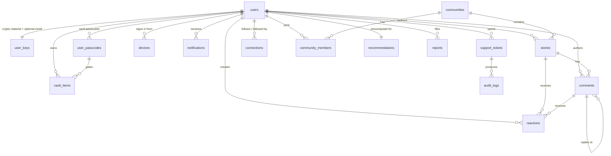

# 07 — Data Model

Seventeen MongoDB collections. Every field, every type, every index, and the reasoning behind the shape of each document.

## 1. Conventions

These apply to every collection without exception.

**Identifiers.** Each document has a `_id` that is a **ULID string with a typed prefix**, not an `ObjectId`. ULIDs are lexicographically sortable by creation time, URL-safe, and 26 characters, and the prefix makes an ID self-describing in a log or a bug report.

| Prefix | Collection |
|---|---|
| `usr_` | users |
| `sto_` | stories |
| `cmt_` | comments |
| `com_` | communities |
| `vit_` | vault_items |
| `tkt_` | support_tickets |
| `aud_` | audit_logs |
| `not_` | notifications |
| `dev_` | devices |
| `rep_` | reports |
| `pcd_` | user_passcodes |

Generated by `app/core/ids.py`:

```python
def new_id(prefix: str) -> str:
    return f"{prefix}_{ULID().str}"
```

The reference project used `ObjectId` with a custom Pydantic `PyObjectId` wrapper, which works but leaks a MongoDB implementation detail into every API response and requires conversion at every boundary. Strings need no conversion, no custom core schema, and no `arbitrary_types_allowed`.

**Timestamps.** Every collection has `created_at` and `updated_at`, both timezone-aware UTC `datetime`. `updated_at` is set in the same `$set` as any mutation — never in a separate write. Nullable timestamps use `_at` suffixes throughout (`published_at`, `verified_at`, `deleted_at`).

**Soft delete.** Content collections use `deleted_at: datetime | None`. A non-null value means deleted; every read query filters on it. Security collections (`user_keys`, `user_passcodes`, `audit_logs`) never soft-delete.

**Field naming.** `snake_case` everywhere, matching the wire format and Python. No abbreviations except the established ones (`dek`, `umk`, `kek`, `otp`, `tnc`).

**Enums** are stored as lowercase strings and typed in Python as `Literal`, not `Enum` — `Annotated[Literal["draft", "public"], BeforeValidator(strip_lower)]`, so input is normalized then constrained. This is the reference project's approach and it is the right one for a document store where the value is a string on the wire anyway.

**Denormalization is deliberate and enumerated.** Author display name and avatar seed are copied into `stories` so a feed renders in one query. Every denormalized field is listed in §14 with its refresh trigger, so nobody has to guess whether a field is authoritative.

**No cross-collection transactions in v1.** Where a multi-document invariant matters (a story's comment count, a community's member count), it is maintained by an atomic `$inc` in the same operation that creates the child document, and reconciled nightly by a maintenance job. Introducing multi-document transactions costs a replica-set requirement on every write path for a consistency guarantee our counters do not need.

---

## 2. `users`

The account. Deliberately thin — no email, no phone, no personal fields at all.

| Field | Type | Default | Notes |
|---|---|---|---|
| `_id` | `str` (`usr_…`) | generated | Immutable. Used in every foreign key. |
| `username` | `str` | required | Unique. `^[a-z0-9_]{3,20}$`. The sign-in handle. |
| `username_lower` | `str` | derived | Redundant lowercase copy for the unique index; `username` is already lowercase, but this makes the index intent explicit and survives a future case-preserving change. |
| `display_name` | `str` | = `username` | 1–40 chars. Non-unique, changeable. Shown on stories. |
| `avatar_seed` | `str` | generated | Server-issued seed the client renders an avatar from. Never a URL, never an upload. |
| `password_hash` | `str` | required | Argon2id PHC string, includes parameters. |
| `role` | `"user" \| "moderator" \| "admin" \| "super_admin" \| "system"` | `"user"` | See the permission matrix in [06](06-recovery-and-admin-flows.md). |
| `status` | `"active" \| "deactivated" \| "blocked" \| "pending_deletion"` | `"active"` | |
| `blocked_reason` | `str \| None` | `None` | Internal only, never returned to the user. |
| `tnc` | `{accepted: bool, version: str, accepted_at: datetime}` | required | Terms acceptance with version. |
| `interests` | `list[str]` | `[]` | Interest slugs. Drives community and people recommendations. |
| `bio` | `str \| None` | `None` | Max 200 chars. Text only; no links (link-in-bio is an identity vector). |
| `counts` | `{stories: int, connections: int, followers: int, communities: int}` | zeros | Denormalized. Maintained by `$inc`. |
| `prefs` | `{theme: str, reading_size: str, notify_in_app: bool, notify_email: bool}` | see below | `theme`: `system\|midnight\|paper`. `reading_size`: `reading\|readingLg`. |
| `onboarding` | `{interests_done: bool, first_story_done: bool, recovery_kit_offered: bool}` | all `false` | Drives the onboarding gate and the one-time Recovery Kit offer. |
| `last_login_at` | `datetime \| None` | `None` | |
| `last_active_at` | `datetime \| None` | `None` | Coarse — written at most once per hour to avoid a write per request. |
| `created_at` / `updated_at` | `datetime` | now | |
| `deleted_at` | `datetime \| None` | `None` | |

**Indexes**

| Keys | Options |
|---|---|
| `{username_lower: 1}` | `unique` |
| `{status: 1, created_at: -1}` | Admin listing |
| `{interests: 1}` | Recommendation queries |
| `{last_active_at: -1}` | Active-user sweeps, `sparse` |

**What is absent, and why.** No `email`, no `phone`, no `full_name`, no `dob`, no `gender`, no `address`, no `pan`, no `kyc`. The reference project's `User` document carried all of those; here every one of them would violate R6 in [05](05-security-and-crypto.md). The optional email lives in `user_keys` in unreadable form, because it is recovery material rather than profile data — and putting it there means a leaked `users` collection contains no contactable identifier at all.

**A note on the original draft schema.** The requirement sketched `{user_id: "USR001", email, email_verified, password, tnc, avatar: "😀"}`. Four changes: `user_id` splits into an immutable `_id` and a mutable `username`; `email`/`email_verified` move to `user_keys` encrypted; `password` becomes `password_hash` so the field name cannot lie about its contents; and `avatar` becomes `avatar_seed`, since storing a rendered emoji fixes the avatar system to emoji forever, whereas a seed lets the rendering strategy evolve (emoji today, generated illustration tomorrow) without a migration.

---

## 3. `user_keys`

One document per user. All cryptographic material and the optional email. **This collection is the most sensitive in the system** and is the reason the security review checklist exists.

| Field | Type | Default | Notes |
|---|---|---|---|
| `_id` | `str` | = `user_id` | One-to-one with `users`; using the user id as `_id` makes the lookup a primary-key hit. |
| `user_id` | `str` | required | Redundant but explicit. |
| `salt_pw` | `bytes` (16) | required | Salt for `KEK_pw` derivation. Client-generated. |
| `wrapped_umk` | `bytes` | required | `nonce ‖ AES-256-GCM(KEK_pw, UMK)`. |
| `umk_version` | `int` | `1` | Increments on password change (re-wrap) or reset (new UMK). |
| `kdf` | `{algo: str, memory_kib: int, iterations: int, parallelism: int}` | see [05](05-security-and-crypto.md) | Stored so parameters can be raised later. |
| `label_key_version` | `int` | `1` | Version of the UMK-derived HMAC key used for vault labels. |
| `recovery` | `{enabled: bool, salt: bytes \| None, blob: bytes \| None, created_at: datetime \| None, mode: "server_stored" \| "offline" \| None}` | `{enabled: false}` | The optional Vault Recovery Kit. `blob` is present only in `server_stored` mode. |
| `email_index` | `str \| None` | `None` | `HMAC-SHA256(EMAIL_INDEX_KEY, normalized_email)`, hex. Deterministic — supports the unique index and exact lookup. |
| `email_ciphertext` | `bytes \| None` | `None` | KMS-envelope AES-256-GCM of the normalized address. Randomized. |
| `email_masked` | `str \| None` | `None` | Precomputed `d••••k@g••••.com` for display, so no read path needs to decrypt. |
| `email_verified` | `bool` | `false` | |
| `email_verified_at` | `datetime \| None` | `None` | The passcode-ticket precondition needs this to be at least 48 hours old. |
| `email_added_at` | `datetime \| None` | `None` | |
| `created_at` / `updated_at` | `datetime` | now | |

**Indexes**

| Keys | Options |
|---|---|
| `{email_index: 1}` | `unique`, `sparse` — enforces one account per address without storing the address |
| `{email_verified: 1, email_verified_at: 1}` | Ticket precondition checks, `sparse` |

**Why `email_masked` is stored rather than computed.** Computing it requires a KMS decrypt, and Settings displays it on every page load. Storing the masked form means the read path never touches KMS, which both reduces cost and shrinks the number of code paths with decrypt permission down to one: the mail sender.

**Why the email lives here and not in `users`.** Blast radius. A query bug, an over-broad projection, or an admin tool that dumps `users` cannot leak recovery material, because there is none in that collection. Sensitive material is concentrated in one place that has exactly two legitimate readers.

---

## 4. `user_passcodes`

Vault passcodes. A user may have several — one general vault passcode plus per-item passcodes for the most sensitive items.

| Field | Type | Default | Notes |
|---|---|---|---|
| `_id` | `str` (`pcd_…`) | generated | |
| `user_id` | `str` | required | |
| `label` | `str` | required | User-chosen name for this passcode, e.g. "Main vault". Plaintext — it names the passcode, not its value. |
| `scope` | `"vault" \| "item"` | `"vault"` | `vault` applies to all items without their own; `item` is referenced by a specific item. |
| `passcode_hash` | `str` | required | Argon2id PHC string. Used to verify entry before attempting a decrypt. |
| `salt_pc` | `bytes` (16) | required | Salt for `KEK_pc` derivation. |
| `kdf` | `{algo, memory_kib, iterations, parallelism}` | see [05](05-security-and-crypto.md) | |
| `escrow_ciphertext` | `bytes` | required | KMS-envelope encryption of the passcode plaintext. Releasable only by an approved ticket. |
| `escrow_key_id` | `str` | required | KMS key version, so rotation is trackable. |
| `hint` | `bytes \| None` | `None` | Optional user hint, encrypted under the UMK. Readable only after any successful unlock. |
| `failed_attempts` | `int` | `0` | Mirrors the Redis counter for durability across restarts. |
| `locked_until` | `datetime \| None` | `None` | |
| `last_used_at` | `datetime \| None` | `None` | |
| `created_at` / `updated_at` | `datetime` | now | |

**Indexes**

| Keys | Options |
|---|---|
| `{user_id: 1, scope: 1}` | |
| `{user_id: 1, label: 1}` | `unique` |

**The escrow is the whole point of this collection and it is safe for one reason:** `escrow_ciphertext` yields a passcode, and a passcode alone derives `KEK_pc`, and `KEK_pc` alone cannot produce `KEK_item` — that needs the UMK too, which needs the password. The `❌` in every "decrypt another user's vault content" cell of the permission matrix is a statement about this document's insufficiency.

`passcode_hash` exists separately from the escrow so that verifying a passcode entry does not require a KMS call on every unlock.

---

## 5. `stories`

The core content unit.

| Field | Type | Default | Notes |
|---|---|---|---|
| `_id` | `str` (`sto_…`) | generated | |
| `author_id` | `str` | required | → `users._id` |
| `author_snapshot` | `{display_name: str, avatar_seed: str}` | required | Denormalized for single-query feed rendering. |
| `title` | `str \| None` | `None` | Max 120 chars. Optional — many stories have no title. |
| `body` | `str` | required | 1–20,000 chars. Plain text with a minimal formatting allowlist. Emoji permitted. |
| `excerpt` | `str` | derived | First 240 chars, server-computed, so feeds never transfer full bodies. |
| `visibility` | `"draft" \| "private" \| "public" \| "scheduled"` | `"draft"` | **Default is `draft`** as specified — publishing is always an explicit act. |
| `community_id` | `str \| None` | `None` | → `communities._id`. Required when `visibility` is `public`. |
| `slug` | `str \| None` | `None` | Opaque URL slug for public stories. Random, not derived from the title — a title-derived slug leaks content into the URL. |
| `media` | `list[StoryMedia]` | `[]` | Embedded, max 4. See below. |
| `counts` | `{likes: int, comments: int, shares: int, views: int}` | zeros | Maintained by `$inc`. |
| `reading_minutes` | `int` | derived | For the "6 min read" affordance. |
| `language` | `str \| None` | `None` | Detected, used for feed filtering. |
| `content_flags` | `{risk_signal: bool, reviewed: bool}` | `false` | `risk_signal` set by the AI worker when the text suggests self-harm risk, which surfaces regional helpline resources to the author. Never used to remove content. |
| `scheduled_for` | `datetime \| None` | `None` | Required when `visibility` is `scheduled`. |
| `published_at` | `datetime \| None` | `None` | Set once, on first publish. Stored to minute precision — see the timing-correlation measure in [05](05-security-and-crypto.md). |
| `edited_at` | `datetime \| None` | `None` | |
| `created_at` / `updated_at` | `datetime` | now | |
| `deleted_at` | `datetime \| None` | `None` | |

Embedded `StoryMedia`:

| Field | Type | Notes |
|---|---|---|
| `media_id` | `str` | |
| `kind` | `"image"` | Images only in v1; no video posts (P7). |
| `object_key` | `str` | R2 key in the public-story bucket. |
| `width` / `height` | `int` | For layout without a fetch. |
| `blur_hash` | `str` | Placeholder while loading. |
| `alt` | `str \| None` | Author-supplied alt text. |
| `exif_stripped` | `bool` | Must be `true` before the story can publish. |

**Indexes**

| Keys | Options |
|---|---|
| `{author_id: 1, created_at: -1}` | Author's own list |
| `{author_id: 1, visibility: 1, created_at: -1}` | Author filtering by tab |
| `{community_id: 1, published_at: -1}` | Community feed. `partialFilterExpression: {visibility: "public", deleted_at: null}` |
| `{published_at: -1}` | Global feed. Same partial filter. |
| `{slug: 1}` | `unique`, `sparse` — public page lookup |
| `{visibility: 1, scheduled_for: 1}` | The publish sweep. `partialFilterExpression: {visibility: "scheduled"}` |
| `{title: "text", body: "text"}` | Search. Weighted 3:1 toward title. Partial-filtered to public. |

**Partial indexes are load-bearing here.** The global feed index covers only public, non-deleted stories, which for a platform where most stories are drafts or private keeps the index a fraction of collection size. The reference project defined no indexes at all; feed queries at any real volume would have been full scans.

**Why `excerpt` is stored rather than computed at read time.** A feed page returns 20 stories. Computing 20 excerpts from 20 full bodies means transferring 20 full bodies out of MongoDB. Storing the excerpt lets the feed projection exclude `body` entirely.

---

## 6. `comments`

| Field | Type | Default | Notes |
|---|---|---|---|
| `_id` | `str` (`cmt_…`) | generated | |
| `story_id` | `str` | required | → `stories._id` |
| `author_id` | `str \| None` | required | `None` after the author deletes their account — the comment becomes a tombstone so threads keep their shape. |
| `author_snapshot` | `{display_name, avatar_seed} \| None` | required | `None` for tombstones. |
| `parent_id` | `str \| None` | `None` | One level of nesting only. Deeper threads become unreadable on a phone. |
| `body` | `str` | required | 1–2,000 chars. |
| `counts` | `{likes: int, replies: int}` | zeros | |
| `is_tombstone` | `bool` | `false` | Renders as "A deleted account". |
| `created_at` / `updated_at` | `datetime` | now | |
| `deleted_at` | `datetime \| None` | `None` | |

**Indexes**

| Keys | Options |
|---|---|
| `{story_id: 1, created_at: 1}` | Thread rendering. `partialFilterExpression: {deleted_at: null}` |
| `{story_id: 1, parent_id: 1, created_at: 1}` | Reply rendering |
| `{author_id: 1, created_at: -1}` | The author's own comment history |

---

## 7. `reactions`

Likes on stories and comments. A separate collection rather than an embedded array, because an embedded array on a story with 50,000 likes is a 50,000-element document.

| Field | Type | Notes |
|---|---|---|
| `_id` | `str` | `{user_id}:{target_kind}:{target_id}` — a **deterministic composite id**, which makes the unique constraint free and makes an idempotent like a single `upsert`. |
| `user_id` | `str` | |
| `target_kind` | `"story" \| "comment"` | |
| `target_id` | `str` | |
| `kind` | `"like"` | One reaction type in v1. Deliberate: a reaction palette invites performance, and this is not a performance platform. |
| `created_at` | `datetime` | |

**Indexes**

| Keys | Options |
|---|---|
| `{target_kind: 1, target_id: 1, created_at: -1}` | "Who liked this" |
| `{user_id: 1, created_at: -1}` | The user's own likes |

`_id` carries the uniqueness constraint, so no additional unique index is needed. Liking is `update_one(..., upsert=True)`; unliking is `delete_one`. Both are idempotent, which means a double-tap or a retried request cannot corrupt the count.

---

## 8. `communities`

Interest-based groups. No owner, no admin, no page — per P3 in [00](00-product-overview.md).

| Field | Type | Default | Notes |
|---|---|---|---|
| `_id` | `str` (`com_…`) | generated | |
| `slug` | `str` | required | Unique. `^[a-z0-9-]{3,40}$`. |
| `name` | `str` | required | |
| `description` | `str` | required | Max 300 chars. |
| `archetype` | `"grief" \| "sacrifice" \| "professional" \| "loneliness" \| "healing" \| "other"` | required | Maps to the personas. Drives recommendation. |
| `icon` | `str` | required | Generated icon name from `packages/icons`. |
| `accent_token` | `str` | `"accent"` | Which token family this community's chrome uses — a token *name*, never a hex. |
| `interests` | `list[str]` | `[]` | Interest slugs used for matching. |
| `is_curated` | `bool` | `true` | v1 communities are platform-curated. User-created communities are a later phase. |
| `counts` | `{members: int, stories: int}` | zeros | |
| `rules` | `list[str]` | `[]` | Displayed on join. |
| `status` | `"active" \| "archived"` | `"active"` | |
| `created_at` / `updated_at` | `datetime` | now | |

**Indexes**

| Keys | Options |
|---|---|
| `{slug: 1}` | `unique` |
| `{archetype: 1, status: 1}` | Browse by archetype |
| `{interests: 1, status: 1}` | Recommendation |
| `{"counts.members": -1}` | Popular listing |

**`accent_token` holds a token name, not a color.** A community whose brand color was stored as `#9B8CFF` would break the moment a new theme shipped, because it would keep rendering a dark-theme violet on a light background. Storing `"accent"` or `"success"` means the community's color resolves through the active theme like everything else.

---

## 9. `community_members`

| Field | Type | Notes |
|---|---|---|
| `_id` | `str` | `{user_id}:{community_id}` — deterministic composite |
| `user_id` | `str` | |
| `community_id` | `str` | |
| `joined_at` | `datetime` | |
| `notifications_enabled` | `bool` | Default `true` |
| `last_read_at` | `datetime \| None` | Drives the unread indicator |

**Indexes**

| Keys | Options |
|---|---|
| `{user_id: 1, joined_at: -1}` | "My communities" |
| `{community_id: 1, joined_at: -1}` | Member listing |

---

## 10. `connections`

One-directional follows.

| Field | Type | Notes |
|---|---|---|
| `_id` | `str` | `{follower_id}:{followee_id}` |
| `follower_id` | `str` | |
| `followee_id` | `str` | |
| `status` | `"active" \| "blocked"` | `blocked` means the followee blocked the follower |
| `created_at` | `datetime` | |

**Indexes**

| Keys | Options |
|---|---|
| `{follower_id: 1, created_at: -1}` | "Following" list and feed fan-in |
| `{followee_id: 1, created_at: -1}` | "Followers" list |
| `{followee_id: 1, status: 1}` | Block filtering |

**No follow requests, no mutual-follow requirement.** Following is public-story consumption only; a private story is never visible to a follower. Because identities are pseudonymous, a follow carries none of the social weight it does elsewhere, so the request/accept ceremony adds friction without adding safety. Blocking exists and is one-directional.

---

## 11. `vault_items`

Encrypted personal storage. The server stores key material it cannot use and metadata it cannot read.

| Field | Type | Default | Notes |
|---|---|---|---|
| `_id` | `str` (`vit_…`) | generated | |
| `user_id` | `str` | required | |
| `passcode_id` | `str` | required | → `user_passcodes._id`. Which passcode gates this item. |
| `kind` | `"image" \| "video" \| "document" \| "audio" \| "other"` | required | Coarse, client-declared. Only enough to choose an icon. |
| `size_bytes` | `int` | required | Ciphertext size. Counts against quota. |
| `chunk_count` | `int` | required | For streaming decrypt and integrity verification. |
| `object_key` | `str` | required | `vault/{user_id}/{item_id}`. No filename, no extension. |
| `encrypted_metadata` | `bytes` | required | AES-GCM under the item's DEK. Contains filename, MIME type, dimensions, duration, user note. |
| `wrapped_dek` | `bytes` | required | `nonce ‖ AES-256-GCM(KEK_item, DEK)`, AAD-bound to `item_id`. |
| `salt_item` | `bytes` (16) | required | HKDF salt for `KEK_item`. |
| `crypto_version` | `str` | `"story.dek.v1"` | Enables future migration. |
| `visibility` | `"normal" \| "hidden"` | `"normal"` | `hidden` items are excluded from every list. |
| `label_hash` | `str \| None` | `None` | Required when `hidden`. `HMAC(UMK-derived key, normalized_label)`. The label itself is never stored. |
| `label_hint` | `bytes \| None` | `None` | Optional, encrypted under the UMK. |
| `key_state` | `"active" \| "orphaned"` | `"active"` | `orphaned` after a password reset — undecryptable but not deleted. |
| `status` | `"pending" \| "ready" \| "failed" \| "deleting"` | `"pending"` | `pending` until the R2 upload is confirmed. |
| `scan_state` | `"pending" \| "clean" \| "unscannable"` | `"pending"` | `unscannable` is the honest terminal state for E2EE content. |
| `thumb_encrypted` | `bytes \| None` | `None` | Client-generated encrypted thumbnail, under 32 KiB, stored inline so grid views need one query and no per-item R2 fetch. |
| `created_at` / `updated_at` | `datetime` | now | |
| `deleted_at` | `datetime \| None` | `None` | |

**Indexes**

| Keys | Options |
|---|---|
| `{user_id: 1, visibility: 1, created_at: -1}` | The normal item list. `partialFilterExpression: {deleted_at: null}` |
| `{user_id: 1, label_hash: 1}` | **Hidden item lookup.** `unique`, `sparse` — an exact-match hit, no scan |
| `{user_id: 1, passcode_id: 1}` | Items affected by a passcode change |
| `{user_id: 1, key_state: 1}` | The "Unrecoverable" section after a reset |
| `{status: 1, created_at: 1}` | Reaping abandoned `pending` uploads. Partial-filtered to `pending` |

**The `hidden` visibility guarantee is enforced at the index and query layer, not the presentation layer.** The list endpoint's query includes `visibility: "normal"` — a hidden item is not filtered out after fetching, it is never fetched. This matters because a presentation-layer filter is one forgotten `if` away from leaking, whereas a query that never selects the documents cannot leak them even through a raw API response. Storage totals shown to the user are computed over normal items only, for the same reason.

**`thumb_encrypted` stored inline is a deliberate trade.** It bloats documents by up to 32 KiB, but the alternative — a separate R2 object per thumbnail — means 40 presigned URLs and 40 network round trips to render one grid screen, which on mobile is the difference between instant and unusable.

---

## 12. `support_tickets`

| Field | Type | Default | Notes |
|---|---|---|---|
| `_id` | `str` (`tkt_…`) | generated | |
| `user_id` | `str` | required | The affected user |
| `type` | `"passcode_release" \| "account_locked" \| "content_appeal" \| "data_export" \| "account_deletion" \| "security_incident"` | required | Determines routing |
| `state` | `"draft" \| "awaiting_email_verify" \| "submitted" \| "under_review" \| "needs_more_info" \| "approved" \| "reveal_ready" \| "revealed" \| "rejected" \| "expired" \| "closed"` | `"draft"` | See the state machine in [06](06-recovery-and-admin-flows.md) |
| `required_role` | `"moderator" \| "admin" \| "super_admin"` | derived from `type` | Enforced by dependency, never re-routable downward |
| `reason` | `str` | required | User's free text |
| `assignee_staff_id` | `str \| None` | `None` | |
| `messages` | `list[TicketMessage]` | `[]` | Threaded conversation |
| `email_verified_for_ticket` | `bool` | `false` | A fresh OTP proves *current* mailbox control |
| `approval` | `{approved_by, approved_at, justification, step_up_factors: list[str], dual_approval_by} \| None` | `None` | |
| `reveal` | `{token_hash, otc_hash, expires_at, payload_ciphertext, revealed_at} \| None` | `None` | `payload_ciphertext` is the passcode list under the one-time reveal key. Destroyed on close. |
| `resolution` | `str \| None` | `None` | |
| `created_at` / `updated_at` / `closed_at` | `datetime` | | |

Embedded `TicketMessage`: `{message_id, author_kind: "user" | "staff", author_ref, body, internal: bool, created_at}`. Messages with `internal: true` are never returned on the user-facing endpoint — enforced by projection, not by filtering after the fact.

**Indexes**

| Keys | Options |
|---|---|
| `{user_id: 1, created_at: -1}` | The user's ticket list |
| `{state: 1, required_role: 1, created_at: 1}` | The staff queue, oldest first |
| `{user_id: 1, type: 1, state: 1}` | Enforces one open ticket per type per user |
| `{"reveal.expires_at": 1}` | Expiry sweep, `sparse` |

**`payload_ciphertext` is the only place a passcode-derived secret is ever persisted outside `user_passcodes`,** it is encrypted under a key that exists only in the super_admin's and the user's hands, it has a 24-hour lifetime, and it is destroyed on close. The sweep job that enforces expiry is not optional infrastructure — it is a security control.

---

## 13. `audit_logs`

Append-only, hash-chained. Full schema and rationale in [06](06-recovery-and-admin-flows.md) §6.

| Field | Type | Notes |
|---|---|---|
| `_id` | `str` (`aud_…`) | ULID — chronologically sortable, which the chain relies on |
| `prev_hash` | `str` | `sha256:…` of the previous entry |
| `entry_hash` | `str` | This entry's hash |
| `occurred_at` | `datetime` | |
| `actor` | `{user_id, role, staff_id, ip_prefix, device_fingerprint}` | |
| `action` | `str` | Dotted, e.g. `passcode_release.approved` |
| `target` | `{kind, id}` | |
| `ticket_id` | `str \| None` | |
| `outcome` | `"success" \| "denied" \| "error"` | |
| `details` | `dict` | Never contains a secret; subject to the redaction processor |
| `visible_to_target` | `bool` | Drives the user's Security activity screen |

**Indexes**

| Keys | Options |
|---|---|
| `{"target.id": 1, visible_to_target: 1, occurred_at: -1}` | The user's security log |
| `{"actor.user_id": 1, occurred_at: -1}` | Staff activity review |
| `{action: 1, occurred_at: -1}` | Anomaly detection |
| `{occurred_at: 1}` | Chain verification walk |

**Database-level enforcement.** The API's MongoDB role has `insert` and `find` on this collection and no `update` or `remove`. This is set up in the provisioning script, not in application code, so an application bug cannot produce a mutation. There is no code path anywhere in the repository that issues an update against `audit_logs`.

---

## 14. Supporting collections

### `devices`

| Field | Type | Notes |
|---|---|---|
| `_id` | `str` (`dev_…`) | |
| `user_id` | `str` | |
| `fingerprint` | `str` | Coarse hash: platform + OS major + app version + model |
| `label` | `str` | "iPhone 14 · iOS 18" — user-readable |
| `platform` | `"ios" \| "android" \| "web"` | |
| `family_ids` | `list[str]` | Refresh-token families associated with this device |
| `first_seen_at` / `last_seen_at` | `datetime` | |
| `trusted` | `bool` | Suppresses repeat login alerts |

Indexes: `{user_id: 1, last_seen_at: -1}`, `{user_id: 1, fingerprint: 1}` unique.

### `notifications`

| Field | Type | Notes |
|---|---|---|
| `_id` | `str` (`not_…`) | |
| `user_id` | `str` | |
| `kind` | `"story_like" \| "story_comment" \| "new_follower" \| "community_story" \| "security_alert" \| "ticket_update" \| "system"` | |
| `actor_snapshot` | `{display_name, avatar_seed} \| None` | `None` for system notifications |
| `target` | `{kind, id} \| None` | Deep-link destination |
| `body` | `str` | Pre-rendered text |
| `read_at` | `datetime \| None` | |
| `created_at` | `datetime` | |

Indexes: `{user_id: 1, created_at: -1}`, `{user_id: 1, read_at: 1}` for the unread badge (partial-filtered to `read_at: null`), and a TTL index on `created_at` at 90 days — except `security_alert` and `ticket_update`, which are excluded from the TTL by a partial filter because a security notice must not silently vanish.

### `reports`

| Field | Type | Notes |
|---|---|---|
| `_id` | `str` (`rep_…`) | |
| `reporter_id` | `str` | |
| `target_kind` | `"story" \| "comment" \| "user"` | Never `vault_item` — vault content is unreadable and unreportable |
| `target_id` | `str` | |
| `reason` | `"harassment" \| "spam" \| "self_harm" \| "illegal" \| "impersonation" \| "other"` | |
| `note` | `str \| None` | |
| `state` | `"open" \| "actioned" \| "dismissed"` | |
| `handled_by` / `handled_at` | `str \| None` / `datetime \| None` | |
| `created_at` | `datetime` | |

Indexes: `{state: 1, created_at: 1}` for the queue, `{target_kind: 1, target_id: 1}` for aggregating reports on one item, `{reporter_id: 1, created_at: -1}` for abuse-of-reporting detection.

### `interests`

A small reference collection, seeded rather than user-generated.

| Field | Type | Notes |
|---|---|---|
| `_id` | `str` | The slug itself, e.g. `"grief"` |
| `name` | `str` | Display name |
| `archetype` | `str` | Links to community archetypes |
| `embedding` | `list[float] \| None` | Precomputed vector for similarity matching |

Index: `{archetype: 1}`.

### `recommendations`

Precomputed per user by the nightly worker, so the request path is a single primary-key read.

| Field | Type | Notes |
|---|---|---|
| `_id` | `str` | = `user_id` |
| `communities` | `list[{community_id, score, reason}]` | `reason` is a human-readable explanation, shown in the UI |
| `people` | `list[{user_id, score, reason}]` | |
| `computed_at` | `datetime` | |
| `model_version` | `str` | |

Index: `{computed_at: 1}` for staleness sweeps.

`reason` is a product requirement, not a debugging aid: a recommendation a user does not understand feels like surveillance. "Because you follow 3 people in Quiet Grief" is reassuring; an unexplained suggestion on an anonymity-focused platform is alarming.

### `schema_migrations`

| Field | Type | Notes |
|---|---|---|
| `_id` | `str` | Migration name, e.g. `"0007_add_vault_label_index"` |
| `applied_at` | `datetime` | |
| `duration_ms` | `int` | |
| `checksum` | `str` | Detects an edited, already-applied migration |

---

## 15. Denormalization register

Every copied field, in one table, with its refresh trigger. Undocumented denormalization is how a data model rots.

| Field | Source of truth | Refreshed when |
|---|---|---|
| `stories.author_snapshot` | `users.display_name`, `users.avatar_seed` | Backfill job on profile change; stale for at most 5 minutes |
| `comments.author_snapshot` | same | same |
| `notifications.actor_snapshot` | same | Never — a notification is a historical statement |
| `users.counts.*` | Aggregates over `stories`, `connections`, `community_members` | Atomic `$inc` on write; reconciled nightly |
| `stories.counts.*` | Aggregates over `reactions`, `comments` | Atomic `$inc` on write; reconciled nightly |
| `communities.counts.*` | Aggregates over `community_members`, `stories` | Atomic `$inc` on write; reconciled nightly |
| `stories.excerpt` | `stories.body` | On every body write |
| `stories.reading_minutes` | `stories.body` | On every body write |
| `user_keys.email_masked` | `user_keys.email_ciphertext` | On email add or change |

**Counts are eventually consistent and that is acceptable.** A like count that is briefly off by one is invisible. A comment thread missing a comment is not — which is why threads are read from `comments` directly and never reconstructed from a count.

`notifications.actor_snapshot` is deliberately frozen. A notification saying "Quiet Fox liked your story" should keep saying that even after the user renames themselves, because the notification records what happened at a point in time.

---

## 16. Index migration

Indexes are declared in code and applied on boot. This is the reference project's largest gap: it defined zero indexes anywhere, so a fresh deployment ran full collection scans and nobody found out until it was slow in production.

```python
# app/db/indexes.py
INDEXES: dict[str, list[IndexSpec]] = {
    "users": [
        IndexSpec(keys=[("username_lower", 1)], unique=True, name="uq_username"),
        IndexSpec(keys=[("status", 1), ("created_at", -1)], name="ix_status_created"),
        IndexSpec(keys=[("interests", 1)], name="ix_interests"),
    ],
    "vault_items": [
        IndexSpec(
            keys=[("user_id", 1), ("label_hash", 1)],
            unique=True, sparse=True, name="uq_user_label",
        ),
        IndexSpec(
            keys=[("user_id", 1), ("visibility", 1), ("created_at", -1)],
            partial={"deleted_at": None}, name="ix_user_visibility_created",
        ),
    ],
    # ... every collection
}

async def ensure_indexes(db: AsyncIOMotorDatabase) -> None:
    """Idempotent. Safe to run on every boot. Logs created and skipped indexes."""
```

Rules:

- **Every index is named explicitly.** Auto-generated names change when a key order changes, which makes a rename look like a drop-and-create.
- `ensure_indexes` runs in the app lifespan **and** as a standalone command, so a large index build can be run ahead of a deploy rather than blocking startup.
- Index creation is `background=True` on any collection expected to exceed a million documents.
- A CI test asserts that every query in the codebase is covered by a declared index, using `explain()` against a seeded test database. This is what stops the next unindexed query from reaching production.

**Data migrations** (as opposed to index migrations) are numbered, forward-only, recorded in `schema_migrations`, and run as an explicit command in the deployment pipeline — never automatically on boot. A migration that runs on boot runs concurrently on every instance during a rolling deploy, which is a class of outage worth avoiding by construction.

---

## 17. Relationship overview


