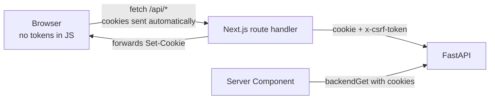

# 10 — Client Conventions

Flutter and Next.js patterns. Both clients share one contract with the backend and one design system, so their conventions are deliberately parallel: the same `Result` type, the same never-throw rule, the same feature colocation, the same refresh-and-retry idiom.

---

# Part A — Flutter

## A1. The never-throw contract

Network calls never throw. Every call returns a `Result<T>`, and every caller pattern-matches. This is the Dart translation of the reference project's `TResult<T>` discriminated union, which is the single best idea in its client layer — it makes forgetting error handling a compile error instead of a crash.

```dart
// lib/core/result.dart
sealed class Result<T> {
  const Result();
}

final class Ok<T> extends Result<T> {
  const Ok(this.data, {this.message});
  final T data;
  final String? message;
}

final class Err<T> extends Result<T> {
  const Err({required this.code, required this.message, this.status, this.fields});
  final String code;        // from data.code — branch on THIS
  final String message;     // safe to display verbatim
  final int? status;
  final List<FieldError>? fields;
}
```

```dart
// Correct — exhaustive, checked by the compiler
final result = await ref.read(storyRepositoryProvider).publish(storyId, visibility);
switch (result) {
  case Ok(:final data):
    AppToast.success(result.message ?? 'Story published.');
    ref.invalidate(myStoriesProvider);
  case Err(:final code, :final message):
    if (code == 'COMMUNITY_REQUIRED') {
      setState(() => _showCommunityPicker = true);
    } else {
      AppToast.danger(message);
    }
}
```

Rules:

- **Branch on `code`, never on `message`.** Messages are localized and change; codes are contract.
- **`Err.message` is always displayable.** The backend guarantees a human sentence, so a fallback is only needed for transport failures.
- **No `try`/`catch` outside `ApiClient`.** Exactly one place converts exceptions into `Err`.

## A2. `ApiClient`

One dio instance, configured once. Interceptors do all the cross-cutting work so no repository method deals with tokens or retries.

```dart
// lib/core/api/api_client.dart
class ApiClient {
  ApiClient(this._dio, this._tokenStore);

  Future<Result<T>> request<T>(
    String path, {
    required HttpMethod method,
    Object? body,
    Map<String, dynamic>? query,
    required T Function(Map<String, dynamic> json) parse,
  }) async {
    try {
      final response = await _dio.request<Map<String, dynamic>>(
        path,
        data: body,
        queryParameters: query,
        options: Options(method: method.name.toUpperCase()),
      );
      final json = response.data ?? const {};
      if (json['success'] != true) {
        return _errFrom(json, response.statusCode);
      }
      return Ok(parse(json['data'] as Map<String, dynamic>? ?? const {}),
                message: json['message'] as String?);
    } on DioException catch (e) {
      return _errFromDio(e);
    } catch (_) {
      return const Err(code: 'UNKNOWN', message: 'Something went wrong. Try again.');
    }
  }
}
```

`_errFromDio` distinguishes the cases that need different copy: no connectivity ("You appear to be offline."), timeout ("That took too long. Try again."), and a server envelope carried inside a non-2xx response (use its `code` and `message`).

**The success check is `statusCode` 2xx *and* `success == true`.** A misconfigured proxy returning a 200 HTML page fails safely rather than parsing as an empty success.

### Interceptors, in order

| Order | Interceptor | Responsibility |
|---|---|---|
| 1 | `AuthInterceptor` | Attaches `Authorization: Bearer` from secure storage |
| 2 | `RefreshInterceptor` | On 401: refresh once, retry once, else sign out |
| 3 | `IdempotencyInterceptor` | Attaches a UUID `Idempotency-Key` to configured POSTs |
| 4 | `VersionInterceptor` | Attaches `X-Client-Version` |
| 5 | `LogInterceptor` | Debug builds only. Never logs bodies. |

`RefreshInterceptor` implements the reference project's retry-once-on-401 idiom, with one addition Flutter needs: a single-flight lock, so twelve concurrent 401s trigger one refresh rather than twelve. All queued requests await the same completer.

```dart
class RefreshInterceptor extends Interceptor {
  Completer<bool>? _inFlight;

  Future<bool> _refreshOnce() {
    if (_inFlight case final existing?) return existing.future;
    final completer = Completer<bool>();
    _inFlight = completer;
    _doRefresh().then((ok) {
      completer.complete(ok);
      _inFlight = null;
    });
    return completer.future;
  }
}
```

Without the lock, a cold app start that fires six parallel requests rotates the refresh token six times, and reuse detection correctly interprets that as token theft and revokes the whole family — logging out a legitimate user.

## A3. State management

Riverpod, code-generated with `riverpod_annotation`. Four provider shapes and nothing else.

| Shape | Use for | Example |
|---|---|---|
| `@riverpod` function returning a plain value | Dependency injection | `apiClient`, `storyRepository` |
| `@riverpod` async function | Read-only server data | `story(id)`, `communityList` |
| `@riverpod class ... extends _$X` with `Notifier` | Client-owned state | `themeController`, `composerDraft` |
| `@riverpod class ... extends _$X` with `AsyncNotifier` | Server data plus mutations | `myStories`, `vaultItems` |

```dart
@riverpod
class VaultItems extends _$VaultItems {
  @override
  Future<List<VaultItem>> build() async {
    final result = await ref.read(vaultRepositoryProvider).listNormal();
    return switch (result) {
      Ok(:final data) => data,
      Err(:final message) => throw VaultLoadFailure(message),
    };
  }

  Future<Result<void>> delete(String itemId) async {
    final result = await ref.read(vaultRepositoryProvider).delete(itemId);
    if (result is Ok) {
      state = AsyncData(state.requireValue.where((i) => i.id != itemId).toList());
    }
    return result;
  }
}
```

The `build` method is the one place `Err` becomes a thrown exception, because `AsyncValue.error` is how Riverpod represents a failed load and how the UI renders it. Mutations return `Result` so the caller decides how to surface a failure.

Rules:

- **No provider reads `BuildContext`.** Providers are pure and testable.
- **UI reads with `ref.watch`, callbacks read with `ref.read`.** Watching in a callback rebuilds the closure and is a common source of stale state.
- **Optimistic updates only where reversal is invisible** — likes, follows. Never for publishing or vault mutations, where a silent rollback would be alarming.
- **`ref.invalidate` after a mutation that affects another provider.** No manual cross-provider mutation.
- Providers are declared in `features/<name>/providers/`, one concern per file.

## A4. Routing

`go_router` with typed routes and a single redirect guard.

```dart
// lib/routing/router.dart
@riverpod
GoRouter appRouter(AppRouterRef ref) {
  final auth = ref.watch(authControllerProvider);
  return GoRouter(
    initialLocation: Routes.feed,
    refreshListenable: auth,
    redirect: (context, state) => guard(auth, state),
    routes: $appRoutes,
  );
}

String? guard(AuthState auth, GoRouterState state) {
  final goingToAuth = state.matchedLocation.startsWith('/auth');

  if (!auth.isSignedIn) {
    return goingToAuth ? null : '${Routes.signIn}?redirect=${state.uri}';
  }
  if (goingToAuth) return Routes.feed;
  if (!auth.keysInitialized) return Routes.setupKeys;
  if (!auth.interestsDone) return Routes.pickInterests;
  return null;
}
```

One `guard` function holding every redirect, mirroring the reference project's single `+layout.server.ts` gate. Scattering guards across routes guarantees an unguarded route eventually appears.

The `?redirect=` parameter is validated before use, porting `safeRedirectPath` from the reference verbatim — a redirect parameter that is not a local path is an open-redirect vulnerability:

```dart
String safeRedirect(String? raw) {
  if (raw == null || raw.isEmpty) return Routes.feed;
  if (!raw.startsWith('/') || raw.startsWith('//')) return Routes.feed;
  if (raw.startsWith('/auth/')) return Routes.feed;
  return raw;
}
```

**Vault routes carry an extra runtime gate.** Navigating to a vault route when the vault is locked redirects to the unlock screen with the intended destination preserved, so a deep link into a vault item cannot bypass the passcode.

## A5. Crypto and key handling

The most security-sensitive client code. Two files, both fully unit-tested, both off-limits to feature code.

```dart
// lib/core/crypto/key_manager.dart
class KeyManager {
  Future<Result<void>> unlockAccount({
    required Uint8List password,     // Uint8List, NOT String — must be zeroable
    required Uint8List saltPw,
    required Uint8List wrappedUmk,
    required KdfParams kdf,
  });

  Future<Uint8List> deriveItemKey({
    required Uint8List passcode,
    required Uint8List saltPc,
    required Uint8List saltItem,
    required String itemId,
  });

  void lockVault();     // zeroes cached KEK_pc and every cached DEK
  void lockAccount();   // zeroes the UMK, clears secure storage session entry
}
```

Non-negotiable rules:

1. **Secrets are `Uint8List`, never `String`.** Dart strings are immutable and interned; a password in a `String` cannot be overwritten and may sit in memory until GC. Text fields feed bytes directly into the KDF.
2. **Every buffer is zeroed after use**, in a `finally`.
3. **Argon2id runs in a background isolate.** 64 MiB and 3 iterations blocks the UI thread for roughly half a second on mid-range hardware.
4. **The UMK lives in `flutter_secure_storage`**, keyed to the session, never in `SharedPreferences`, never in a provider that could be serialized.
5. **`KEK_pc` is memory-only.** It is never persisted, except as a biometric-gated keystore entry when the user opts into biometric unlock.
6. **Auto-lock is unconditional:** vault locks on 60 seconds of backgrounding, on device lock, and on session end. Implemented in one `AppLifecycleListener`, not per screen.
7. **`FLAG_SECURE` on every vault and passcode route**, applied by a route observer so no screen has to remember it.

Every vault screen is wrapped in a `VaultGuard` widget that renders the unlock UI when the vault is locked. A feature widget therefore cannot render decrypted content in a locked state — it is not reachable.

## A6. Local storage

| Store | Contents | Never contains |
|---|---|---|
`flutter_secure_storage` | Refresh token, wrapped UMK cache, biometric-gated `KEK_pc` | Anything not a secret |
| `shared_preferences` | Theme, reading size, feed position, onboarding flags | Any secret, any token |
| `drift` (SQLite) | Story feed cache, community list, vault item *metadata* (still encrypted) | Decrypted vault content, decrypted metadata |
| In-memory only | Decrypted vault thumbnails and files, `KEK_pc`, DEKs | — |

The drift database and the temp decrypt directory are **excluded from iOS and Android backups**. A vault file that reaches an unencrypted device backup defeats the whole design, and this is one line of configuration that is easy to forget and impossible to detect from the app.

Offline behaviour: the feed renders from the drift cache immediately and revalidates in the background. Vault items list from cached encrypted metadata, but any content operation requires connectivity — there is no offline decrypt, because there is no offline ciphertext.

## A7. Widget conventions

**Screens are thin.** A screen resolves providers, handles navigation, and composes components. No `BoxDecoration`, no `TextStyle`, no `Color`.

```dart
class VaultHomeScreen extends ConsumerWidget {
  const VaultHomeScreen({super.key});

  @override
  Widget build(BuildContext context, WidgetRef ref) {
    final items = ref.watch(vaultItemsProvider);
    return VaultGuard(
      child: Scaffold(
        appBar: const AppBarWidget(title: 'Vault', icon: AppIcons.vault),
        body: items.when(
          loading: () => const VaultGridSkeleton(),
          error: (e, _) => EmptyState(
            icon: AppIcons.alertCircle,
            title: 'Could not load your Vault',
            description: e is VaultLoadFailure ? e.message : 'Try again.',
            actionLabel: 'Retry',
            onAction: () => ref.invalidate(vaultItemsProvider),
          ),
          data: (list) => list.isEmpty
              ? const VaultEmptyState()
              : VaultGrid(items: list),
        ),
      ),
    );
  }
}
```

Every async surface handles all three states explicitly. `items.when` without an `error` branch is a lint failure.

Additional rules:

- `const` constructors wherever possible.
- Extract a widget rather than writing a `_buildSomething` method — a method rebuilds with its parent, a widget does not.
- `ListView.builder` with `itemExtent` or `prototypeItem` for uniform rows; never a `Column` inside a `SingleChildScrollView` for a list of unknown length.
- Keys on list items so reordering does not remount.
- Feature widgets live in `features/<name>/widgets/` and are promoted to `components/` only on second use.

## A8. Model conventions

`freezed` + `json_serializable`. Wire fields are `snake_case`; Dart members are `camelCase`; the boundary conversion happens once via `FieldRename.snake`.

```dart
@freezed
class VaultItem with _$VaultItem {
  const factory VaultItem({
    required String id,
    required String passcodeId,
    required VaultItemKind kind,
    required int sizeBytes,
    required int chunkCount,
    required VaultVisibility visibility,
    required VaultKeyState keyState,
    required DateTime createdAt,
    @Uint8ListConverter() required Uint8List encryptedMetadata,
    @Uint8ListConverter() required Uint8List wrappedDek,
    @Uint8ListConverter() required Uint8List saltItem,
    @Uint8ListConverter() Uint8List? thumbEncrypted,
    String? displayName,   // null while locked — populated only after decrypt
  }) = _VaultItem;

  factory VaultItem.fromJson(Map<String, dynamic> json) =>
      _$VaultItemFromJson(json);
}
```

`displayName` being nullable is a type-level enforcement of the rule from [04-component-library.md](04-component-library.md): a locked item has no readable name, so a widget cannot render one by accident.

Enums are `@JsonEnum(fieldRename: FieldRename.snake)` with an `unknown` fallback value, so a new server-side enum member does not crash an older client.

## A9. Testing

| Layer | Tool | Covers |
|---|---|---|
| Unit | `flutter_test` | `Result` mapping, crypto (100% required), formatters, guards |
| Provider | `ProviderContainer` with overrides | State transitions, mutation flows |
| Widget | `flutter_test` + `mocktail` | Every component variant, every async state, golden tests per theme |
| Integration | `patrol` | Signup → first story → vault upload → unlock, on a real device |

Golden tests run for both themes and at 100% and 160% text scale. That combination is what catches the layout break that only appears for a large-text user on a light theme — a case no manual pass will reliably find.

---

# Part B — Next.js

## B1. The BFF boundary

**Access and refresh tokens never reach client JavaScript.** The browser talks to Next.js route handlers under `/api/*`; those handlers attach httpOnly cookies server-side and proxy to the backend. This is the reference project's architecture and it is the correct one.



Two server-side entry points, mirroring the reference's `backend-fetch.ts` and `backend-proxy.ts`:

**`lib/server/backend.ts`** — for Server Components and `page.tsx` data loading.

```ts
export async function backendGet<T>(path: string): Promise<TResult<T>> {
  const jar = await cookies();
  const send = () => fetch(`${apiUrl}${path}`, {
    headers: { cookie: accessCookieHeader(jar) },
    cache: 'no-store',
  });

  let res = await send();
  if (res.status === 401 && (await tryRefreshTokens(jar))) {
    res = await send();
  }
  return resolveEnvelope<T>(res);
}
```

**`lib/server/proxy.ts`** — for route handlers, which makes every `route.ts` two lines.

```ts
export async function forwardToBackend(
  req: NextRequest, backendPath: string, method: string,
): Promise<NextResponse> {
  const jar = await cookies();
  if (!jar.get(ACCESS_COOKIE) && !(await tryRefreshTokens(jar))) {
    return NextResponse.json(
      { success: false, message: 'Please sign in again.',
        data: { code: 'SESSION_REQUIRED' } },
      { status: 401 },
    );
  }

  const body = await req.text();
  const send = () => {
    const csrf = jar.get(CSRF_COOKIE)?.value ?? '';
    return fetch(`${apiUrl}${backendPath}`, {
      method,
      headers: {
        'content-type': 'application/json',
        'x-csrf-token': csrf,
        cookie: `${accessCookieHeader(jar)}; ${CSRF_COOKIE}=${csrf}`,
      },
      body: body || undefined,
    });
  };

  let res = await send();
  if (res.status === 401 && (await tryRefreshTokens(jar))) res = await send();

  const data = await res.json().catch(() => ({}));
  return NextResponse.json(data, { status: res.status });
}
```

```ts
// src/app/api/stories/[id]/publish/route.ts
export async function POST(req: NextRequest, { params }: RouteParams) {
  const { id } = await params;
  return forwardToBackend(req, `/stories/${id}/publish`, 'POST');
}
```

The backend's status code passes through unchanged, so the client's `apiCall` sees the same shape whether the error came from the proxy or the API.

## B2. `apiCall` and `TResult`

Client-side, the same never-throw contract as Flutter.

```ts
// src/lib/api/client.ts
export type TResult<T = unknown> =
  | { ok: true; data: T; message: string }
  | { ok: false; code: string; message: string; status?: number;
      fields?: TFieldError[] };

export async function apiCall<T = unknown>(
  url: string, method: THttpMethod, body?: unknown,
): Promise<TResult<T>> {
  try {
    const res = await fetch(url, {
      method,
      headers: {
        'content-type': 'application/json',
        'x-csrf-token': readCsrfCookie(),
      },
      body: body === undefined ? undefined : JSON.stringify(body),
    });
    const json = (await res.json().catch(() => ({}))) as TEnvelope<T>;

    if (!res.ok || json?.success !== true) {
      return {
        ok: false,
        code: json?.data?.code ?? 'UNKNOWN',
        message: json?.message ?? 'Something went wrong. Try again.',
        status: res.status,
        fields: json?.data?.fields,
      };
    }
    return { ok: true, data: json.data as T, message: json.message };
  } catch {
    return { ok: false, code: 'NETWORK', message: 'You appear to be offline.' };
  }
}
```

Per-feature service files wrap it into one-line typed functions — the pattern from the reference's `watchlist/service.ts`, which was the cleanest part of its API layer:

```ts
// src/app/(app)/vault/_lib/service.ts
export const listVaultItems = (cursor?: string) =>
  apiCall<TVaultListPayload>(
    `/api/vault/items${cursor ? `?cursor=${encodeURIComponent(cursor)}` : ''}`,
    'GET',
  );

export const deleteVaultItem = (itemId: string) =>
  apiCall<{ item_id: string }>(`/api/vault/items/${itemId}`, 'DELETE');
```

Call sites branch on `ok`, never `try`/`catch`:

```tsx
const res = await deleteVaultItem(item.id);
if (res.ok) {
  toast.success(res.message);
  router.refresh();
} else if (res.code === 'PASSCODE_LOCKED') {
  setLockedUntil(res.fields?.[0]?.message);
} else {
  toast.danger(res.message);
}
```

## B3. Server versus Client Components

Default to Server Components. `'use client'` is added when a component needs one of: state, an effect, an event handler, or a browser API.

| Concern | Where it lives |
|---|---|
| Data fetching for initial render | Server Component via `backendGet` |
| Mutations | Client Component calling a `_lib/service.ts` function |
| Feed pagination | Client Component, cursor in state |
| Public story pages | Fully server-rendered, no client JS beyond the reaction bar |
| Theme resolution | Server — reads the cookie so the correct `data-theme` is in the initial HTML |
| Vault | **Entirely client-side.** Decryption uses WebCrypto and never touches the server. |

The vault split is the important one. A Server Component cannot decrypt anything — it has no UMK, and it must never have one. Vault routes render a shell on the server and everything inside it on the client.

**Web vault crypto** uses WebCrypto (`crypto.subtle`) for AES-GCM and HKDF, and a WASM Argon2id build in a Web Worker so key derivation does not block the main thread. Keys are held in JavaScript memory as `CryptoKey` objects with `extractable: false`, and never in `localStorage`, `sessionStorage`, or IndexedDB.

## B4. Route-local colocation

Identical to the reference project's SvelteKit convention; the App Router ignores `_`-prefixed folders the same way.

```
src/app/(app)/vault/
├── page.tsx
├── loading.tsx
├── error.tsx
├── _components/
│   ├── VaultGrid.tsx
│   ├── VaultTile.tsx
│   └── PasscodeDialog.tsx
├── _lib/
│   ├── types.ts       Types for this route
│   ├── const.ts       Static config, limits, tab definitions
│   ├── helper.ts      Pure functions
│   ├── service.ts     apiCall wrappers
│   └── crypto.ts      Route-local WebCrypto helpers
└── _assets/
    └── vault-empty.svg
```

`_lib` holds exactly those files and nothing else. Route-scoped components have deliberately generic names because the folder is the namespace — several routes can each have their own `_components/Header.tsx`, and that is correct rather than a collision.

## B5. Conventions

**Class merging.** One `cn` helper, `tailwind-merge` only, applied last so a caller's `className` wins:

```ts
export function cn(...inputs: ClassNameValue[]) {
  return twMerge(...inputs);
}
```

**Prop destructuring.** `className` is destructured explicitly and merged last, never spread into the element ahead of internal classes.

**URL as state.** Filters, tabs, and pagination cursors live in the query string, so the back button works and a view is shareable. This is the reference project's approach and it is right.

**Forms.** `zod` schemas in `_lib/types.ts`, shared between client validation and the submit handler. Server errors from `res.fields` map onto form fields by name.

**Images.** `next/image` with explicit `width`/`height` and a `blurDataURL` from the story's blur hash. Public story images come from the CDN bucket; vault images are never rendered through `next/image`, because it proxies through the server.

**Metadata.** Public story pages export `generateMetadata` with the title, the excerpt as the description, and an Open Graph image — the reason for choosing Next.js in the first place. Every other route sets `robots: { index: false }`.

## B6. Middleware

`src/middleware.ts` does three cheap things and nothing else:

1. Redirects unauthenticated requests for `(app)` routes to `/signin?redirect=…`, based on cookie presence only — no backend call.
2. Sets the security headers from [05](05-security-and-crypto.md) §8, including a per-request CSP nonce.
3. Resolves the theme cookie so the correct `data-theme` reaches the HTML.

Middleware runs on every request including static assets, so it never makes a network call and never touches a database. The authoritative auth check lives in `(app)/layout.tsx`, which calls `/auth/me` — middleware is an optimization to avoid rendering a page that will redirect, not a security boundary.

## B7. Testing

| Layer | Tool | Covers |
|---|---|---|
| Unit | `vitest` | `apiCall` mapping, `cn`, helpers, `safeRedirectPath`, crypto |
| Component | `vitest` + Testing Library | Component variants and states |
| E2E | Playwright | Signup, publish, vault upload and unlock, theme persistence with no flash |
| a11y | `axe-core` in Playwright | Every route, both themes |

The theme test asserts no flash of the wrong theme on first paint. That is the specific failure the cookie-based approach exists to prevent, so it is worth an explicit test rather than a manual eyeball.

---

# Part C — Shared discipline

Where the two clients must agree, and the mechanism that makes them agree.

| Concern | Shared mechanism |
|---|---|
| Design values | Generated from `tokens.json` — [03](03-design-tokens.md) |
| Component names and props | Specified in [04](04-component-library.md), verified by a gallery in both apps |
| Icons | Generated from `packages/icons` |
| API types | Generated from the OpenAPI schema into `packages/api-types` and `api_models.g.dart` |
| Error handling | `Result<T>` / `TResult<T>`, never-throw, branch on `code` |
| Auth retry | Refresh once on 401, retry once, then sign out |
| Redirect safety | The same `safeRedirect` logic, ported and tested on both sides |
| Copy | One strings module per platform, never inline in a view |
| Domain vocabulary | The glossary in [00](00-product-overview.md), enforced by `vocab-guard` in CI |

**Neither client ever holds a decryption key on the server side.** Flutter derives keys on-device; the web app derives them in the browser. A Next.js Server Component, a route handler, and the FastAPI backend are all equally incapable of decrypting a vault item, and that symmetry is deliberate — it means the security property does not depend on which client a user chooses.
