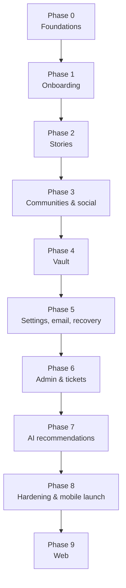

# 11 — MVP Roadmap

Nine phases. Mobile first, mobile finished, then web. Every phase has a definition of done that is verifiable rather than asserted.

## Sequencing principles

**S1 — Foundations before features.** Tokens, components, and the API skeleton come first. Building three screens and then introducing a design system means retrofitting three screens, and the hardcoded values from those screens survive forever.

**S2 — Vertical slices, not horizontal layers.** Each feature phase ships its backend, its API, and its mobile UI together and is genuinely usable at the end. A phase that delivers "the stories API" with no way to write a story cannot be tested by a human and hides its own defects.

**S3 — Security work is never a later phase.** Crypto ships with the vault, redaction ships with logging, the audit log ships with the first privileged action. There is no "harden it before launch" milestone, because that milestone always slips into the launch.

**S4 — Web starts only after the mobile app is finalized.** Explicitly per the requirement. Finalized means the token file, the component contract, and the API contract have stopped changing — those are exactly the three things the web app consumes, and building against moving versions of them doubles the work.

**S5 — Every phase leaves `main` deployable.** Feature flags gate incomplete work. No long-lived branches.

---

## Phase 0 — Foundations

Nothing user-visible. Everything downstream depends on it.

**Repo and tooling**
- Monorepo scaffold per [02](02-repo-structure-and-conventions.md): `app/`, `web/`, `backend/`, `packages/`, `tools/`, `Makefile`.
- `docker-compose.yml` with MongoDB, Redis, MinIO.
- All CI jobs wired and **actually failing on a deliberate violation** — verified, not assumed.
- Husky + lint-staged.

**Design system**
- `packages/design-tokens/tokens.json` with both themes complete.
- Both generators emitting `tokens.g.dart` and `tokens.css`.
- `design-guard` lint rules written and proven to fail on a raw hex.
- `packages/icons` with the first ~40 icons and both generators.

**Backend skeleton**
- `main.py`, `config.py`, `responses.py`, `error_handlers.py`, `logging.py` with the redaction processor.
- `db/mongo.py`, `db/redis.py`, `db/indexes.py`, `db/keys.py`.
- `core/deps.py` with every `Annotated` alias, `csrf_protect`, `rate_limit`, `require_role`, `idempotent`.
- `core/crypto.py` and `core/security.py`, **at 100% test coverage**.
- `/health` and `/health/ready`.
- Contract tests: envelope shape, route policy enforcement.

**Flutter skeleton**
- `app.dart`, theme wiring, `ThemeController` with persistence and no-flash resolution.
- `Result<T>`, `ApiClient` with all interceptors, `go_router` with the `guard` function.
- The full primitive component set from [04](04-component-library.md) plus a gallery screen.

**Definition of done**
- [ ] `make check` passes from a clean clone.
- [ ] Changing one hex in `tokens.json` visibly changes both apps after `make tokens`.
- [ ] The gallery screen renders every component variant in both themes at 100% and 160% text scale.
- [ ] `design-guard` fails on an intentionally added raw color, and CI shows it.
- [ ] Redaction test passes: a payload of every denied key leaks nothing.
- [ ] Codegen drift check fails on a hand-edited generated file.

**Why this phase is worth its cost.** Everything after it is faster, and none of the shortcuts that produce a hardcoded-value codebase are available. The reference project's token layer was theme-ready but its theme switch was never built; by the time anyone tried, two hundred components had accumulated assumptions. Building the switch in Phase 0 is what makes multi-theme real.

---

## Phase 1 — Onboarding

The first end-to-end flow. A user can create an account and sign in.

**Backend**
- `users` and `user_keys` collections with indexes.
- `POST /auth/signup`, `/auth/signin`, `/auth/refresh`, `/auth/signout`, `/auth/signout-all`, `GET /auth/me`.
- `POST /auth/username-available`.
- `POST/GET /users/me/keys`.
- Argon2id with PHC-string parameter storage and login-time re-hash on policy change.
- Token families, rotation with reuse detection, denylist.
- Constant-time login failure.
- `interests` collection, seeded. `GET /interests`.
- `PATCH /users/me` for display name, bio, interests.
- `POST /users/me/avatar/regenerate`.
- Login alerts and the `devices` collection.

**Mobile**
- Welcome, sign up, sign in, forgot-password stub.
- Username availability check with debounce.
- Password strength meter with the breached-password check.
- Terms acceptance.
- On-device UMK generation and key upload.
- Interest picker.
- Avatar reveal with regenerate.
- Session persistence, silent refresh, auto sign-out on refresh failure.

**Definition of done**
- [ ] A new account can be created and signed into on a real device.
- [ ] Killing and reopening the app keeps the user signed in.
- [ ] A username collision returns `USERNAME_TAKEN` and the form shows it on the field.
- [ ] `wrapped_umk` is present in `user_keys` and the plaintext UMK appears in no log and no request body.
- [ ] Refresh token reuse revokes the family (integration test).
- [ ] Login timing for an unknown username matches a known one within noise.
- [ ] Signing in on a second device produces a login alert.
- [ ] No personal field exists anywhere in the schema.

---

## Phase 2 — Stories

The core product loop.

**Backend**
- `stories` and `comments` collections with all partial indexes.
- `POST /stories`, `PATCH`, `DELETE`, `POST /{id}/publish`, `/unpublish`.
- `GET /stories/mine`, `/stories/{id}`.
- `POST /stories/media/presign`, `/complete`.
- `strip_exif_and_thumbnail` worker.
- `publish_scheduled_stories` cron.
- Excerpt and reading-time derivation.
- Opaque slug generation.

**Mobile**
- Story composer: title, body, autosave to draft.
- Visibility picker with schedule.
- Image attachment with an EXIF-stripping notice.
- Draft list, published list, scheduled list.
- Story detail with `reading` typography and the max-width cap.
- Edit within the 24-hour window.
- The pre-first-public-story writing-style warning.

**Definition of done**
- [ ] A story can be written, saved as a draft, and published in all three visibilities.
- [ ] A scheduled story publishes within one minute of its time.
- [ ] Drafts survive app kill mid-compose.
- [ ] Published story images have no EXIF (verified with `exiftool`).
- [ ] The share URL contains an opaque slug and no `user_id`.
- [ ] A private story returns `404` to another account, not `403`.
- [ ] `published_at` is truncated to the minute.
- [ ] Story body reads comfortably at 160% text scale.

---

## Phase 3 — Communities and social

Stories become social.

**Backend**
- `communities`, `community_members`, `connections`, `reactions`, `notifications`.
- Community browse, detail, join, leave, my-communities.
- Follow, unfollow, followers, following, block, blocked.
- Like and unlike for stories and comments.
- Comments with one nesting level, tombstone handling.
- `GET /stories/feed`.
- `fan_out_new_story`, `fan_out_comment` workers.
- Notifications list, unread count, mark read.
- `reconcile_counts` cron.
- ~12 seeded curated communities across the archetypes.

**Mobile**
- Community browse and detail with a join control.
- Home feed with skeletons, pull-to-refresh, cursor pagination.
- Reaction bar; comment thread with composer.
- Public profile with follow.
- Notification list with badge.
- Block from a story or a profile.

**Definition of done**
- [ ] The feed renders followed users and joined communities, correctly paginated.
- [ ] A double-tapped like produces one like (idempotency verified).
- [ ] Blocking removes the user from the feed in both directions.
- [ ] Comments from a deleted account render as a tombstone without breaking the thread.
- [ ] Counts match a recomputed aggregate after the nightly job.
- [ ] The feed's first paint is under 1.5 s on a mid-range Android over 4G.
- [ ] Every empty list shows a real `EmptyState`, never a blank screen.

---

## Phase 4 — Vault

The most security-sensitive phase. Nothing here is rushed.

**Backend**
- `vault_items` and `user_passcodes` with all indexes including the unique sparse label index.
- `VaultRepository` with the hidden-item guarantee enforced in the query.
- Every `/vault/*` endpoint from [08](08-api-contract.md).
- KMS envelope encryption for passcode escrow.
- Presigned upload and download.
- `verify_vault_object` worker and `reap_pending_uploads` cron.
- Quota enforcement.
- Passcode lockout with exponential backoff.
- Timing-equalized search.

**Mobile**
- Vault home with an encrypted-thumbnail grid.
- Passcode creation with the PIN-versus-passphrase trade-off explained.
- `PasscodePad` with no clipboard, no autofill, `FLAG_SECURE`.
- Chunked streaming encrypt-and-upload with progress and resume.
- Chunked streaming download-and-decrypt with in-app viewers for image, video, PDF, and audio.
- Hidden-item creation with label and encrypted hint.
- Label search.
- Auto-lock: 60 s background, device lock, session end.
- Biometric unlock, opt-in.
- Export with re-entered passcode and a plain warning.
- The Recovery Kit offer, on first vault use.

**Definition of done**
- [ ] A 400 MB video uploads, downloads, and plays correctly.
- [ ] Ciphertext in R2 is unreadable and carries no filename or extension.
- [ ] The plaintext filename appears nowhere server-side.
- [ ] A hidden item is absent from `GET /vault/items` at the raw API level, not just in the UI.
- [ ] Vault storage totals and counts exclude hidden items.
- [ ] Label search for a nonexistent label and a wrong passcode are byte-identical and timing-equivalent.
- [ ] Moving user A's `wrapped_dek` onto user B's item fails the AEAD tag check.
- [ ] Vault locks on all three triggers.
- [ ] Screenshots are blocked on every vault screen and the recents thumbnail is obscured.
- [ ] No decrypted file appears in shared storage, the gallery, or a device backup.
- [ ] A full database plus KMS dump yields no plaintext vault content (manual exercise, documented).
- [ ] Key derivation does not block the UI thread.
- [ ] Every security checklist item in [05](05-security-and-crypto.md) §13 is green.

**This phase gets an internal security review before merge.** Not a code review — a review specifically against [05](05-security-and-crypto.md), by someone who did not write the code.

---

## Phase 5 — Settings, email, and recovery

Everything a user needs to manage and, if necessary, rescue their account.

**Backend**
- Email add, verify, resend, remove, with blind index, ciphertext, and precomputed mask.
- OTP with `HSETNX` attempt preservation, lockout, and resend cooldown.
- Password change (vault-preserving) and password reset (vault-destroying).
- `acknowledged_vault_loss` server-side gate.
- Orphaned-key marking and bulk delete.
- Recovery Kit create, delete, and use.
- Sessions list and per-session revocation.
- `audit_logs` with hash chaining, `verify_audit_chain` cron, external chain-head write.
- Deactivate and delete with a grace period.
- `send_email_otp` and `send_security_alert` workers.

**Mobile**
- Settings home.
- Theme picker with live preview.
- Reading size picker.
- Email add and verify with a masked display.
- Change password.
- Forgot password with the full typed-confirmation warning showing live item count and size.
- Recovery Kit creation with word confirmation.
- Recovery Kit use after a reset.
- Active sessions with revoke.
- Security activity log.
- Passcode management.
- Deactivate and delete.

**Definition of done**
- [ ] A password change preserves vault access; a reset destroys it and the app says so beforehand.
- [ ] The reset warning shows the real item count and byte total.
- [ ] A reset without `acknowledged_vault_loss` is rejected by the API.
- [ ] Orphaned items are listed as unrecoverable with no misleading retry affordance.
- [ ] A Recovery Kit restores vault access after a reset.
- [ ] Requesting a new OTP does not reset the failure counter.
- [ ] The reset-request endpoint responds identically for existing, existing-without-email, and nonexistent usernames.
- [ ] No endpoint returns a plaintext email address.
- [ ] Revoking a session logs that device out within one refresh cycle.
- [ ] The audit chain verifies; a manually tampered entry is detected.
- [ ] Theme choice survives a restart with no flash.

---

## Phase 6 — Admin and tickets

The escrow release flow, end to end.

**Backend**
- `support_tickets` with the full state machine.
- Ticket create with all five preconditions, per-ticket email verification, messaging.
- Role-based routing enforced by dependency.
- `require_step_up` with password, TOTP, and email OTP.
- Passcode release approval with justification and optional dual approval.
- Reveal token, one-time code, 24-hour expiry, `expire_reveal_links` cron.
- Every `/admin/*` endpoint.
- `reports` and the moderation queue.
- Full audit coverage of every privileged action.
- Staff TOTP enrolment, IP allowlist, idle timeout.

**Admin surface**
A minimal Next.js app — the one exception to S4, because it is staff-only, has no public surface, and does not consume the mobile component contract. Ticket queue, ticket detail, step-up approval, user metadata view, moderation queue, audit viewer.

**Mobile**
- Ticket creation from Settings.
- `TicketStatusCard` with the live timeline.
- Ticket messaging.
- The reveal screen with all three checks and a 10-minute countdown.

**Definition of done**
- [ ] A user with a verified email can open a passcode ticket; one without cannot.
- [ ] All five preconditions are individually enforced, each with a specific message.
- [ ] An `admin` cannot approve a `passcode_release`.
- [ ] Approval requires all three step-up factors plus a 50-character justification.
- [ ] The reveal link expires at 24 hours and the blob is destroyed.
- [ ] The reveal screen requires session, email OTP, and the one-time code — and **never asks for the account password**.
- [ ] A released passcode alone cannot decrypt anything (verified without the password).
- [ ] Every step appears in the user's Security activity log in plain language.
- [ ] `audit_logs` rejects an update attempt at the database-role level.
- [ ] No impersonation, password-set, or vault-read endpoint exists anywhere in the admin surface.

---

## Phase 7 — AI recommendations

The last feature phase.

**Backend**
- Interest embeddings and the `refresh_interest_embeddings` worker.
- `recommendations` collection and the nightly `recompute_recommendations` worker.
- `GET /recommendations/communities`, `/people`, `POST /dismiss`.
- Human-readable `reason` generation for every recommendation.
- `GET /stories/discover`.
- `risk_signal` detection on story text, surfacing regional helpline resources to the author only.
- Improved avatar generation from the seed.

**Mobile**
- Suggested communities and people, each with its visible reason.
- Discover feed.
- Dismiss.
- Helpline resource sheet when a risk signal fires.

**Definition of done**
- [ ] Recommendations are relevant to declared interests and joined communities (manual review of 20 accounts).
- [ ] Every recommendation shows a reason a user can understand.
- [ ] Dismissal persists.
- [ ] The request path is a single primary-key read — no inference at request time.
- [ ] `risk_signal` never removes, hides, or reports content; it only offers resources to the author.
- [ ] No recommendation exposes any signal derived from a private story or a vault item.

The last item is a hard constraint. Feeding private content into a recommendation model would make private stories observable through their effects, which is a subtler but real violation of the product's promise. Only public stories, joined communities, and declared interests are inputs.

---

## Phase 8 — Hardening and mobile launch

No new features. Only the work that makes it safe to ship.

- Load test: feed, story creation, vault upload. Fix what the numbers expose.
- Index coverage verification via `explain()` on every query in the codebase.
- Full accessibility pass: screen reader end to end, 160% text, contrast per theme.
- Performance: cold start under 2 s, feed first paint under 1.5 s, 60 fps scroll, APK under 30 MB.
- Certificate pinning with a backup pin and a kill switch.
- Sentry with PII scrubbing verified.
- **External security review of [05](05-security-and-crypto.md) and its implementation.**
- Penetration test of auth, vault, and the admin surface.
- Privacy policy and terms, written to match what the system actually does.
- App Store and Play Store listings, with the data-safety declarations completed honestly.
- Support runbooks for every ticket type.
- Incident response runbook and on-call rotation.
- Backup and restore drill, actually performed.
- Staging soak with synthetic load for one week.
- Closed beta with 50 real users; triage everything they hit.

**Definition of done**
- [ ] External security review passed with no unresolved high or critical findings.
- [ ] Penetration test findings resolved or explicitly accepted with a documented rationale.
- [ ] Store data-safety declarations match reality field by field.
- [ ] Every query is index-covered.
- [ ] Restore from backup verified end to end.
- [ ] Beta feedback triaged; every crash fixed.
- [ ] Transparency report template ready.

---

## Phase 9 — Web

Begins only when Phase 8 is complete and the token file, component contract, and API contract are frozen.

**Order within the phase**
1. **Foundation.** Next.js scaffold, `tokens.css` wired into `@theme inline`, `apiCall` and `TResult`, `backendGet` and `forwardToBackend`, middleware with security headers and theme resolution.
2. **Components.** The full primitive set with props matching Flutter exactly, plus a `/gallery` route.
3. **Auth.** Signup, signin, keys initialization, session handling through the BFF.
4. **Public story pages.** `app/s/[slug]` — server-rendered, `generateMetadata`, Open Graph, indexable. **The reason Next.js was chosen**, so it lands early enough to validate the decision.
5. **Feed, stories, communities, social.**
6. **Vault.** Fully client-side with WebCrypto and a WASM Argon2id worker.
7. **Settings and tickets.**
8. **Polish.** Responsive layouts, keyboard navigation, `axe` on every route, Lighthouse.

**Definition of done**
- [ ] Every component's props match the Flutter implementation exactly; both galleries render identically.
- [ ] A public story page scores ≥ 95 on Lighthouse SEO and is indexable.
- [ ] A shared story link produces a correct preview in WhatsApp, iMessage, Slack, and X.
- [ ] Theme persists across reload with no flash.
- [ ] Vault upload, download, and unlock work in the browser with WebCrypto.
- [ ] No token is reachable from client JavaScript (verified in DevTools).
- [ ] `axe` reports zero violations on every route in both themes.
- [ ] Every flow is keyboard-operable end to end.
- [ ] Changing a token in `tokens.json` updates both apps in one commit.

---

## Cross-phase practices

| Practice | Applies |
|---|---|
| `main` deployable at all times | Every phase |
| Feature flags for incomplete work | Every phase |
| A phase is not done until its DoD is fully green | Every phase |
| Security-relevant code reviewed by a second person against [05](05-security-and-crypto.md) | Phases 1, 4, 5, 6 |
| Contract tests updated with every new route | Every phase |
| Golden tests updated with every component change | Every phase |
| Index declared in the same commit as the query that needs it | Every phase |
| Docs updated in the same PR as the behaviour they describe | Every phase |

**The last row is the one that decays first.** These twelve documents are only useful while they are true. A PR that changes the token contract, adds an error code, or alters a collection and does not touch the corresponding document has introduced a second source of truth — and from that point on, nobody can trust either one. Reviewers should treat a stale doc as a defect on the same footing as a failing test.

## Explicitly deferred

Out of scope for everything above, listed so the boundary is not renegotiated mid-phase:

Direct messaging, video stories, live audio, user-created communities, story collections and series, reactions beyond a single like, push notifications, in-app search across comments, translation, monetization, story analytics for authors, group vaults or shared vault items, desktop apps, and any form of advertising.

Each of these is a reasonable future feature. None of them is required to prove that people will tell their story to strangers who cannot judge them, which is the only question the MVP exists to answer.
