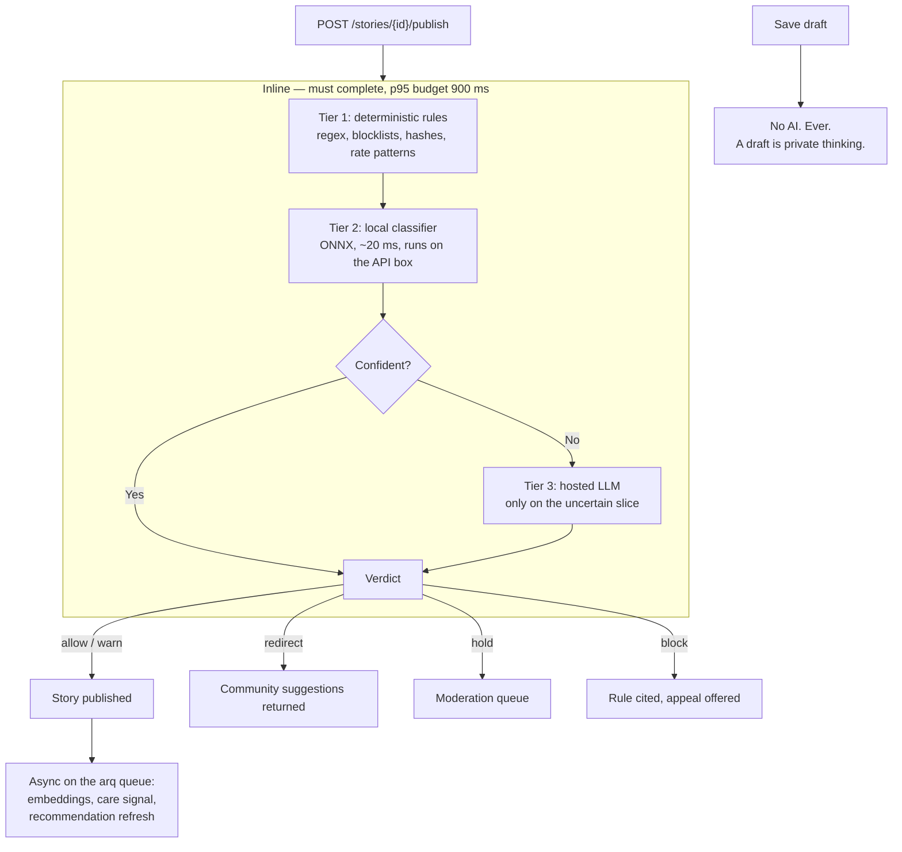

# 12 — The AI Layer

> Anonymity without moderation produces a sewer. Moderation without explanation produces a platform nobody trusts. This document specifies how STORY gets both.

Read this before writing anything under `backend/app/ai/`, and before adding any model call anywhere else — because there is no anywhere else. All model access goes through the ports defined here.

## 1. What this layer is, and is not

**Is:** a pre-publication gate, a router that sends people to the right room, a warning system that tells authors when their own words would expose them, and a suggestion engine.

**Is not:** an author, a ranker, or an engagement optimizer. P8 in [00](00-product-overview.md) is binding — no model in this system exists to increase time-in-app, and no model writes or rewrites user content.

The distinction matters for a specific reason. Instagram's failure mode is not that it lacks AI; it is that its AI optimizes for attention and its moderation runs *after* publication, on report. By then the harm is delivered. STORY inverts both: the models run before content lands, and none of them are pointed at engagement.

## 2. The five checks

Five distinct jobs. They are separate because they have different failure costs, different appeal paths, and different consequences — collapsing them into one "the AI blocks bad stuff" switch is what makes moderation feel arbitrary.

| # | Check | Question it answers | Worst outcome | May block? |
|---|---|---|---|---|
| 1 | **Safety gate** | Does this break a platform rule? | A user is harassed, doxxed, or shown illegal content | **Yes** |
| 2 | **Fit check** | Does this belong in *this* community? | A room loses its character | No — redirects |
| 3 | **Exposure check** | Would this deanonymize its own author? | A user is identified from their own story | No — warns |
| 4 | **Care signal** | Does the author sound at risk? | Someone in crisis sees no resource | Never |
| 5 | **Suggestion** | Which communities and people fit this user? | Irrelevant feed | N/A |

### 2.1 Safety gate

The only check with the power to stop publication. Its rule set is small, concrete, and closed — a vague rule is an unappealable rule.

| Rule | Verdict |
|---|---|
| Targeted harassment of an identifiable person | `block` |
| Doxxing — a third party's real name plus a locator (employer, address, phone, handle) | `block` |
| Sexual content involving minors, or any content sexualizing a minor | `block` + immediate account suspension + `security_incident` ticket |
| Credible threat of violence toward a specific person | `block` |
| Solicitation of illegal goods or services | `block` |
| Spam, promotion, link farming, repeated identical content | `block` |
| Explicit sexual content | `hold` — allowed in no v1 community, held for human review |
| Graphic self-harm method detail | `hold` — the story is welcome, the method detail is not; author is asked to edit |
| Impersonation of a named real person | `hold` |

Everything else is allowed. **Sadness is not a rule violation. Anger is not a rule violation. Despair is not a rule violation.** A platform for people in pain that flags pain has misunderstood its own product, and the golden-set evaluation in §10 exists specifically to catch that regression.

### 2.2 Fit check — "does this belong here"

This is the "sanity match" requirement, and it is deliberately **not** a block.

The check scores a story against the target community's rubric, which is derived from the category's `tone` plus the community's own description and rules.

| Score | Verdict | What the user sees |
|---|---|---|
| ≥ 0.65 | `allow` | Nothing. Publishes. |
| 0.35 – 0.65 | `warn` | "This might land better in **First Year Without Them**. Publish here anyway?" — with a one-tap switch and a one-tap dismiss. |
| < 0.35 | `redirect` | Publication is paused. Up to three suggested communities are offered, plus "publish here anyway" behind a confirm. |
| Any score, but content is a different *category* of thing entirely (an advertisement, a code snippet, a wall of links) | `block` | Falls through to the safety gate's spam rule. |

**Why a topic mismatch does not hard-block.** A person writing about being laid off may be writing about grief; a person writing about their mother's death may be writing about caregiving. The boundary between two rooms is genuinely ambiguous, and a machine that is 70% accurate on an ambiguous boundary, given the power to refuse, will refuse a large number of legitimate stories from people who took an hour to write them. The cost of a wrong `redirect` is one extra tap. The cost of a wrong `block` is a user who never comes back. Fit is a routing problem, and routing problems get suggestions, not refusals.

The hard "publish here anyway" escape exists on purpose and is recorded. If a community accumulates a high rate of override-then-reported stories, that is a signal about the community's definition, not about the users.

### 2.3 Exposure check — the one nobody else builds

Scans the author's own text for material that would identify **the author**, and warns before publish. This directly serves P4.

Detected: full personal names in a self-referential position, phone numbers, email addresses, physical addresses, employer names combined with a role and a city, school or university names combined with a year, social handles, invoice or ID numbers, and images whose caption or alt text names a place.

```
"You wrote your company name and your team size. Two people in
 that team could recognise this. Remove it?"     [Remove]  [Keep it]
```

It **never blocks**, for the same reason the vault has an export button: the user's own information is the user's decision. It only ensures the decision is informed. A `keep it` is recorded on the story so that the choice is not re-litigated on every edit.

Detecting a third party's identifiers is a different matter and belongs to the safety gate, where it does block — your right to expose yourself does not extend to your ex-partner.

### 2.4 Care signal

Stored as `stories.moderation.risk_signal` in [07](07-data-model.md), and constrained here:

- Surfaces regional helpline resources **to the author only**.
- Never removes, hides, downranks, or reports content.
- Never notifies another user, a moderator, or an emergency service. The platform has no identity, no phone number, and no location — it could not contact anyone if it wanted to, and it must never claim it can.
- Fires at most once per story and at most once per user per 24 hours, because a resource sheet that appears on every story becomes wallpaper.

### 2.5 Suggestion

Communities, people, and the discover feed. Inputs are strictly limited: declared interests, joined communities, public stories the user wrote, and public stories the user read. **Never** private stories, never vault items, never draft content, never the text of a held or blocked story.

Every suggestion carries a human-readable `reason`. An unexplained recommendation on an anonymity product reads as surveillance; "Because you follow 3 people in Quiet Grief" reads as a feature.

## 3. Verdicts

One closed enum, used by every check and stored on every review record.

| Verdict | Content state | User experience |
|---|---|---|
| `allow` | Published | Nothing |
| `warn` | Published | A non-blocking notice before publish, dismissible |
| `redirect` | Not published | Alternative communities offered, override available |
| `hold` | Not published, queued | "A person is reviewing this. Usually under 12 hours." Appears in the author's drafts, marked. |
| `block` | Not published, terminal | The rule cited by name, plus an appeal button |

`hold` exists because the alternative to "machine is unsure" is either over-blocking or under-blocking, and both are worse than a queue. The queue is the `moderator` role's primary job (see [06](06-recovery-and-admin-flows.md)), and a hold that ages past its SLA auto-resolves to `allow` — a backlog must not become a silent ban.

## 4. Where the checks run



**Drafts are never sent to a model.** This is a hard rule and there is a test for it. A draft is a person thinking, and thinking is not publication.

**Comments** run the safety gate only — no fit check (a comment inherits its story's room) and no exposure check inline (it runs async and produces an after-the-fact warning, because a 900 ms gate on a two-line comment destroys the conversation).

**Private stories** run the exposure check and the care signal only. There is no audience to protect, so the safety gate does not apply, and they are never embedded or fed to the suggestion engine.

**Vault items are never touched by any model, in any tier, ever.** They are ciphertext; there is nothing to send. This is stated here as well as in [05](05-security-and-crypto.md) because it is the single most important sentence in both documents.

### The three-tier cascade is a cost decision, not an architecture flourish

Tier 1 and Tier 2 are free and run in-process. In the expected steady state they resolve the large majority of content — most stories are obviously fine, and most spam is obviously spam. Only the genuinely ambiguous slice reaches Tier 3, where a token is actually spent. Sending every story to a hosted LLM would cost roughly two orders of magnitude more for a worse p95, and would make the publish path fail whenever a vendor has an incident.

## 5. The provider port

P9 is enforced here. One protocol, one adapter per vendor, selected by configuration. No controller, worker, or router ever imports a vendor SDK.

```python
# app/ai/port.py
from typing import Protocol, Literal, Sequence

Verdict = Literal["allow", "warn", "redirect", "hold", "block"]

class Judgement(BaseModel):
    verdict: Verdict
    rule: str | None            # e.g. "safety.doxxing"; None when allow
    score: float                # 0..1 confidence or fit score
    rationale: str              # one sentence, shown to the user
    spans: list[TextSpan]       # offsets the client highlights
    model_id: str               # "local-onnx-v3" | "claude-haiku-4-5-20251001"
    tier: Literal[1, 2, 3]
    latency_ms: int

class AIPort(Protocol):
    async def classify(self, text: str, *, rubric: Rubric) -> Judgement: ...
    async def embed(self, texts: Sequence[str]) -> list[list[float]]: ...
    async def extract_identifiers(self, text: str) -> list[TextSpan]: ...
```

Three methods. That is the entire surface, and it is small on purpose — a port with twenty methods is a vendor SDK wearing a costume.

### Adapters

| Adapter | Backs | Cost | Used for |
|---|---|---|---|
| `RulesAdapter` | Regex, blocklists, perceptual hashes | Free | Tier 1, always on, never disabled |
| `LocalAdapter` | ONNX Runtime + a small classifier and a sentence-embedding model | Free after download | Tier 2 and all embeddings |
| `GeminiAdapter` | Google AI Studio / Gemini API (Flash for the volume path) | Free tier, then per token | Tier 3 — **the chosen provider** |
| `AnthropicAdapter` | Claude (Haiku for the volume path, Sonnet for appeals review assistance) | Per token | Tier 3 alternative |
| `OpenAICompatAdapter` | Any OpenAI-shaped endpoint — vLLM, Ollama, Together, Groq | Varies / free self-hosted | Tier 3 alternative, and the local-dev default |
| `NullAdapter` | Returns `allow` with `tier=0` | Free | Tests and local development |

Selection is per capability, not global, because the right answer differs per job:

```bash
AI_CLASSIFY_PROVIDER=gemini         # or anthropic | openai_compat | local | null
AI_EMBED_PROVIDER=local             # embeddings should never cost money
AI_EXTRACT_PROVIDER=local
AI_CLASSIFY_MODEL=gemini-flash-latest
AI_TIER3_ENABLED=true
AI_TIER3_TIMEOUT_MS=2500
AI_FAIL_MODE=hold                   # hold | allow  — see §6
```

A provider swap is one environment variable. Adding a vendor is one file under `app/ai/adapters/` and one line in the factory. Nothing else in the codebase changes, and there is a contract test suite that every adapter must pass, so a new adapter is verified against the same behaviour the old one had.

### The rubric is data too

```
backend/app/ai/rubrics/
├── safety.v3.yaml           # the rule table from §2.1, versioned
├── tone.reflective.v2.yaml
├── tone.supportive.v2.yaml
├── tone.practical.v2.yaml
├── tone.open.v2.yaml
└── exposure.v1.yaml
```

A rubric file is loaded by version, and the version that produced a judgement is recorded on it. Changing moderation behaviour is a YAML edit plus a golden-set run — not a prompt buried in a Python string that nobody can diff. Prompts are assembled from the rubric; there are no free-floating prompt literals in the codebase, and a lint rule enforces that.

## 6. Failure behaviour

A moderation system's most important property is what it does when it is broken.

| Failure | Response |
|---|---|
| Tier 3 provider times out or errors | Fall back to the Tier 1 + Tier 2 verdict. If those were uncertain, apply `AI_FAIL_MODE` — default `hold`, so nothing unreviewed reaches a room. |
| Tier 2 model fails to load | API refuses to start. A publish path with no classifier is not a degraded service, it is a different product. |
| Tier 1 unavailable | Impossible — it is in-process pure Python with no dependency. |
| Provider returns malformed output | Parsed with a strict schema; a parse failure is a provider error, handled as above. Never `eval`, never a partial parse. |
| Moderation queue exceeds SLA | Holds older than 24 hours auto-resolve to `allow` and page the on-call. A backlog must not become a silent ban. |

`AI_FAIL_MODE=allow` exists for local development and is rejected at boot in `production` by a config validator, because it would otherwise be one wrong environment variable away from an unmoderated platform.

## 7. Prompt injection

Story text is untrusted input that is fed to a model, which is the textbook injection surface. Mitigations, all required:

- User content is passed in a clearly delimited, labelled block, never concatenated into the instruction section.
- The model returns a **constrained schema** — verdict enum, float, short rationale. There is no field in which "ignore previous instructions" can express itself as an action.
- The rationale string is treated as untrusted output: escaped on render, length-capped, and never used as a lookup key, a path, or a command.
- No tool use, no function calling, no retrieval on the moderation path. The model reads text and returns a judgement. It has no capability to misuse.
- A red-team fixture set of injection attempts is part of the golden set in §10, and a regression there fails CI.

## 8. Privacy boundary

| Content | Ever sent to a model? | Ever sent to a *hosted* model? |
|---|---|---|
| Draft | No | No |
| Private story | Exposure check + care signal only | No — local adapters only |
| Public / community story | Yes | Only the Tier 3 uncertain slice |
| Comment | Safety gate only | Only the Tier 3 uncertain slice |
| Username, display name, bio | On profile change only, safety gate | No |
| Email, in any form | **No** | **No** |
| Vault item, metadata, filename, label, thumbnail | **No. Structurally impossible — it is ciphertext.** | **No** |

Contractual requirements on any hosted provider: no training on submitted content, no retention beyond the request, and a signed data-processing agreement. These are stated in the privacy policy in the same words used here.

### 8.1 The Gemini free-tier rule

Google AI Studio's free tier is the intended development path, and it carries one condition that overrides convenience: **on the free tier Google may use submitted prompts and responses to improve its products.** That is incompatible with the row above and with P8.

The rule, therefore:

- **Free tier is for development and evaluation only**, and only against the golden set and synthetic fixtures in `backend/tests/ai/golden/`. No real user text.
- **Real user content requires a paid key** (paid Gemini API or Vertex AI), where submitted data is not used for training.
- `AI_TIER3_ENABLED` defaults to `false`. Turning it on in an environment that serves real users while `AI_BILLING_TIER=free` is a **startup invariant failure**, in the same class as the production checks in `app/config.py`. The process refuses to start.

This is the one place where a free tier is not a saving. It is a disclosure.

The transparency report states, per period: volume checked, verdict distribution, appeal count, appeal overturn rate, and the share of content that reached a hosted provider. Publishing the overturn rate is the accountability mechanism — a rising overturn rate is a public admission that the gate is miscalibrated, which is exactly the pressure that keeps it calibrated.

## 9. Appeals

Every `hold` and every `block` produces an appeal affordance. An appeal is a `content_appeal` ticket ([06](06-recovery-and-admin-flows.md)) and inherits the whole ticket machinery — state, messaging, audit, SLA.

- A `moderator` reviews. The reviewer sees the content, the verdict, the rule, and the rubric version — **not** the author's identity beyond `user_id`, because there is no identity to see.
- An overturn republishes the story, notifies the author, and writes a labelled example into the golden set. **The correction becomes a test.** That is the only mechanism by which the gate actually improves.
- Two overturns of the same rule within a review window escalate to a rubric review rather than being handled case by case.
- No appeal path exists for a CSAM block. That verdict is terminal and is reported through the legally required channel.

## 10. Evaluation

A moderation model without a test set is a rumour.

**The golden set** lives at `backend/tests/ai/golden/`, is version-controlled, and holds labelled examples across four buckets: clearly-allow, clearly-block, ambiguous-by-design, and adversarial (injection attempts, obfuscated slurs, spam wearing a story's clothes). Every appeal overturn adds a case.

Gates in CI:

| Metric | Threshold | Rationale |
|---|---|---|
| False-block rate on clearly-allow | **< 0.5%** | The expensive error. A wrongly refused story is a lost user. |
| Recall on clearly-block | > 95% | |
| False-block rate on the *emotional-distress* slice | **0%** | Hard gate. Flagging sadness on this platform is a product-destroying bug, not a tuning issue. |
| Injection fixtures producing a non-`block` verdict change | 0 | |
| p95 inline latency | < 900 ms | Measured against the tier cascade, not the LLM alone. |

A rubric change that regresses any of these does not merge. A model or provider swap runs the same suite before the environment variable changes.

## 11. Cost model

Rough shape at 10,000 stories per day, which is well past MVP:

| Tier | Share of volume | Unit cost | Daily |
|---|---|---|---|
| 1 — rules | ~55% | 0 | 0 |
| 2 — local ONNX | ~35% | 0 (CPU already paid for) | 0 |
| 3 — hosted LLM | ~10%, ≈1,000 calls, ~800 tokens each | Gemini Flash-class pricing | Cents to low single-digit dollars |

Embeddings are local and therefore free. The nightly recommendation recompute is vector arithmetic over stored embeddings — no inference, no provider call.

Two properties fall out of this that matter more than the number: the platform **can run with `AI_TIER3_ENABLED=false` and still be safe**, degrading to more `hold`s and fewer auto-allows; and the hosted-provider bill scales with the *ambiguous* slice rather than with total volume, so a traffic spike does not produce a proportional bill.

## 12. Later AI features

Deliberately not in v1. Each is listed with the constraint it must satisfy, so that a future implementation cannot quietly violate P8.

| Feature | Constraint |
|---|---|
| Semantic search over public stories | Local embeddings only; public content only |
| "Stories like this one" | Must never surface a story whose author blocked the reader |
| Community health summaries for the team | Aggregate only; never a per-user profile |
| Comment tone nudge before posting | A suggestion to the commenter, never a block, never visible to anyone else |
| Auto-suggested community for a *new* community proposal | Assists a human curator; never auto-creates |
| Multilingual fit checking | Must meet the same golden-set thresholds per language before that language is enabled |
| On-device pre-check in Flutter | Reduces round trips; server check remains authoritative and is never skipped |

Permanently excluded, not deferred: AI-generated stories, AI-generated comments, AI personas, engagement-optimized ranking, and any model whose output is a prediction about a specific user's mental state that is shown to anyone but that user.
